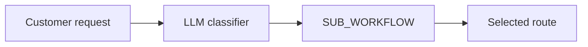

# Dynamic routing

**Derived from:** `ai/examples/36-ai-workflow-routing.json`, `36a-ai-route-support-ticket.json`, `36b-ai-route-refund-request.json`, and `36c-ai-route-sales-lead.json` (cookbook name and prose only).

**Outcome:** let an LLM choose one workflow from a fixed catalog, then invoke it through `SUB_WORKFLOW`.



## Register the workflow family

Register the three approved child workflows before the router. The parent can select only these names; do not interpolate an arbitrary workflow name from untrusted input.

```bash
conductor workflow create ai-route-support-ticket.json
conductor workflow create ai-route-refund-request.json
conductor workflow create ai-route-sales-lead.json
conductor workflow create ai-workflow-routing.json
```

## Runnable definitions

Save this as `ai-workflow-routing.json`:

```json
--8<-- "docs/devguide/ai/cookbook/assets/ai-workflow-routing.json"
```

The related child fixtures are intentionally simple `NOOP` workflows. They make the selected route inspectable without triggering a real ticket, refund, or lead action.

Save this as `ai-route-support-ticket.json`:

```json
--8<-- "docs/devguide/ai/cookbook/assets/ai-route-support-ticket.json"
```

Save this as `ai-route-refund-request.json`:

```json
--8<-- "docs/devguide/ai/cookbook/assets/ai-route-refund-request.json"
```

Save this as `ai-route-sales-lead.json`:

```json
--8<-- "docs/devguide/ai/cookbook/assets/ai-route-sales-lead.json"
```

## Run

```bash
conductor workflow start -w ai_workflow_routing --sync -i '{"request":"I was charged twice for my subscription."}'
```

Open **[Executions](http://localhost:8080/executions)** in the Conductor UI and select the new execution to review the task graph, and each task's inputs and outputs.

The LLM output is parsed as JSON and carries its selection reason into the child. Keep the catalog short and reviewed; put consequential work inside each child workflow behind its own policy and approval boundary.
