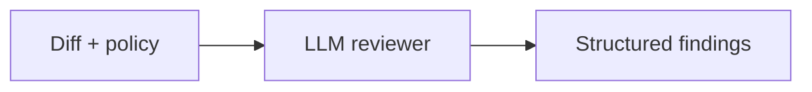

# Coding review

**Derived from:** `ai/examples/19-coding-agent.json` (cookbook name and prose only).

**Outcome:** return structured review findings for a supplied diff without granting repository write access.



## Prerequisites and contract

Configure the LLM provider. Input is `diff`, `repository`, and `policy`; output is a JSON review. Pass a pull-request URL or file reference for oversized diffs and retrieve only the relevant patch chunks.

## Runnable definition

Save this as `coding-review-agent.json`:

```json
--8<-- "docs/devguide/ai/cookbook/assets/coding-review-agent.json"
```

## Register and run

```bash
conductor workflow create coding-review-agent.json
conductor workflow start -w coding_review_agent --sync -i '{"repository":"acme/service","policy":"Flag correctness and security issues.","diff":"diff --git a/app.py b/app.py"}'
```

Open **[Executions](http://localhost:8080/executions)** in the Conductor UI and select the new execution to review the task graph, and each task's inputs and outputs.

## Production notes

The task is token-, time-, retry-, rate-, and concurrency-bounded. It is intentionally read-only; a separate governed publication recipe owns comments or change requests. Keep the source revision SHA with every result, reconcile repeated reviews by SHA and policy version, and record false-positive feedback for evaluation. Replace the model, review rubric, and data classification rules for your environment.
