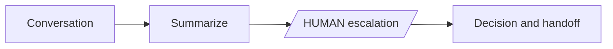

# Conversation handoff

**Outcome:** turn a conversation into a durable support handoff and wait for an accountable human response.



## Prerequisites and contract

Configure the LLM provider. Input is `conversation` and `customerId`; output includes the generated handoff and human decision. The `HUMAN` task is the explicit policy boundary: downstream work must inspect its decision rather than assume approval.

## Runnable definition

Save this as `conversation-handoff.json`:

```json
--8<-- "docs/devguide/ai/cookbook/assets/conversation-handoff.json"
```

## Register and run

```bash
conductor workflow create conversation-handoff.json
conductor workflow start -w conversation_handoff_and_escalation --sync -u human_escalation -i '{"customerId":"C-123","conversation":"Customer reports a duplicate charge."}'
```

Open **[Executions](http://localhost:8080/executions)** in the Conductor UI and select the new execution to review the task graph, and each task's inputs and outputs.

On OSS Conductor, complete the blocked task through your approval UI or the verified task-by-reference endpoint (replace the workflow ID):

```bash
curl -X POST 'http://localhost:8080/api/tasks/WORKFLOW_ID/human_escalation/COMPLETED' \
  -H 'Content-Type: application/json' \
  -d '{"approved":true,"owner":"support-oncall","nextStep":"investigate payment ledger"}'
```

## Production notes

The LLM call is bounded by timeout, retry, and concurrency controls; the 24-hour workflow limit allows a real escalation queue. Store transcripts and attachments as Files API/object references, redact sensitive fields before prompting, and record the assigned operator and escalation SLA. Reconcile repeated callbacks against the workflow ID. Replace roles, retention policy, and escalation integration for your environment.
