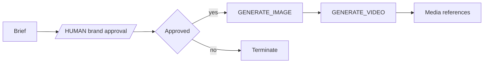

# Creative campaign

**Outcome:** approve a campaign brief, generate a still, then create a matching video asset.



## Prerequisites and contract

Configure the supported image/video provider and its server-side credential. Input is `prompt` and `campaignId`; output is image and video media references. The human task confirms rights, brand rules, and prompt policy before costly generation.

## Runnable definition

Save this as `creative-campaign-pipeline.json`:

```json
--8<-- "docs/devguide/ai/cookbook/assets/creative-campaign-pipeline.json"
```

## Register and run

```bash
conductor workflow create creative-campaign-pipeline.json
conductor workflow start -w creative_campaign_asset_pipeline --sync -u approve_creative_brief -i '{"campaignId":"spring-REPLACE","prompt":"A product hero image in the approved brand style."}'
```

Open **[Executions](http://localhost:8080/executions)** in the Conductor UI and select the new execution to review the task graph, and each task's inputs and outputs.

Approve the brief only after confirming rights, brand policy, and intended audience. On OSS Conductor, complete the gate with:

```bash
curl -X POST 'http://localhost:8080/api/tasks/WORKFLOW_ID/approve_creative_brief/COMPLETED' \
  -H 'Content-Type: application/json' \
  -d '{"approved":true,"approver":"REPLACE"}'
```

## Production notes

Generation uses bounded retry, rate, concurrency, and end-to-end time budgets. Store media in approved storage and return URIs, not base64 payloads. Reconcile a timeout by campaign ID and provider job/media ID before regenerating, because a completed asset can arrive after a callback failure. Add content-safety review before external delivery. Replace model, aspect ratio, brand policy, storage location, and quotas for your environment.
