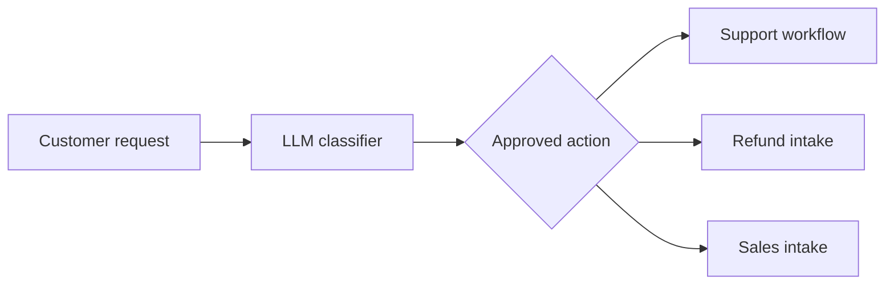

# Static routing

**Outcome:** classify a request, then route it through an explicit `SWITCH` allowlist of reviewed paths.



## Prerequisites and contract

Register `ai_route_support_ticket`, `ai_route_refund_request`, and `ai_route_sales_lead` before starting this workflow. Input is `request`; output is the classification. The model cannot supply a workflow name: the `SWITCH` is the allowlist and unrecognized output terminates safely.

## Runnable definition

Save this as `customer-request-routing.json`:

```json
--8<-- "docs/devguide/ai/cookbook/assets/customer-request-routing.json"
```

## Register and run

Register the three approved child workflows before the router, then run it. Their definitions are listed in [Dynamic routing](ai-workflow-routing.md#runnable-definitions) — save each one alongside the router definition above.

```bash
conductor workflow create ai-route-support-ticket.json
conductor workflow create ai-route-refund-request.json
conductor workflow create ai-route-sales-lead.json
conductor workflow create customer-request-routing.json
conductor workflow start -w customer_request_approved_dispatch --sync -i '{"request":"I was charged twice for my returned order."}'
```

Open **[Executions](http://localhost:8080/executions)** in the Conductor UI and select the new execution to review the task graph, and each task's inputs and outputs.

## Production notes

The classifier is deterministic, JSON-shaped, retry-bounded, rate-limited, and time-bounded. Put consequential operations inside the destination workflow behind its own policy/approval boundary. Reconcile a repeated request using a caller correlation ID; do not let classification retries create duplicate tickets, refunds, or leads. Replace the child workflows and taxonomy for your environment.
