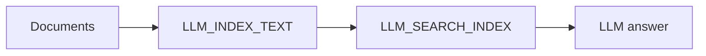

# RAG workflow

**Derived from:** `ai/examples/07-rag-complete.json` (cookbook name and prose only).

**Outcome:** ingest a document set into a vector index, retrieve relevant context, and generate a grounded answer in one durable workflow.



## Prerequisites and contract

Configure the named vector database and embedding model on the server. The index-time and query-time embedding model must match exactly; different embedding spaces return unreliable results.

## Runnable definition

Save this as `rag-assistant.json`:

```json
--8<-- "docs/devguide/ai/cookbook/assets/rag-assistant.json"
```

## Register and run

```bash
conductor workflow create rag-assistant.json
conductor workflow start -w rag_assistant --sync -i '{}'
```

Open **[Executions](http://localhost:8080/executions)** in the Conductor UI and select the new execution to review the task graph, and each task's inputs and outputs.

## Production notes

The copied fixture supplies three short demonstration documents and a fixed question. For production, replace the fixture documents with an idempotent ingestion step that carries document references and metadata rather than large bodies. Keep document identifiers and source versions in the index metadata, and return the retrieved chunks so callers can inspect the grounding evidence.
