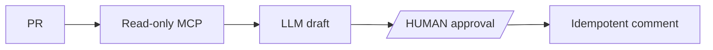

# PR reviewer

**Derived from:** `ai/examples/35-governed-adaptive-agent.json` (cookbook name and prose only).

**Outcome:** read PR evidence, draft findings, require approval, and publish exactly one idempotent comment.



## Prerequisites and contract

Expose separate read and write GitHub MCP methods and store the token as `GITHUB_MCP_TOKEN`. Input is MCP URL, repository coordinates, pull number, and `publicationKey`; output is draft and publication result. Scope the token to the target repository and ensure the comment tool recognizes the key or a marker in the body.

## Runnable definition

Save this as `governed-pr-reviewer.json`:

```json
--8<-- "docs/devguide/ai/cookbook/assets/governed-pr-reviewer.json"
```

## Register and run

```bash
conductor workflow create governed-pr-reviewer.json
conductor workflow start -w governed_pull_request_reviewer --sync -u approve_publication -i '{"mcpServerUrl":"https://REPLACE.example/mcp","owner":"REPLACE","repo":"REPLACE","pullNumber":1,"publicationKey":"pr-1-REPLACE"}'
```

Open **[Executions](http://localhost:8080/executions)** in the Conductor UI and select the new execution to review the task graph, and each task's inputs and outputs.

Approve `approve_publication` only after reviewing the draft and confirming the idempotency marker has not already been published.

## Production notes

Read, model, and write work are bounded by workflow timeout; external reads/writes include retry, timeout, and concurrency limits. The human task is mandatory before publication. If publication times out, search for the marker/key before retrying. Keep PR SHA, policy version, approval identity, and tool outputs for evaluation; pass large diffs by reference. Replace MCP methods, approval policy, model, and retention settings for your environment.
