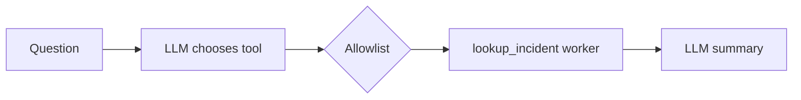

# Tool agent

**Outcome:** the model selects the one approved read-only tool, Conductor dispatches it through an explicit `SWITCH`, and a second bounded model call explains the result.



## Prerequisites and worker

This recipe has one `SIMPLE` task: `lookup_incident`. The worker below registers the matching task definition; run it before starting the workflow. The worker is deliberately read-only and idempotent. Replace the fixture with your incident-system client, preserving the input/output contract.

Save this as `lookup_incident_worker.py`:

```python
--8<-- "docs/devguide/ai/cookbook/assets/lookup_incident_worker.py"
```

Install and run it with the current Python SDK:

```bash
python -m pip install conductor-python
python lookup_incident_worker.py
```

## Runnable definition

Save this as `tool-calling-agent.json`:

```json
--8<-- "docs/devguide/ai/cookbook/assets/tool-calling-agent.json"
```

## Register and run

```bash
conductor workflow create tool-calling-agent.json
conductor workflow start -w tool_calling_incident_agent --sync -i '{"incidentId":"INC-123","question":"What is the current status?"}'
```

Open **[Executions](http://localhost:8080/executions)** in the Conductor UI and select the new execution to review the task graph, and each task's inputs and outputs.

## Production notes

The model may propose a tool but cannot execute arbitrary code: the workflow allowlist is the authority. The two LLM calls have timeout/retry/concurrency limits; configure worker task timeouts and rate limits when registering it. Persist the source incident version with the result and reconcile repeated requests by incident ID plus caller correlation ID. Add `HUMAN` before any follow-up write.
