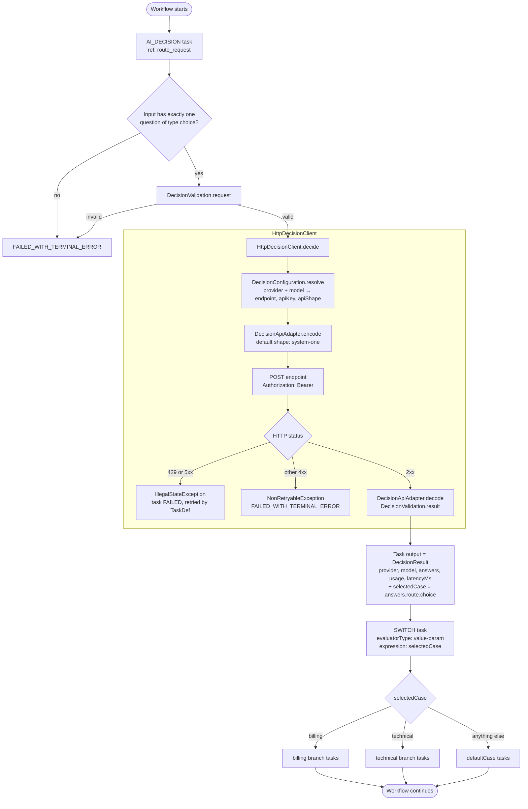
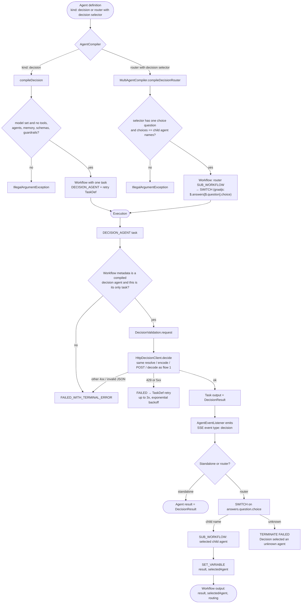

# Decision flows

Two ways to use a decision. Both call the same `HttpDecisionClient`, which
resolves provider, endpoint, API key, and API shape from `conductor.ai.decision`
configuration and never returns credentials to the workflow.

## 1. Deterministic workflow: `AI_DECISION` + `SWITCH`

You author a normal workflow definition. The `AI_DECISION` system task asks one
`choice` question and writes `selectedCase` to its output. A plain `SWITCH` task
routes on that value. No server-side rewriting of the definition happens.

```json
{
  "name": "route_request",
  "taskReferenceName": "route_request",
  "type": "AI_DECISION",
  "inputParameters": {
    "model": "jev-1.13",
    "state": "${workflow.input.request}",
    "questions": {
      "route": {
        "type": "choice",
        "instructions": "Choose the team best suited to handle this request.",
        "choices": {
          "billing": "Payments, invoices, refunds, or subscriptions.",
          "technical": "Errors, outages, or product troubleshooting."
        }
      }
    }
  }
},
{
  "name": "dispatch",
  "taskReferenceName": "dispatch",
  "type": "SWITCH",
  "evaluatorType": "value-param",
  "expression": "selectedCase",
  "inputParameters": { "selectedCase": "${route_request.output.selectedCase}" },
  "decisionCases": {
    "billing":   [ /* your tasks */ ],
    "technical": [ /* your tasks */ ]
  },
  "defaultCase": [ /* your fallback */ ]
}
```



## 2. Agent way: `kind: "decision"` and the decision router

### 2a. Standalone decision agent

An agent definition with `kind: "decision"` compiles (`AgentCompiler.compileDecision`)
to a one-task workflow containing a `DECISION_AGENT` system task with a retry
`TaskDef` (3 retries, exponential backoff). `DecisionAgentTask` refuses to run
unless the workflow metadata is a compiled decision agent, so it cannot be dropped
into a hand-written workflow. The result is the full `DecisionResult`, and the
`AgentEventListener` emits a `decision` SSE event.

### 2b. Decision router (parent agent with a decision selector)

A parent agent whose selector is a `kind: "decision"` agent with one `choice`
question whose choice names exactly equal the child agent names compiles
(`MultiAgentCompiler.compileDecisionRouter`) to: router sub-agent → `SWITCH` →
selected child sub-agent → `SET_VARIABLE`.



## Side by side

| | Deterministic (`AI_DECISION`) | Agent (`DECISION_AGENT`) |
| --- | --- | --- |
| Authored as | Task in a workflow definition | Agent definition, `kind: decision` |
| Questions | Exactly one `choice` question | Any number of `choice`, `score`, `boolean` |
| Routing | You write the `SWITCH` on `selectedCase` | Router compiler writes the `SWITCH` for you |
| Branches | Any tasks | Child agents, one per choice name |
| Retry | Whatever the task's `TaskDef` says | 3 retries, exponential backoff, built in |
| Result | `DecisionResult` + `selectedCase` | `DecisionResult` (standalone) or `result`, `selectedAgent`, `routing` (router) |
| Events | None | `decision` SSE event |
