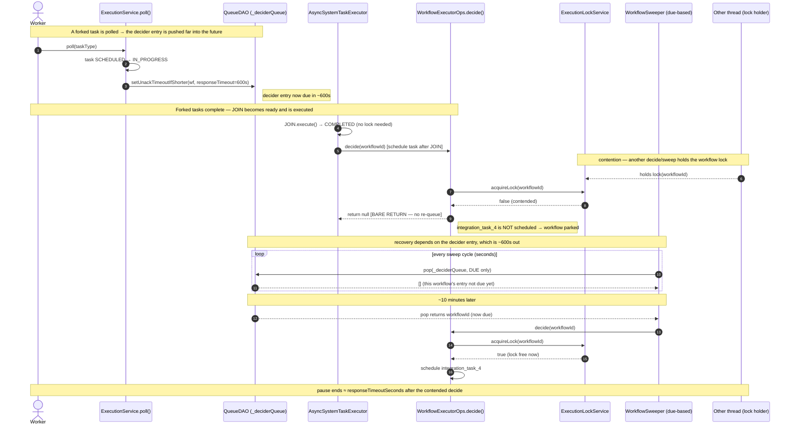
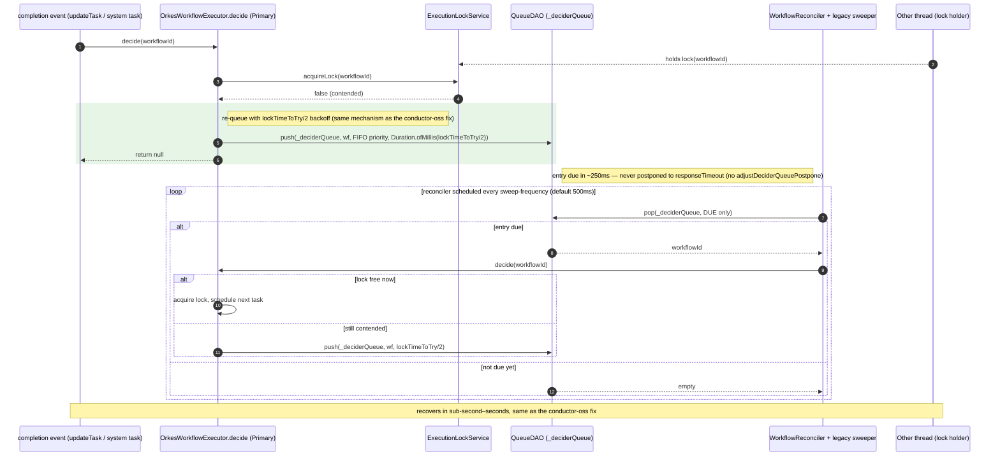

# Lock-contention pause at JOIN boundaries, and the `decide()` re-queue fix

**Repo:** `/home/nicholascole/IdeaProjects/conductor` (conductor-oss)
**PR:** conductor-oss/conductor#1259
**Branch:** `feature/fix_lock_contention_wait_issue`

## Context

On Conductor 3.30.2 (Redis queue + distributed workflow-execution lock), dynamic FORK/JOIN
workflows intermittently stall for a multi-minute pause per run. The pause length matches the task
definitions' `responseTimeoutSeconds` (e.g. 600s → ~10 minutes).

The pause is the product of three pieces that only line up on the *current* conductor-oss engine:

1. **`ExecutionService.poll()`** postpones the workflow's decider-queue entry out to
   `responseTimeoutSeconds` every time a worker polls a task
   (`adjustDeciderQueuePostpone()` → `queueDAO.setUnackTimeoutIfShorter(DECIDER_QUEUE, wf, responseTimeoutSeconds*1000)`).
2. **`WorkflowExecutorOps.decide(String)`** returns `null` on a workflow-lock miss with **no
   re-queue**. Its completion-event callers — `updateTask()` and `AsyncSystemTaskExecutor` (the
   JOIN-completion path) — ignore that `null`, so the next task is never scheduled.
3. The **new `WorkflowSweeper`** (`org.conductoross...WorkflowSweeper`) only sweeps entries that are
   **due**. The parked workflow's entry isn't due for `responseTimeoutSeconds`, so the sweeper never
   runs on it during the pause window.

Net: when the post-JOIN `decide()` loses the lock (transient contention), the workflow parks on its
far-future decider entry and nothing re-evaluates it until `responseTimeoutSeconds` elapses.

Key participants / source anchors (links pinned to the commits below):

| Component | Source (conductor-oss @ `bb5c3da2a`) |
|---|---|
| `poll()` → `adjustDeciderQueuePostpone()` | [`ExecutionService.java#L190`, `#L255-L272`](https://github.com/conductor-oss/conductor/blob/bb5c3da2a1ac3cdedaa1c8ac1c0709228a2fa217/core/src/main/java/com/netflix/conductor/service/ExecutionService.java#L255-L272) |
| `decide(String)` (lock acquire → re-queue → null) | [`WorkflowExecutorOps.java#L1209-L1223`](https://github.com/conductor-oss/conductor/blob/bb5c3da2a1ac3cdedaa1c8ac1c0709228a2fa217/core/src/main/java/com/netflix/conductor/core/execution/WorkflowExecutorOps.java#L1209-L1223) |
| JOIN completion → `decide()` | [`AsyncSystemTaskExecutor.java`](https://github.com/conductor-oss/conductor/blob/bb5c3da2a1ac3cdedaa1c8ac1c0709228a2fa217/core/src/main/java/com/netflix/conductor/core/execution/AsyncSystemTaskExecutor.java) |
| due-based sweep loop (picks up the re-queued entry) | [`WorkflowSweeper.java#L171-L180`](https://github.com/conductor-oss/conductor/blob/bb5c3da2a1ac3cdedaa1c8ac1c0709228a2fa217/core/src/main/java/org/conductoross/conductor/core/execution/WorkflowSweeper.java#L171-L180) |
| workflow lock | [`ExecutionLockService.java`](https://github.com/conductor-oss/conductor/blob/bb5c3da2a1ac3cdedaa1c8ac1c0709228a2fa217/core/src/main/java/com/netflix/conductor/service/ExecutionLockService.java) |

**Pinned commits** (so the line numbers/links stay valid):
- conductor-oss: `bb5c3da2a1ac3cdedaa1c8ac1c0709228a2fa217` (branch `feature/fix_lock_contention_wait_issue`)
- orkes-conductor: `69b19299a6c888f0a3d8f0c13e6cd0b952caeb6d` (branch `feat/runtime-metadata-secret-resolution`) — private repo

Relevant config: `responseTimeoutSeconds` (per task def, e.g. 600s), `lockTimeToTry` (default 500ms),
`lockLeaseTime` (default 60s), `workflowOffsetTimeout`.

---

## Diagram 1 — The bug: JOIN completion under lock contention parks the workflow



**Why it stalls:** step 10's `return null` is the lost wake-up. The sweeper (steps 11–13) cannot
help because the entry set in step 3 isn't due for ~600s — the sweeper only pops **due** messages.

---

## Diagram 2 — The fix: `decide()` re-queues on the lock miss → prompt recovery

```mermaid
sequenceDiagram
    autonumber
    actor W as Worker
    participant ES as ExecutionService.poll()
    participant Q as QueueDAO (_deciderQueue)
    participant AST as AsyncSystemTaskExecutor
    participant WE as WorkflowExecutorOps.decide()
    participant L as ExecutionLockService
    participant SW as WorkflowSweeper (due-based)
    participant X as Other thread (lock holder)

    Note over W,Q: same setup — polling pushes the decider entry to responseTimeout
    W->>ES: poll(taskType)
    ES->>Q: setUnackTimeoutIfShorter(wf, responseTimeout=600s)

    AST->>AST: JOIN.execute() → COMPLETED
    AST->>WE: decide(workflowId)
    X-->>L: holds lock(workflowId)
    WE->>L: acquireLock(workflowId)
    L-->>WE: false (contended)

    rect rgb(230, 245, 230)
        Note right of WE: FIX — re-queue before returning null
        WE->>Q: push(_deciderQueue, wf, offset = lockTimeToTry/2 ~= 250ms)
        WE-->>AST: return null
    end
    Note right of Q: decider entry now due in ~250ms (not 600s)

    Note over SW,Q: the entry is now due in ~250ms; the sweeper pops it once due
    X-->>L: releaseLock(workflowId)
    Q-->>SW: pop returns workflowId (due)
    SW->>L: sweep() acquireLock(workflowId)
    L-->>SW: true (lock free now)
    SW->>WE: decide(workflowId) [reentrant — sweeper already holds the lock]
    WE->>WE: schedule integration_task_4
    Note over W,X: recovery in sub-second–seconds, independent of responseTimeoutSeconds
```

The single re-queue lives in `decide(String)`, so it covers every completion-event caller —
`updateTask` and `AsyncSystemTaskExecutor`. Contention is transient (millisecond-scale), so by the
time the re-queued entry is due (~`lockTimeToTry/2` later) the lock is free; the sweeper then acquires
it and the nested `decide()` runs reentrantly. No change to `WorkflowSweeper` is required.

> Note: `decide()` called *from the sweeper* never hits the lock-miss branch — `sweep()` already
> holds the workflow lock at its top level and the lock is reentrant, so the nested `decide()`
> re-acquire always succeeds. The re-queue therefore only ever fires from the completion-event
> callers, which is exactly the path that was losing the wake-up.

---

## The fix, precisely

**The fix** — `WorkflowExecutorOps.decide(String)`, on a lock miss, re-queues with a
**contention-scale** backoff (`lockTimeToTry/2`, floor 100ms) before returning `null`
([`WorkflowExecutorOps.java#L1213-L1223`](https://github.com/conductor-oss/conductor/blob/bb5c3da2a1ac3cdedaa1c8ac1c0709228a2fa217/core/src/main/java/com/netflix/conductor/core/execution/WorkflowExecutorOps.java#L1213-L1223)):

```java
// core/.../execution/WorkflowExecutorOps.java  (decide(String), lines 1213-1223)
if (!lockAcquired) {
    // Lock contention is transient (millisecond-scale). Re-queue the workflow for a prompt
    // retry ... does not silently fall back to the workflow's decider-queue entry, which a
    // polled task postpones out to responseTimeoutSeconds (the multi-minute pause). Backoff is
    // lockTimeToTry-scale, not lockLeaseTime-scale (the latter is only for an orphaned lock).
    long backoffMillis = Math.max(properties.getLockTimeToTry().toMillis() / 2, 100);
    queueDAO.push(DECIDER_QUEUE, workflowId, 0, Duration.ofMillis(backoffMillis));
    return null;
}
```

Backoff is `lockTimeToTry`-scale (contention is a millisecond event), **not** `lockLeaseTime`-scale.
The Redis queue's `push(..., Duration)` overload preserves sub-second offsets.

**The postpone that creates the long park** — `ExecutionService.adjustDeciderQueuePostpone()`, called
from `poll()`, pushes the decider entry out to `responseTimeoutSeconds`
([`ExecutionService.java#L255-L267`](https://github.com/conductor-oss/conductor/blob/bb5c3da2a1ac3cdedaa1c8ac1c0709228a2fa217/core/src/main/java/com/netflix/conductor/service/ExecutionService.java#L255-L267)):

```java
// core/.../service/ExecutionService.java  (lines 255-267; called from poll() at L190)
private void adjustDeciderQueuePostpone(TaskModel taskModel, TaskDef taskDef) {
    long responseTimeoutSeconds =
            (taskDef != null && taskDef.getResponseTimeoutSeconds() != 0)
                    ? taskDef.getResponseTimeoutSeconds()
                    : taskModel.getResponseTimeoutSeconds();
    if (responseTimeoutSeconds == 0) return;
    queueDAO.setUnackTimeoutIfShorter(
            Utils.DECIDER_QUEUE, taskModel.getWorkflowInstanceId(), responseTimeoutSeconds * 1000);
}
```

**`WorkflowSweeper` is unchanged.** The sweeper already pops **due** decider entries and calls
`decide(String)`; once `decide()` re-queues the workflow at a short offset, the existing sweeper
picks it up as soon as it is due. No sweeper-side change is needed for the reported bug, so this PR
touches only `WorkflowExecutorOps.decide(String)`. (An earlier draft added a `sweep()`-side re-queue
as a backstop; it was dropped after the end-to-end test confirmed recovery is driven entirely by the
`decide()` re-queue — see Verification.)

## Why orkes-conductor was never affected (comparison)

orkes-conductor already does **exactly this fix**, and has for a long time — just in its own
executor. Its active `WorkflowExecutor` bean is `OrkesWorkflowExecutor` (`@Component @Primary`, which
overrides `oss-core`'s `WorkflowExecutorOps`), and its `decide(String)` re-queues on a lock miss with
the **same `lockTimeToTry/2` backoff** this PR adds to conductor-oss.

> Correction to an earlier draft of this doc: the `oss-core` `WorkflowExecutorOps.decide()` bare
> `return null` is real, but it is **not on the runtime path** in orkes — `@Primary`
> `OrkesWorkflowExecutor` replaces it. The executor orkes actually runs re-queues.

### Diagram 3 — orkes-conductor: the active executor re-queues on the lock miss (mirrors Diagram 2)



**The active executor's re-queue** — `OrkesWorkflowExecutor.decide(String)`, `@Primary`
([`OrkesWorkflowExecutor.java#L756-L762` @ `8c963075`](https://github.com/orkes-io/orkes-conductor/blob/8c963075a04aff9f75481e39ceef7536791f9c56/server/src/main/java/com/netflix/conductor/core/execution/OrkesWorkflowExecutor.java#L756-L762)):

```java
// orkes-conductor  server/.../execution/OrkesWorkflowExecutor.java  (@Primary; L756-762 @ 8c963075)
if (!executionLockService.acquireLock(workflowId)) {
    // Let's try again... with the lockTime timeout / 2
    int backoff = (int) (properties.getLockTimeToTry().toMillis() / 2);
    log.debug("can't get a lock on {}, will try after {} ms with priority: {}",
            workflowId, backoff, getWorkflowFIFOPriority(workflowId, 0));
    queueDAO.push(DECIDER_QUEUE, workflowId, getWorkflowFIFOPriority(workflowId, 0), Duration.ofMillis(backoff));
    return null;
}
```

This is the conductor-oss fix, essentially one-to-one:

| | conductor-oss fix (`WorkflowExecutorOps.decide()`) | orkes `OrkesWorkflowExecutor.decide()` (`@Primary`) |
|---|---|---|
| re-queue on lock miss | yes | yes |
| backoff | `lockTimeToTry/2` (floor 100ms) | `lockTimeToTry/2` |
| queue offset | `Duration.ofMillis(...)` | `Duration.ofMillis(...)` |
| priority arg | `0` | `getWorkflowFIFOPriority(workflowId, 0)` |

**Secondary reasons orkes never parked long** (defense in depth; both verified by grep at `69b19299`):
- No `adjustDeciderQueuePostpone` / `setUnackTimeoutIfShorter(responseTimeout)` — the decider entry is
  never pushed out to `responseTimeout` in the first place.
- The legacy `WorkflowSweeper.sweep()` also unconditionally re-queues at a flat `workflowOffsetTimeout`
  (~30s) on every sweep
  ([`oss-core/.../reconciliation/WorkflowSweeper.java#L66-L97`](https://github.com/orkes-io/orkes-conductor/blob/69b19299a6c888f0a3d8f0c13e6cd0b952caeb6d/oss-core/src/main/java/com/netflix/conductor/core/reconciliation/WorkflowSweeper.java#L66-L97)).

**Conclusion:** orkes was never exposed because its `@Primary` executor already re-queues on the
decide lock-miss — the very behavior this PR ports into conductor-oss's `WorkflowExecutorOps`. The
conductor-oss bug arose only because its executor had a bare `return null` **and** the newer engine
stopped unconditionally re-queuing in the sweeper while `adjustDeciderQueuePostpone` pushed the entry
out to `responseTimeout`.

## Verification

- [`TestWorkflowExecutor.testDecideReQueuesWorkflowOnLockMiss`](https://github.com/conductor-oss/conductor/blob/bb5c3da2a1ac3cdedaa1c8ac1c0709228a2fa217/core/src/test/java/com/netflix/conductor/core/execution/TestWorkflowExecutor.java)
  — unit: `decide()` lock miss pushes to `_deciderQueue` at the short backoff and returns null (fails
  against the old bare return).
- [`DynamicForkJoinLockContentionSpec`](https://github.com/conductor-oss/conductor/blob/bb5c3da2a1ac3cdedaa1c8ac1c0709228a2fa217/test-harness/src/test/groovy/com/netflix/conductor/test/integration/DynamicForkJoinLockContentionSpec.groovy)
  — e2e: real dynamic fork/join driven to the JOIN boundary, workflow lock held from a foreign
  thread, JOIN run (post-completion decide misses the lock), lock released, then asserts
  `integration_task_4` is scheduled within seconds **via the real background sweeper** (no manual
  sweep). Times out without the fix; the no-contention control passes either way.
- **Sweeper left unchanged, verified sufficient:** `DynamicForkJoinLockContentionSpec` was also run
  with the `decide(String)` re-queue in place but `WorkflowSweeper` reverted to its pre-PR form —
  both cases still pass. This confirms recovery is driven entirely by the `decide()` re-queue and the
  existing due-based sweeper, so no sweeper-side change is included in this PR.
