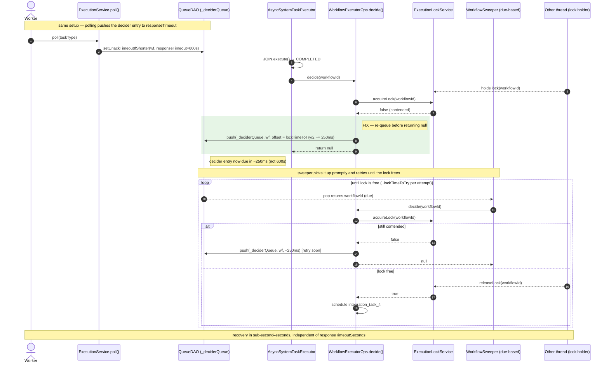

# Lock-contention pause at JOIN boundaries, and the `decide()` re-queue fix

**Repo:** `/home/nicholascole/IdeaProjects/conductor` (conductor-oss)
**PR:** conductor-oss/conductor#1259
**Branch:** `feature/fix_lock_contention_wait_issue`

## Context

On Conductor 3.30.2 (Redis queue + distributed workflow-execution lock), dynamic FORK/JOIN
workflows intermittently stall for a multi-minute pause per run. The pause length matches the task
definitions' `responseTimeoutSeconds` (e.g. 600s → ~10 minutes).

The pause is the product of three pieces that only line up on the *current* conductor-oss engine:

1. **`ExecutionService.poll()`** postpones the workflow's decider-queue entry out to
   `responseTimeoutSeconds` every time a worker polls a task
   (`adjustDeciderQueuePostpone()` → `queueDAO.setUnackTimeoutIfShorter(DECIDER_QUEUE, wf, responseTimeoutSeconds*1000)`).
2. **`WorkflowExecutorOps.decide(String)`** returns `null` on a workflow-lock miss with **no
   re-queue**. Its completion-event callers — `updateTask()` and `AsyncSystemTaskExecutor` (the
   JOIN-completion path) — ignore that `null`, so the next task is never scheduled.
3. The **new `WorkflowSweeper`** (`org.conductoross...WorkflowSweeper`) only sweeps entries that are
   **due**. The parked workflow's entry isn't due for `responseTimeoutSeconds`, so the sweeper never
   runs on it during the pause window.

Net: when the post-JOIN `decide()` loses the lock (transient contention), the workflow parks on its
far-future decider entry and nothing re-evaluates it until `responseTimeoutSeconds` elapses.

Key participants / source anchors (links pinned to the commits below):

| Component | Source (conductor-oss @ `bb5c3da2a`) |
|---|---|
| `poll()` → `adjustDeciderQueuePostpone()` | [`ExecutionService.java#L190`, `#L255-L272`](https://github.com/conductor-oss/conductor/blob/bb5c3da2a1ac3cdedaa1c8ac1c0709228a2fa217/core/src/main/java/com/netflix/conductor/service/ExecutionService.java#L255-L272) |
| `decide(String)` (lock acquire → re-queue → null) | [`WorkflowExecutorOps.java#L1209-L1223`](https://github.com/conductor-oss/conductor/blob/bb5c3da2a1ac3cdedaa1c8ac1c0709228a2fa217/core/src/main/java/com/netflix/conductor/core/execution/WorkflowExecutorOps.java#L1209-L1223) |
| JOIN completion → `decide()` | [`AsyncSystemTaskExecutor.java`](https://github.com/conductor-oss/conductor/blob/bb5c3da2a1ac3cdedaa1c8ac1c0709228a2fa217/core/src/main/java/com/netflix/conductor/core/execution/AsyncSystemTaskExecutor.java) |
| due-based sweep loop + backstop | [`WorkflowSweeper.java#L171-L180`](https://github.com/conductor-oss/conductor/blob/bb5c3da2a1ac3cdedaa1c8ac1c0709228a2fa217/core/src/main/java/org/conductoross/conductor/core/execution/WorkflowSweeper.java#L171-L180) |
| workflow lock | [`ExecutionLockService.java`](https://github.com/conductor-oss/conductor/blob/bb5c3da2a1ac3cdedaa1c8ac1c0709228a2fa217/core/src/main/java/com/netflix/conductor/service/ExecutionLockService.java) |

**Pinned commits** (so the line numbers/links stay valid):
- conductor-oss: `bb5c3da2a1ac3cdedaa1c8ac1c0709228a2fa217` (branch `feature/fix_lock_contention_wait_issue`)
- orkes-conductor: `69b19299a6c888f0a3d8f0c13e6cd0b952caeb6d` (branch `feat/runtime-metadata-secret-resolution`) — private repo

Relevant config: `responseTimeoutSeconds` (per task def, e.g. 600s), `lockTimeToTry` (default 500ms),
`lockLeaseTime` (default 60s), `workflowOffsetTimeout`.

---

## Diagram 1 — The bug: JOIN completion under lock contention parks the workflow

```mermaid
sequenceDiagram
    autonumber
    actor W as Worker
    participant ES as ExecutionService.poll()
    participant Q as QueueDAO (_deciderQueue)
    participant AST as AsyncSystemTaskExecutor
    participant WE as WorkflowExecutorOps.decide()
    participant L as ExecutionLockService
    participant SW as WorkflowSweeper (due-based)
    participant X as Other thread (lock holder)

    Note over W,Q: A forked task is polled → the decider entry is pushed far into the future
    W->>ES: poll(taskType)
    ES->>ES: task SCHEDULED → IN_PROGRESS
    ES->>Q: setUnackTimeoutIfShorter(wf, responseTimeout=600s)
    Note right of Q: decider entry now due in ~600s

    Note over W,WE: Forked tasks complete; JOIN becomes ready and is executed
    AST->>AST: JOIN.execute() → COMPLETED (no lock needed)
    AST->>WE: decide(workflowId) [schedule task after JOIN]

    Note over X,L: contention — another decide/sweep holds the workflow lock
    X-->>L: holds lock(workflowId)
    WE->>L: acquireLock(workflowId)
    L-->>WE: false (contended)
    WE-->>AST: return null [BARE RETURN — no re-queue]
    Note right of WE: integration_task_4 is NOT scheduled → workflow parked

    Note over SW,Q: recovery depends on the decider entry, which is ~600s out
    loop every sweep cycle (seconds)
        SW->>Q: pop(_deciderQueue, DUE only)
        Q-->>SW: [] (this workflow's entry not due yet)
    end

    Note over Q,SW: ~10 minutes later
    Q-->>SW: pop returns workflowId (now due)
    SW->>WE: decide(workflowId)
    WE->>L: acquireLock(workflowId)
    L-->>WE: true (lock free now)
    WE->>WE: schedule integration_task_4
    Note over W,X: pause ends ≈ responseTimeoutSeconds after the contended decide
```

**Why it stalls:** step 10's `return null` is the lost wake-up. The sweeper (steps 11–13) cannot
help because the entry set in step 3 isn't due for ~600s — the sweeper only pops **due** messages.

---

## Diagram 2 — The fix: `decide()` re-queues on the lock miss → prompt recovery



**Backstop:** `WorkflowSweeper.sweep()` also re-queues (same short backoff) if it can't acquire the
lock at its own top level, instead of bare-returning. The primary re-queue lives in `decide()` so it
covers every caller — `updateTask`, `AsyncSystemTaskExecutor`, and the sweeper.

---

## The fix, precisely

**The fix** — `WorkflowExecutorOps.decide(String)`, on a lock miss, re-queues with a
**contention-scale** backoff (`lockTimeToTry/2`, floor 100ms) before returning `null`
([`WorkflowExecutorOps.java#L1213-L1223`](https://github.com/conductor-oss/conductor/blob/bb5c3da2a1ac3cdedaa1c8ac1c0709228a2fa217/core/src/main/java/com/netflix/conductor/core/execution/WorkflowExecutorOps.java#L1213-L1223)):

```java
// core/.../execution/WorkflowExecutorOps.java  (decide(String), lines 1213-1223)
if (!lockAcquired) {
    // Lock contention is transient (millisecond-scale). Re-queue the workflow for a prompt
    // retry ... does not silently fall back to the workflow's decider-queue entry, which a
    // polled task postpones out to responseTimeoutSeconds (the multi-minute pause). Backoff is
    // lockTimeToTry-scale, not lockLeaseTime-scale (the latter is only for an orphaned lock).
    long backoffMillis = Math.max(properties.getLockTimeToTry().toMillis() / 2, 100);
    queueDAO.push(DECIDER_QUEUE, workflowId, 0, Duration.ofMillis(backoffMillis));
    return null;
}
```

Backoff is `lockTimeToTry`-scale (contention is a millisecond event), **not** `lockLeaseTime`-scale.
The Redis queue's `push(..., Duration)` overload preserves sub-second offsets.

**The postpone that creates the long park** — `ExecutionService.adjustDeciderQueuePostpone()`, called
from `poll()`, pushes the decider entry out to `responseTimeoutSeconds`
([`ExecutionService.java#L255-L267`](https://github.com/conductor-oss/conductor/blob/bb5c3da2a1ac3cdedaa1c8ac1c0709228a2fa217/core/src/main/java/com/netflix/conductor/service/ExecutionService.java#L255-L267)):

```java
// core/.../service/ExecutionService.java  (lines 255-267; called from poll() at L190)
private void adjustDeciderQueuePostpone(TaskModel taskModel, TaskDef taskDef) {
    long responseTimeoutSeconds =
            (taskDef != null && taskDef.getResponseTimeoutSeconds() != 0)
                    ? taskDef.getResponseTimeoutSeconds()
                    : taskModel.getResponseTimeoutSeconds();
    if (responseTimeoutSeconds == 0) return;
    queueDAO.setUnackTimeoutIfShorter(
            Utils.DECIDER_QUEUE, taskModel.getWorkflowInstanceId(), responseTimeoutSeconds * 1000);
}
```

**The sweeper backstop** — `WorkflowSweeper.sweep()` re-queues (same short backoff) on its own
top-level lock miss instead of bare-returning
([`WorkflowSweeper.java#L171-L180`](https://github.com/conductor-oss/conductor/blob/bb5c3da2a1ac3cdedaa1c8ac1c0709228a2fa217/core/src/main/java/org/conductoross/conductor/core/execution/WorkflowSweeper.java#L171-L180)):

```java
// core/.../org/conductoross/.../WorkflowSweeper.java  (lines 171-180)
public void sweep(String workflowId) {
    if (!executionLockService.acquireLock(workflowId)) {
        log.error("Couldn't acquire lock to sweep workflow {}", workflowId);
        queueDAO.push(DECIDER_QUEUE, workflowId, 0, lockContentionBackoff());
        return;
    }
```

## Why orkes-conductor was never affected (comparison)

`orkes-conductor/oss-core` is an **older engine snapshot**. Three concrete differences mean the park
never forms there. (Links pinned to orkes-conductor `69b19299` — private repo.)

**(1) `decide()` has the *same* bare `return null`** — orkes did **not** fix it here either
([`oss-core/.../WorkflowExecutorOps.java#L1037-L1042`](https://github.com/orkes-io/orkes-conductor/blob/69b19299a6c888f0a3d8f0c13e6cd0b952caeb6d/oss-core/src/main/java/com/netflix/conductor/core/execution/WorkflowExecutorOps.java#L1037-L1042)):

```java
// orkes-conductor  oss-core/.../execution/WorkflowExecutorOps.java  (lines 1037-1042)
public WorkflowModel decide(String workflowId) {
    StopWatch watch = new StopWatch();
    watch.start();
    if (!executionLockService.acquireLock(workflowId)) {
        return null;                 // identical to conductor-oss *before* the fix
    }
```

**(2) The legacy sweeper unconditionally re-queues at a flat `workflowOffsetTimeout` (~30s)** — on
every sweep it falls through to `setUnackTimeout`, so a lock-missed (`null`) decide is still retried
within ~30s
([`oss-core/.../reconciliation/WorkflowSweeper.java#L66-L97`](https://github.com/orkes-io/orkes-conductor/blob/69b19299a6c888f0a3d8f0c13e6cd0b952caeb6d/oss-core/src/main/java/com/netflix/conductor/core/reconciliation/WorkflowSweeper.java#L66-L97)):

```java
// orkes-conductor  oss-core/.../reconciliation/WorkflowSweeper.java  (lines 66-97, abridged)
public void sweep(String workflowId) {
    try {
        ...
        WorkflowModel workflow = workflowExecutor.decide(workflowId);   // null on lock miss
        if (workflow != null && workflow.getStatus().isTerminal()) {
            queueDAO.remove(DECIDER_QUEUE, workflowId);
            return;
        }
    } catch (ApplicationException e) { if (NOT_FOUND) { remove; return; } }
      catch (Exception e) { ... }
    // fall-through: ALWAYS re-queue, even after a decide() lock-miss (null)
    queueDAO.setUnackTimeout(
            DECIDER_QUEUE, workflowId, properties.getWorkflowOffsetTimeout().toMillis());
}
```

**(3) It lacks the two newer conductor-oss additions entirely** (verified by grep in `oss-core/src/main`, orkes `69b19299`):

| Symbol | conductor-oss (`bb5c3da2a`) | orkes `oss-core` (`69b19299`) |
|---|---|---|
| `adjustDeciderQueuePostpone` / `setUnackTimeoutIfShorter(responseTimeout)` | present — parks entry at 600s | **absent** — entry never pushed past `workflowOffsetTimeout` |
| `AsyncSystemTaskExecutor` (JOIN-completion `decide()` caller) | present | **absent** |
| sweeper re-sweep interval | due-based; `responseTimeout` on active tasks | flat `workflowOffsetTimeout` (~30s) |

**Conclusion:** the bug needs the due-based sweeper **and** the `responseTimeout` postpone to line up,
which only happens on the newer conductor-oss engine. orkes' older `oss-core` recovers a contended
workflow within `workflowOffsetTimeout` (~30s) regardless, so it never exhibits the ~10-minute pause.
If/when orkes adopts the newer engine, it will inherit this bug and need the same `decide()` re-queue.

## Verification

- [`TestWorkflowExecutor.testDecideReQueuesWorkflowOnLockMiss`](https://github.com/conductor-oss/conductor/blob/bb5c3da2a1ac3cdedaa1c8ac1c0709228a2fa217/core/src/test/java/com/netflix/conductor/core/execution/TestWorkflowExecutor.java)
  — unit: `decide()` lock miss pushes to `_deciderQueue` at the short backoff and returns null (fails
  against the old bare return).
- [`DynamicForkJoinLockContentionSpec`](https://github.com/conductor-oss/conductor/blob/bb5c3da2a1ac3cdedaa1c8ac1c0709228a2fa217/test-harness/src/test/groovy/com/netflix/conductor/test/integration/DynamicForkJoinLockContentionSpec.groovy)
  — e2e: real dynamic fork/join driven to the JOIN boundary, workflow lock held from a foreign
  thread, JOIN run (post-completion decide misses the lock), lock released, then asserts
  `integration_task_4` is scheduled within seconds **via the real background sweeper** (no manual
  sweep). Times out without the fix; the no-contention control passes either way.
