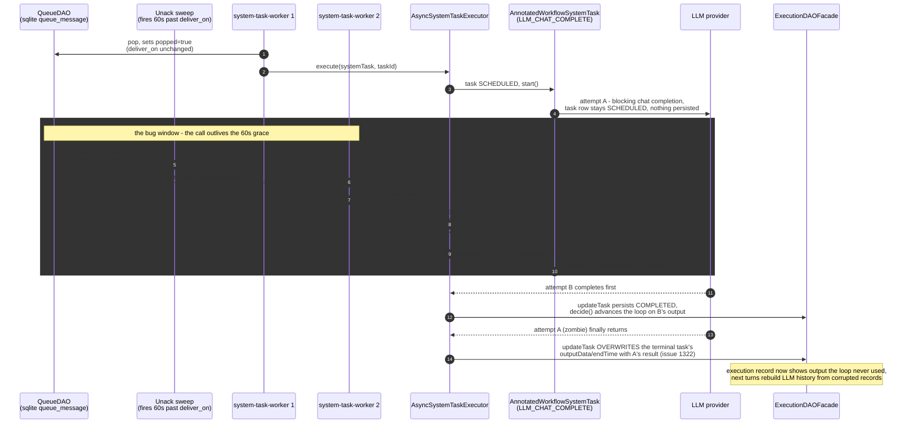
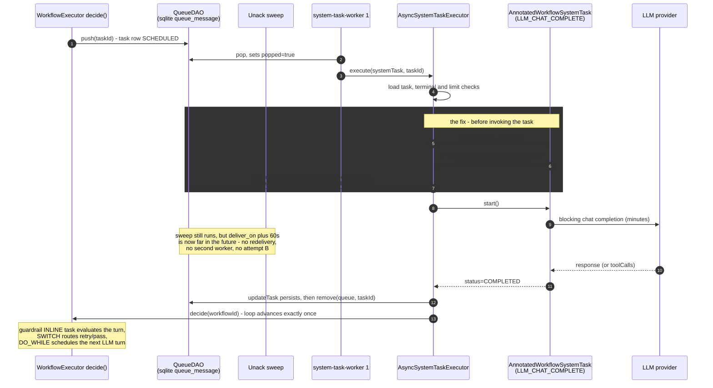

# AgentSpan chat turn — async system task execution sequence

How one LLM turn of an agentspan-compiled agent workflow actually executes, and
where the fixes for [#1321](https://github.com/conductor-oss/conductor/issues/1321)
(duplicate LLM execution), [#1322](https://github.com/conductor-oss/conductor/issues/1322)
(zombie overwrite of terminal tasks), and [#1323](https://github.com/conductor-oss/conductor/issues/1323)
(output guardrail misfiring on tool-call turns) sit in that sequence.

Derived from source at `feature/fix_functional_ubgs`:

| Step | Source |
|---|---|
| Queue poll loop | `core/.../core/execution/tasks/SystemTaskWorker.java:94-148` |
| Async system task execution | `core/.../core/execution/AsyncSystemTaskExecutor.java:69-222` |
| Execution-lease hook | `core/.../core/execution/tasks/WorkflowSystemTask.java` (`getExecutionLease`), honored by `AsyncSystemTaskExecutor.extendLease` before `start()`/`execute()` |
| Annotated task invocation + lease declaration | `core/.../core/execution/tasks/annotated/AnnotatedWorkflowSystemTask.java` (`getExecutionLease` returns `responseTimeoutSeconds`) |
| LLM worker | `ai/.../ai/tasks/worker/LLMWorkers.java:126` (`@WorkerTask("LLM_CHAT_COMPLETE")`) |
| Queue lease / redelivery sweep | `sqlite-persistence/.../sqlite/dao/SqliteQueueDAO.java:200` (`setUnackTimeout`), `:309` and `:376-378` (unack sweep, hardcoded `+60 seconds` grace) |
| Embedded task def on compiled LLM task | `agentspan/.../runtime/compiler/AgentCompiler.java:1545-1551` |
| Ad-hoc task def fallback | `core/.../core/metadata/MetadataMapperService.java:120-134` |
| Guardrail compilation | `agentspan/.../runtime/compiler/GuardrailCompiler.java`, `agentspan/.../runtime/util/JavaScriptBuilder.java` |

## Vanilla state — why one LLM turn executes twice (#1321, then #1322)

The engine's implicit contract is that `start()` returns quickly; nothing is
persisted between pop and the first `updateTask`. The sqlite sweep re-flags any
popped message older than `deliver_on + 60s` (`SqliteQueueDAO.java:309`,
`:376-378`) — and `pop` does not move `deliver_on` — so any blocking call
longer than ~60s is redelivered mid-flight:

## With the fix — the task declares an execution lease, the executor extends it

`WorkflowSystemTask.getExecutionLease(task)` (default `Optional.empty()`) lets a
system task that blocks declare how long its invocation may legally run.
`AsyncSystemTaskExecutor.extendLease` honors it with one `setUnackTimeout` call
just before invoking the task. `AnnotatedWorkflowSystemTask` returns the task
def's `responseTimeoutSeconds`; `HttpTask` returns its configured
`connectionTimeOut + readTimeOut` when that exceeds 20s. Tasks that declare no
lease take the empty path: no queue write, behavior identical to vanilla.

The trade-off encoded here: a JVM crash mid-call now delays redelivery by up to
the declared lease instead of ~60s — accepted only for tasks that opt in, where
a duplicate is more expensive than a slow retry (paid LLM generations,
long-timeout HTTP calls).

## Not a sqlite quirk — every queue backend redelivers

The diagrams above show sqlite, but the pop-lease-redeliver model (and therefore
the bug and the fix) is common to all four `QueueDAO` implementations. Redis has
the tightest window:

| Backend | Redelivery mechanism | Window after pop |
|---|---|---|
| sqlite | sweep re-flags `popped=true` messages past `deliver_on` (`SqliteQueueDAO.java:309`, `:376`) | ~60s (hardcoded) |
| Postgres | same sweep, `deliver_on + 60 seconds` (`PostgresQueueDAO.java:326`) | ~60s (hardcoded) |
| MySQL | same sweep, `TIMESTAMPADD(SECOND,-60,...)` (`MySQLQueueDAO.java:262`) | ~60s (hardcoded) |
| Redis (`orkes-conductor-queues`) | pop re-scores the message to `now + queueUnackTime` in the sorted set; expired unacked messages become poppable again | 30s (`QueueMonitor.queueUnackTime`) |

`setUnackTimeout` is implemented by all four (the SQL stores push `deliver_on`
forward; Redis re-scores to `now + lease`), so the executor's single lease
write protects the blocking call uniformly. On Redis, any blocking `start()`
over 30s duplicates without the fix — which is why `HttpTask`'s lease
threshold sits at 20s, safely below the tightest window.

**#1322 in this branch:** `ExecutionDAOFacade.updateTask` intentionally stays
last-write-wins (see `ExecutionDAOFacadeTest.java:431-483`): legitimate engine
flows update terminal tasks (`FAILED → COMPLETED_WITH_ERRORS`, sub-workflow
retry syncing the parent task, rerun resetting a terminal task to `SCHEDULED`).
The overwrite is prevented only by fixing its root cause (#1321) — there is no
defense-in-depth guard.

## #1323 in the same turn (tool-call turns vs the output guardrail)

On a tool-call turn, `${llm.output.result}` is `[]`, so a `require_nonempty_reply`
regex guardrail failed and injected a "write your final answer now" nag while the
model was legally mid-tool-use. The fix binds
`toolCalls: ${<agent>_llm.output.toolCalls}` into the guardrail INLINE task
(`GuardrailCompiler.java`, `deriveToolCallsRef` via
`contentRef.replace(".output.result", ".output.toolCalls")`) and short-circuits
the compiled JS with `passed: true` when `toolCalls.length > 0`
(`JavaScriptBuilder.java`, regex/JSON-schema/custom guardrail scripts). Output
guardrails now only judge final prose turns.

## Where the #1321 lease value comes from (and its coverage gap)

`AnnotatedWorkflowSystemTask.getExecutionLease` reads
`task.getTaskDefinition()` — the **embedded** `TaskDef` on the compiled
`WorkflowTask` — and declares no lease unless `responseTimeoutSeconds > 0`:

- **Single-agent compile path** (`AgentCompiler.buildLlmTask`,
  `AgentCompiler.java:1545-1551`): embeds `llmRetryDef`, which never sets
  `responseTimeoutSeconds`, so the `TaskDef` field default `ONE_HOUR`
  (`TaskDef.java:96`) applies → lease extended to 3600s. Works, but only by
  virtue of the class default.
- **Multi-agent compile paths** (`MultiAgentCompiler.java:388`, `:1000`,
  `:1310`): the `finalLlm` / router `LLM_CHAT_COMPLETE` tasks embed **no**
  `TaskDef`. At workflow start, `MetadataMapperService.java:120-134` looks up a
  registered def (none is registered for `LLM_CHAT_COMPLETE`) and falls back to
  an ad-hoc def with `responseTimeoutSeconds(0)` for non-SIMPLE tasks → the
  filter skips → **no lease extension → #1321 persists on these turns**.
- Any other annotated worker task compiled without an embedded def (tool/MCP
  tasks with long calls) has the same gap.

Note the semantic inversion: `responseTimeoutSeconds == 0` means "no response
timeout" — i.e. the invocation may legally run the longest — yet that is
exactly the case where no lease extension happens.

<!-- TODO: verify against live server — reproduce a >60s multi-agent finalLlm
     turn on the sqlite queue and confirm whether it still double-executes. -->
