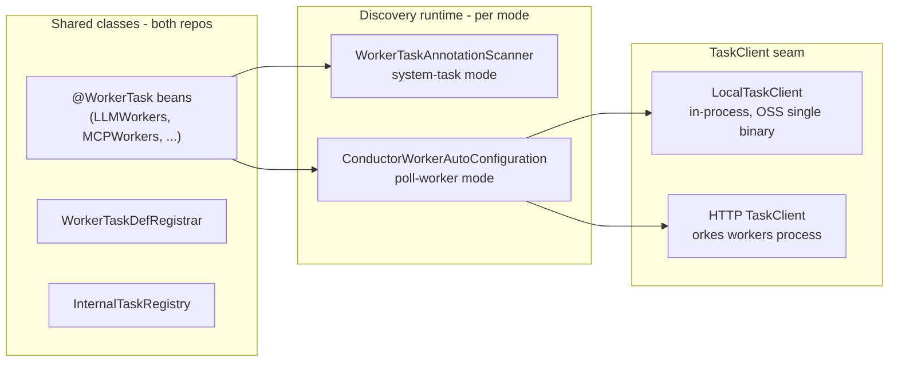

# Annotated workers: poll-worker mode (convergence with orkes-conductor)

**Status: proposal** — not scheduled; written so OSS and orkes-conductor can
converge on one mechanism later without rework.

## Where the two repos stand today

The `@WorkerTask` worker beans are already shared code: orkes-conductor's
workers process depends on this repo's `conductor-ai` jar and component-scans
`org.conductoross`, so **our `LLMWorkers` (`ai/.../LLMWorkers.java:126`,
`@WorkerTask("LLM_CHAT_COMPLETE")`) is the class executing LLM calls in orkes
production**, with `OrkesLLM extends LLMs` injected as the `@Primary` provider.
The divergence is exactly one decision — which runtime discovers the
annotation:

| | Discovery runtime | Execution model |
|---|---|---|
| orkes-conductor | `ConductorWorkerAutoConfiguration` (`org.conductoross:conductor-client-spring`) in a separate workers process | SDK pollers via `TaskClient` HTTP → ack at poll → `IN_PROGRESS` → decider def-timeout recovery |
| conductor-oss | `WorkerTaskAnnotationScanner` in the server | in-engine async system task → blocking `start()` → queue redelivery (made safe by the #1321 execution lease) |

Everything below the annotation (worker methods, `LLMs` provider layer,
`TaskContext`, `NonRetryableException`) is identical. Everything above the
`TaskClient` seam (poller machinery, `@WorkerTask` scanning) is identical.
Only the hosting differs.

## Target architecture

`conductor.annotated-workers.mode = system-task | poll-worker` (default
`system-task` until parity is proven).

## The pieces

### 1. `WorkerTaskDefRegistrar` (shared; do this first, useful regardless)

Scan `@WorkerTask` beans and register a `TaskDef` per task type
(`responseTimeoutSeconds`, `retryCount`, thread/poll config from the
annotation) when none exists — the OSS port of orkes'
`OrkesConductorWorkersApplication.wireupTaskDefinitions()` +
`RemoteWorker.getTaskDef()`. Home: the `ai` module or a small new
`conductor-annotated-workers` module orkes already imports.

- In system-task mode this **also fixes the #1321 lease-value gap**: every
  annotated type gets a registered def with a real `responseTimeoutSeconds`,
  so `MetadataMapperService.java:123` populates it into any workflow and
  `getExecutionLease` always has a number (multi-agent compiled tasks
  included).
- Orkes convergence: they delete `wireupTaskDefinitions()` and use this class.

### 2. `InternalTaskRegistry` (upstream from orkes into core)

Orkes' `oss-core/.../InternalTaskRegistry.java` marks worker-executed types
(`LLM_CHAT_COMPLETE`, `HTTP_POLL`, ...) as "internal" so domain routing skips
them and UX treats them as built-ins. Upstreaming the class (same package,
same name) into this repo's core means orkes drops a vendored file on their
next rebase, and OSS has the classification hook poll-worker mode needs.

### 3. Poll-worker mode wiring

- Scanner behavior per mode: `system-task` → today's path (register system
  tasks + mappers, executor lease protects blocking calls); `poll-worker` →
  register **nothing** with `SystemTaskRegistry` (the decider then queues
  these types for polling like any worker task), run only the def registrar.
- Worker host: reuse `org.conductoross:conductor-client-spring`'s
  `ConductorWorkerAutoConfiguration` verbatim — it only needs a `TaskClient`
  bean and finds the `@WorkerTask` beans already in the context.

### 4. `LocalTaskClient` (the only genuinely new code)

A `TaskClient` implementation backed by the in-process `TaskService` /
`ExecutionService` beans (batch poll, update, ack) instead of HTTP. This keeps
OSS single-binary while running the *identical* poller machinery. Orkes keeps
their HTTP `TaskClient`; both repos share everything above the seam. (A
loopback-HTTP fallback config is nearly free and gives an orkes-identical
topology for anyone running OSS workers out-of-process.)

## Known deltas to resolve before flipping the default

- **Poll latency**: system tasks fire ~ms after `decide()`; pollers add
  `pollingInterval` per task. Agent loops run many tasks per turn — measure a
  real chat turn; tune `@WorkerTask(pollingInterval)` or batch-poll settings.
- **Cancellation**: `AnnotatedTaskCancellationHandler` hooks the system task's
  engine-side `cancel()` (A2A relies on it). Poll workers get no cancel
  callback — needs a poll-side check (task state watch) or accepted loss.
- **Retry semantics**: with real defs registered, decider response-timeout
  retries apply — correct for idempotent-billing-aware workers, but review
  `retryCount` per task type (a paid LLM call retry is a real cost decision).
- **Metrics/ops**: worker-poller metrics replace system-task metrics;
  dashboards and alerting change shape.

## Phasing

1. **Now-ish (small, standalone value)**: `WorkerTaskDefRegistrar` +
   upstream `InternalTaskRegistry`. Fixes the lease-value gap; gives orkes two
   deletions on next rebase.
2. **Poll-worker mode behind the flag**: `LocalTaskClient` + scanner mode
   switch + client-spring dependency. Default stays `system-task`.
3. **Parity validation**: latency benchmark on an agent chat turn,
   cancellation story, soak in e2e-testing.
4. **Flip default**; deprecate `AnnotatedWorkflowSystemTask`. The #1321
   execution lease stays (it protects `HttpTask` and any straggler blocking
   system task); it simply stops being load-bearing for LLM tasks.

## Convergence end-state

Orkes' workers app reduces to: OSS worker-host config + HTTP `TaskClient` +
`@Primary` provider overrides (`OrkesLLM`) + their enterprise-only workers.
Every mechanism class — beans, registrar, registry, poller wiring — is the
same class from the same jar in both repos.
