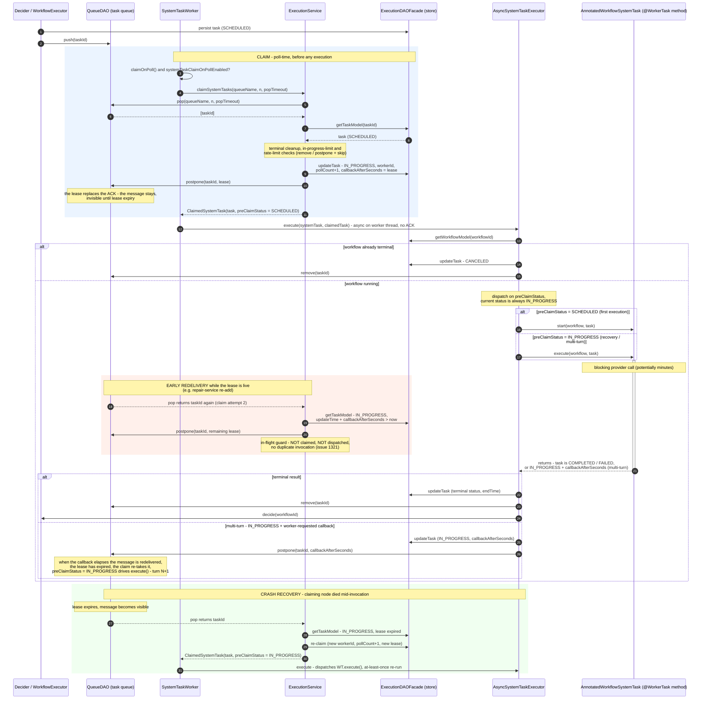

# Poll-time claiming in SystemTaskWorker (batch-poll model for async system tasks)

- **Status:** Implemented in this PR (draft)
- **Date:** 2026-07-20
- **Issues:** #1321 (duplicate execution), #1322 (late-write corruption), #1347
- **Related work:** `feature/annotated-task-in-progress-guard` branch (claim-before-`start()`),
  PR #1359 (poll-worker mode)

## Problem

Async system tasks never transition `SCHEDULED → IN_PROGRESS`. `SystemTaskWorker` pops a
taskId from the queue (`queueDAO.pop`, `SystemTaskWorker.java:125`), ACKs it, and hands it to
`AsyncSystemTaskExecutor`, which loads the task and — while it is still `SCHEDULED` — invokes
`systemTask.start()`. Nothing is persisted until `start()` returns.

For annotated `@WorkerTask` system tasks (`LLM_CHAT_COMPLETE` etc.), `start()` blocks on a
remote provider call for up to minutes. During that window:

1. The persisted task still reads `SCHEDULED`, so any redelivery of the queue message (unack
   expiry, repair service, sweeper) is indistinguishable from a first delivery → the method
   executes twice (#1321).
2. The losing attempt's late `updateTask` overwrites the winner's terminal record (#1322).
3. Operationally, the task is invisible: it shows `SCHEDULED` the whole time it is running.

Remote worker tasks never had this bug because `ExecutionService.poll` **claims** the task —
persists `IN_PROGRESS` + `workerId` — before the worker ever sees it.

## Proposal in one sentence

Give `SystemTaskWorker` the same claim step: for system tasks that opt in, the poll itself
performs the persisted `SCHEDULED → IN_PROGRESS` transition and takes a lease on the queue
message, and only then dispatches to `AsyncSystemTaskExecutor` — which receives the claimed
`TaskModel` directly instead of re-loading by taskId.

This is the batch-poll model (`TaskService.batchPoll` → `ExecutionService.poll`) applied to
the system-task path. We do **not** call `batchPoll`/`poll` verbatim — §"Why not stock
batchPoll" explains each divergence — but the claim semantics are identical.

## Goals

- A queue message redelivered while an invocation is in flight must not trigger a duplicate
  invocation.
- The task record must read `IN_PROGRESS` for the duration of the blocking call.
- Crash recovery: a node dying mid-invocation must not strand the task forever, even when the
  task type has no registered task def.
- The multi-turn pattern (worker returns `IN_PROGRESS` with `callbackAfterSeconds > 0` and
  expects re-invocation) must keep working, with every turn protected.
- Zero behavior change for system tasks that do not opt in (`SUB_WORKFLOW`, `EVENT`,
  `START_WORKFLOW`, …) and for remote worker tasks.

## Non-goals

- Moving annotated tasks out of the system-task pipeline (that is PR #1359's approach; see
  §Alternatives).
- Exactly-once execution across node crashes. Like the remote-worker contract, this design is
  exactly-once while the lease holds and at-least-once across lease expiry.

## Design

### New pieces

**1. `WorkflowSystemTask.claimOnPoll()`** — default `false`. Types whose execution blocks
in-process opt in; `AnnotatedWorkflowSystemTask` returns `true`. This scopes the entire
design: queues for non-opting types keep today's pop→ack→execute path byte-identical.

**2. `ExecutionService.claimSystemTasks(String queueName, int count, int timeoutMs)`** —
the engine-shaped sibling of `poll()`. Returns `List<ClaimedSystemTask>`:

```java
public record ClaimedSystemTask(TaskModel task, TaskModel.Status preClaimStatus) {}
```

Per popped taskId it:

1. Loads the `TaskModel`; terminal/missing → remove from queue and skip (as `poll()` does).
2. Runs the `exceedsInProgressLimit` / rate-limit checks → postpone and skip (as `poll()` does).
3. **In-flight guard:** if the task is `IN_PROGRESS` and its current lease has not expired
   (`updateTime + callbackAfterSeconds * 1000 > now`), the message is an early redelivery for
   a live invocation (e.g. a queue impl whose `containsMessage` missed a postponed message and
   the repair service re-added it). Postpone by the remaining lease and skip. This is the
   "`if (IN_PROGRESS) return false`" guard — placed in the claim step, *before* anything
   resets `callbackAfterSeconds`, and lease-aware so it never eats a due multi-turn callback.
4. Claims: capture `preClaimStatus`; set `IN_PROGRESS`; `pollCount++`; `workerId` = server
   node id; `startTime` if unset; `callbackAfterSeconds` = lease (see below); persist via
   `executionDAOFacade.updateTask`; fire `taskStatusListener.onTaskInProgress`.
5. **Leases instead of ACKs the message:** `queueDAO.postpone(queueName, taskId, priority,
   lease)`. The message stays in the queue, invisible until the lease expires.

Deliberately absent relative to `poll()`: secrets substitution (the executor substitutes with
its literal-input restore, `AsyncSystemTaskExecutor.java:158-197`; substituting here would
persist resolved secrets in step 4), the `callbackAfterSeconds = 0` reset, the 5-second
`MAX_POLL_TIMEOUT_MS` cap, and `taskType + domain` queue-name reconstruction (the method takes
the worker's actual `queueName`, so isolation-group queues keep working).

**Lease duration:** `taskDef.responseTimeoutSeconds` when a def exists with a positive value
(so the lease and the response-timeout reaper agree), else new property
`conductor.app.systemTaskClaimLeaseDuration`, default 3600s.

**3. `AsyncSystemTaskExecutor.execute(WorkflowSystemTask, ClaimedSystemTask)`** — new
overload. The existing `execute(WorkflowSystemTask, String taskId)` is untouched and remains
the path for non-claiming types. The overload:

- Uses the passed `TaskModel`; no reload (the claimant runs what it claimed — the
  remote-worker handoff).
- Skips the limit checks and `incrementPollCount` (the claim did both).
- Keeps the workflow-terminal check (cancel + remove from queue).
- Dispatches on **`preClaimStatus`**, not current status: `SCHEDULED` → `start()`, else
  `execute()`. This is what makes poll-time claiming compatible with the status-based
  dispatch contract — current status is always `IN_PROGRESS` after a claim, so the pre-claim
  status must travel with the task.
- Keeps the existing tail: secrets substitution with literal restore, terminal → set end
  time, remove from queue, `decide()`; non-terminal → postpone by
  `getEvaluationOffset(...)` (the multi-turn callback), persist in `finally`.

**4. `SystemTaskWorker.pollAndExecute`** branches once per queue:

```java
if (systemTask.claimOnPoll()) {
    List<ClaimedSystemTask> claimed =
            executionService.claimSystemTasks(queueName, messagesToAcquire, queuePopTimeout);
    // no ackTaskReceived — the lease postpone in the claim replaces the ACK
    for (ClaimedSystemTask ct : claimed) {
        CompletableFuture.runAsync(
                () -> asyncSystemTaskExecutor.execute(systemTask, ct), executorService)
            .whenComplete((r, e) -> semaphoreUtil.completeProcessing(1));
    }
    // release slots for (messagesToAcquire - claimed.size()) as today
} else {
    // existing pop → ackTaskReceived → execute(taskId) path, unchanged
}
```

**5. `AnnotatedWorkflowSystemTask`:** `claimOnPoll()` → `true`. `start()` and `execute()`
both invoke the worker method (`execute()` is turn N of the multi-turn pattern). **No status
guard in the task class** — the lease is the guard; the claim step's in-flight check is
defense in depth. `getEvaluationOffset` keeps returning the worker-requested
`callbackAfterSeconds` for the multi-turn postpone.

### Why the lease replaces the ACK

Today `SystemTaskWorker` ACKs (`ackTaskReceived`, removing the message) immediately after the
pop. Keeping that ACK under poll-time claiming would make crash recovery depend entirely on
the response-timeout reaper — which never fires for tasks without a task def
(`responseTimeoutSeconds` = 0), permanently stranding an `IN_PROGRESS` task if the node dies
mid-call. Replacing the ACK with a lease-length postpone keeps recovery queue-native:

- **Node crashes mid-invocation:** the lease expires, the message becomes visible, another
  node claims (task is `IN_PROGRESS`, lease expired → re-claim) and re-executes. At-least-once
  across crashes — the same contract remote workers have via `responseTimeoutSeconds`.
- **Invocation outlasts the lease:** duplicate possible, again exactly like a remote worker
  outliving its response timeout. The lease must be sized above the worst-case blocking call;
  3600s default, tunable per task def.

### Sequence walkthroughs

**Happy path (blocking annotated task).** Claim persists `IN_PROGRESS` + lease, message
postponed 3600s. Method runs 4 minutes. Executor persists `COMPLETED`, removes the message,
calls `decide()`. Any observer during those 4 minutes sees `IN_PROGRESS` with the claiming
node's `workerId`.

**Redelivery mid-invocation.** Only possible if something re-adds/re-exposes the message
early (repair service on a queue impl where `containsMessage` misses postponed messages).
The claim step's in-flight guard sees `IN_PROGRESS` with a live lease → postpones the
message by the remaining lease, skips. No duplicate. (`WorkflowRepairService.java:147` checks
`containsMessage` before re-adding; on the Redis and Postgres queue impls a postponed message
is still present, so this path should be rare — see Open Questions.)

**Crash recovery.** Node dies 1 minute into the call. Task sits `IN_PROGRESS`; message
reappears after the lease (3600s). Another node's claim finds `IN_PROGRESS` with an expired
lease → re-claims (pollCount++, new workerId, new lease) → `preClaimStatus = IN_PROGRESS` →
executor dispatches `execute()` → method re-runs. If a task def with `retryCount` semantics
is wanted instead, the response-timeout reaper handles it before the lease expires (lease ==
responseTimeout when a def exists).

**Multi-turn (LLM/A2A).** Turn 1: claim → `start()` → worker returns `IN_PROGRESS` +
`callbackAfterSeconds = 120`. Executor postpones the message 120s and persists the task with
`callbackAfterSeconds = 120`. Turn 2, 120s later: message delivered → claim step sees
`IN_PROGRESS` with lease expired (`updateTime + 120s < now`) → re-claims with a fresh lease →
`execute()` re-invokes. Every turn gets claim + lease protection — parity with PR #1359's
per-turn re-claiming.

### Full sequence diagram



## Why not stock `TaskService.batchPoll` / `ExecutionService.poll`

Each divergence in `claimSystemTasks` maps to a defect the stock method would introduce here:

| Stock `poll()` behavior | Consequence in the system-task path |
|---|---|
| Returns `Task` DTOs | Executor needs `TaskModel`; no reverse converter exists in the codebase |
| Substitutes secrets into the returned task | Executor's `finally` persist would write resolved secrets to the execution store |
| Resets `callbackAfterSeconds` to 0 | Erases the multi-turn contract before any guard can read it; a naive `IN_PROGRESS` guard then eats worker-requested re-invocations |
| No in-flight guard; re-claims any non-terminal task | An early redelivery mid-invocation is handed to a second thread — #1321 again |
| Leaves the message on unack (worker ACKs via REST) | `SystemTaskWorker`'s in-process ACK would remove it → no queue-based crash recovery; not ACKing → unack-expiry redeliveries during every long call |
| Rebuilds queue name from `taskType + domain` | Isolation-group queues (`taskType-isolationGroup`) stop being pollable |
| Caps timeout at 5s, stamps external worker metrics/events | Wrong operational semantics for an internal dispatch loop |

`TaskService.batchPoll` adds only logging and REST-facing metrics on top of `poll()` —
there is nothing in the service layer this path needs.

## Alternatives considered

**A. Claim-before-`start()` (the `feature/annotated-task-in-progress-guard` branch).**
Persists the `IN_PROGRESS` hand-off inside `AsyncSystemTaskExecutor` immediately before the
blocking `start()`, plus a status guard in `AnnotatedWorkflowSystemTask.execute()`. Smallest
possible diff; already reviewed once. Differences from this design: the claim happens after
the executor's load/checks rather than at the poll, the queue message is protected by the
same postpone but the `SCHEDULED` window between pop and claim is slightly longer, and there
is no `workerId`/`onTaskInProgress` observability. This design supersedes it; the branch's
test harness (`Issue1321DuplicateAsyncSystemTaskSpec`, `ControllableWorker`) ports directly.

**B. PR #1359 (poll-worker mode).** Removes annotated tasks from the system-task pipeline
entirely; they schedule as `USER_DEFINED` and execute through the literal worker contract.
Cleanest separation, but: it is a per-server mode flip for *all* annotated types at once,
mixed fleets during rolling deploys have two pipelines contending for the same type, task
defs are auto-registered with policy defaults (retry on paid provider calls), and the
ai/agentspan/a2a modules need a migration story. This design keeps annotated tasks as system
tasks — no workflow-def, mapper, or module changes — while adopting the same claim + lease +
per-turn protection semantics. If #1359 lands and matures, `claimOnPoll()` types could
migrate to it and this claim path becomes their compatibility bridge.

**C. Poll-time claim for all system task types.** Rejected: `SUB_WORKFLOW` etc. rely on
`start()`-on-`SCHEDULED` dispatch and their executions are non-blocking engine operations
that gain nothing from a claim; the blast radius is unjustified. `claimOnPoll()` scoping
keeps them untouched.

## Rollout & compatibility

- Property gate: `conductor.app.systemTaskClaimOnPollEnabled` (default **true** — this is a
  bug fix; the flag is an operational escape hatch). When false, `claimOnPoll()` queues use
  the legacy path.
- Mixed cluster during rolling deploy: old nodes still run pop→`start()` without a claim, so
  the #1321 window persists until the deploy completes. No new failure mode; transient.
- Non-claiming system tasks and remote workers: no code path changes.
- Persisted-state compat: no schema changes; `callbackAfterSeconds`/`updateTime` already
  exist and the lease math uses them as-is.

## Test plan

Landed in this PR:

1. **#1321 regression (integration, `SystemTaskPollClaimSpec`):** real scanner + registry +
   queue; a blocking invocation is claimed `IN_PROGRESS` (with `workerId`) at poll time,
   before execution; a message forced visible mid-invocation is refused by the in-flight
   guard; the method executes exactly once and the task completes.
2. **Crash recovery (integration, `SystemTaskPollClaimSpec`):** a task claimed by a "dead"
   node (short-lease task def) is re-claimed after lease expiry with
   `preClaimStatus = IN_PROGRESS` and executes exactly once.
3. **Claim semantics (unit, `ExecutionServiceTest`):** SCHEDULED claim (status, lease,
   poll count, worker id, no secrets substitution, postpone-not-remove, listener); in-flight
   guard postpones without claiming; expired lease re-claims; task-def responseTimeout used
   as lease; terminal tasks removed.
4. **Executor dispatch (unit, `AsyncSystemTaskExecutorTest`):** pre-claim-status dispatch
   (`start()` vs `execute()`), no reload, no double poll count / start time, terminal result
   removes the leased message and decides, terminated workflow cancels.

Follow-ups before the PR leaves draft:

5. **Multi-turn:** two-turn worker; each turn invoked exactly once; lease re-taken per turn.
6. **#1322 regression:** late `updateTask` from a superseded attempt cannot overwrite a
   terminal record (executor tail unchanged, but assert it).
7. **Non-claiming regression:** full `test-harness` suite green (`SUB_WORKFLOW` unit
   coverage already exists in `AsyncSystemTaskExecutorTest`).
8. **Isolation queues:** claim works on `taskType-isolationGroup` queue names.

## Open questions

1. **`containsMessage` vs. postponed messages per queue impl** — verify on Redis (dyno-queues
   ZSET semantics), Postgres, and SQLite that a postponed message reports present; the
   in-flight guard covers a `false` answer, but we should know which impls exercise it.
2. **Lease default (3600s)** — is one hour the right ceiling for annotated provider calls,
   and should `@WorkerTask` grow a per-type lease attribute instead of relying on task defs?
3. **Re-execution on crash for paid provider calls** — at-least-once means a crashed node's
   LLM call is re-issued after the lease. Acceptable, or should crash recovery mark the task
   `FAILED` and defer to workflow-level retry policy? (Same question PR #1359 carries.)
4. **`workerId` stamping** — node hostname vs. a stable server identity; affects debuggability
   of the crash-recovery walkthrough.
