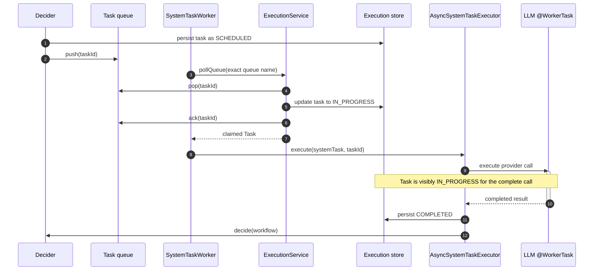

# Poll-time claiming for async system tasks

- **Status:** Implemented in PR #1364
- **Date:** 2026-07-20
- **Issues:** #1321 (duplicate execution), #1322 (late-write corruption)

## Problem

`SystemTaskWorker` used to pop and acknowledge an async system-task message, then invoke
`AsyncSystemTaskExecutor` while the persisted task remained `SCHEDULED`. An annotated task such
as `LLM_CHAT_COMPLETE` can block for minutes. During that call, recovery logic still sees a
scheduled task and can enqueue it again, resulting in a second provider invocation.

Remote workers avoid this state gap: `ExecutionService.poll()` claims a task by persisting
`IN_PROGRESS` before returning it to the worker.

## Implemented approach

`SystemTaskWorker` now uses `ExecutionService.pollQueue(queueName, workerId, count, timeout)`
instead of calling `QueueDAO.pop()` directly. `pollQueue` reuses the existing `poll()` claim
logic but accepts the exact queue name. That detail matters for queues with an execution
namespace or isolation group; reconstructing the queue from only task type and domain would
silently poll the wrong queue.

This is not an additional isolation-routing fix. The old direct `QueueDAO.pop(queueName, ...)`
path already polled isolated and namespaced queues correctly. Accepting the exact queue name is
required to preserve that existing behavior while moving the pop behind the normal claim
lifecycle; using the task-type/domain `poll()` overload would introduce a routing regression.

The claim path:

1. Pops the message from its exact queue.
2. Persists `SCHEDULED → IN_PROGRESS`, worker ID, start time, poll count, and callback state.
3. Acknowledges the queue message only after the task is successfully claimed.
4. Dispatches the task ID to `AsyncSystemTaskExecutor`.

`ExecutionService.poll()` already advances the decider queue from the stale poll deadline to
the task response timeout. Therefore a long-running provider call is treated as an in-progress
call rather than a task that was never picked up.

There is deliberately no `IN_PROGRESS` guard in `AnnotatedWorkflowSystemTask.execute()`. Its
`start()` method delegates to `execute()`, and a claimed first delivery is already
`IN_PROGRESS`; such a guard prevents the first provider invocation and strands the task.

## Sequence

## Recovery and limits

This change removes the normal `SCHEDULED` recovery window, but it does not promise exactly-once
execution across a process crash. A crash after the provider receives a request but before the
terminal task update can still require a retry. Provider calls that need stronger guarantees
should use an idempotency key derived from the Conductor task ID.

The response timeout should be configured above the expected provider-call duration. It is the
recovery boundary for a task that has been claimed but has not completed.

## Tests

- `TestSystemTaskWorker` verifies that the worker uses the claimed-poll API, dispatches all
  returned task IDs, and releases permits for empty and failed polls.
- `SystemTaskPollClaimSpec` uses the production `HTTP` system-task queue and Redis-backed test
  harness without a test-only worker implementation. It claims but deliberately does not execute
  the task, modeling a node failure after poll. The test verifies that the acknowledged original
  message is not redelivered while the claim is live, then verifies that the configured response
  timeout marks that attempt `TIMED_OUT` and enqueues one new retry attempt.
