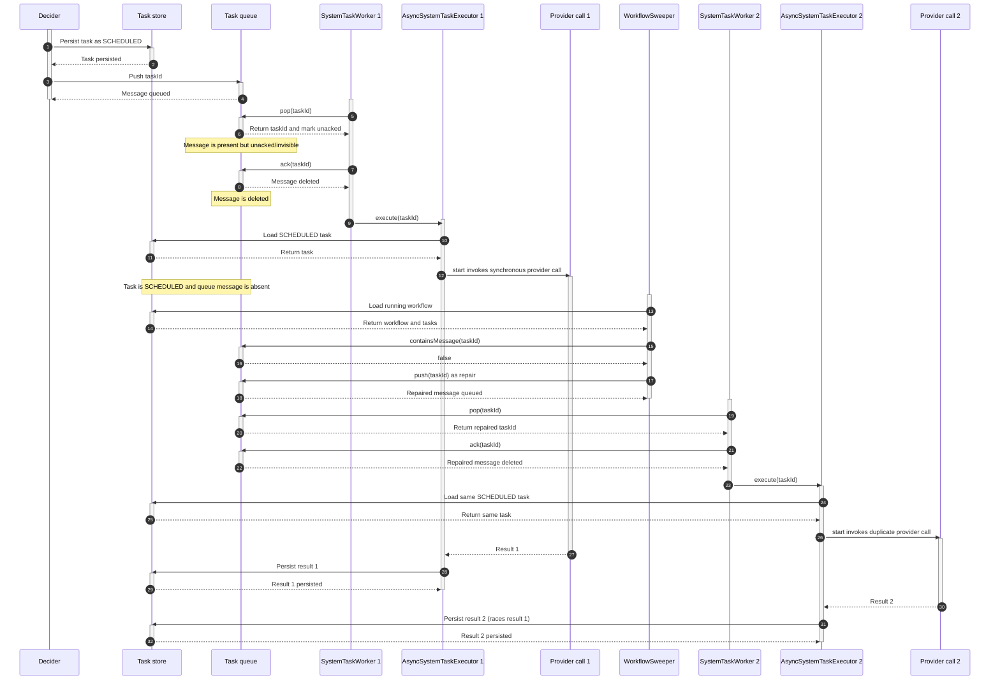
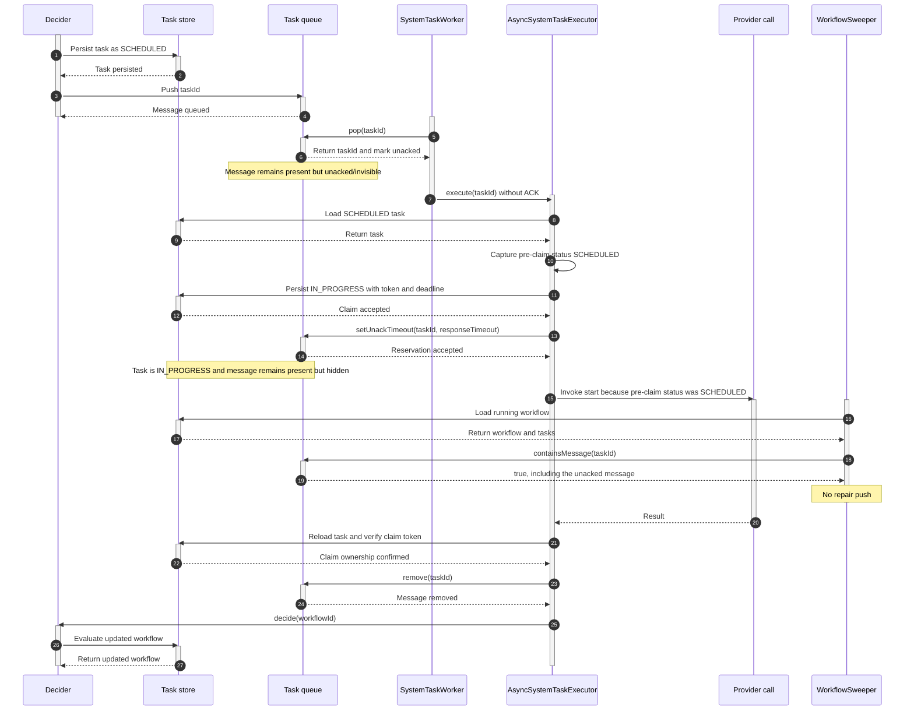
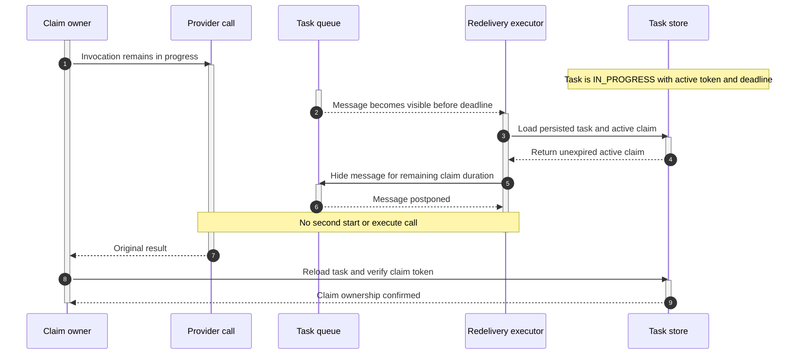

# #1321 — Duplicate execution of async system tasks (queue-message reservation)

Issue: https://github.com/conductor-oss/conductor/issues/1321

## Summary

An async system task whose synchronous execution outlasts the queue's redelivery
window is executed a **second time in parallel** by another `system-task-worker`.
For `LLM_CHAT_COMPLETE` this means duplicate paid provider calls (observed: all 4
agent-loop turns billed twice). The fix keeps a task's queue message **present but
invisible** while it runs, so the scheduler's own repair logic no longer re-queues
a task that is legitimately in flight.

## Background: how a system task's message flows

`SystemTaskWorker.pollAndExecute` (per task-type queue), then `AsyncSystemTaskExecutor`:

1. `queueDAO.pop(queue)` → the message moves to the queue's *unacked* set (invisible).
2. `executionService.ackTaskReceived(taskId)` → `queueDAO.ack` → **the message is removed.**
3. `AsyncSystemTaskExecutor.execute` runs on a worker thread; the task's
   `start()`/`execute()` runs the work (for annotated `@WorkerTask` adapters, the
   provider call runs **synchronously** here).
4. Only in `AsyncSystemTaskExecutor`'s `finally` — *after* the work returns — is the
   message removed (terminal) or re-posted (`postpone`, non-terminal).

Between step 2 and step 4 a **running** task has **no message in the queue**.

## Before: `main` behavior

On `main`, the queue pop itself is not the normal source of the duplicate. A SQL
queue initially represents the popped row as unacked (`popped = true`), but
`SystemTaskWorker` immediately acknowledges it. For SQL implementations, that ACK
deletes the row. The duplicate is created later when `WorkflowSweeper` repairs the
now-missing message.



## Root cause: a violated invariant + the sweeper's repair

`WorkflowSweeper` (`org.conductoross.conductor.core.execution.WorkflowSweeper`, on
by default) enforces on every sweep (~30s): *"every running task MUST be in the
queue."* Its repair re-pushes any repairable task whose message is missing:

```java
if (isTaskRepairable.test(task) && !queueDAO.containsMessage(queue, taskId)) {
    queueDAO.push(queue, taskId, task.getCallbackAfterSeconds());   // re-queue
}
```

For async system tasks `isTaskRepairable` is true in `SCHEDULED` **and**
`IN_PROGRESS`. So while the task runs (message removed at step 2, task still
non-terminal), a sweep sees "running task, no message" → **re-pushes it** → a
second worker pops it and runs the same task again → **duplicate**.

Remote worker tasks never hit this: their poll does **not** remove the message,
and their repair predicate requires `SCHEDULED`. Async system tasks have neither
guard. This is generic to **every** async system task — the message is briefly
absent for all of them; it is only *reliably* hit by long-running (LLM/A2A) tasks
whose window (minutes) is wider than the 30s sweep.

## Fix (what): don't remove the message at poll; reserve it for the run

Two small changes, both on the shared execution path (no per-task-type gating):

1. **`SystemTaskWorker` stops removing the message at poll.** The
   `executionService.ackTaskReceived(taskId)` call is dropped. The popped message
   stays in the queue (invisible while unacked), so a task that is about to run
   still *has* a message — `containsMessage` is true — and the sweeper's repair
   leaves it alone. (This removed the only use of `ExecutionService` in
   `SystemTaskWorker`, so that dependency is gone.)

2. **`AsyncSystemTaskExecutor` reserves the message for the run.** Before invoking
   `start()`/`execute()`, it extends the message's visibility to the task's
   `responseTimeoutSeconds`:

   ```java
   // before the SCHEDULED/IN_PROGRESS invocation:
   queueDAO.setUnackTimeout(queueName, taskId, responseTimeoutSeconds * 1000);
   ```

   The executor already loads the `TaskModel`, so `responseTimeoutSeconds` is in
   hand — no new config property and no extra read. It falls back to the default
   response timeout (`TaskDef.ONE_HOUR`, 3600s) when the task has none (e.g. an
   annotated task with no registered task def).

Together: the message is present from pop (repair can't re-push it — **no
ack→reserve race**), and invisible for `responseTimeout` (the unack sweep won't
redeliver it mid-run). The executor's `finally` still owns the outcome — it
`remove`s (terminal) or `postpone`s (non-terminal / worker-requested callback),
overriding the reservation — so normal completion, the async-complete flow, and
long-running `IN_PROGRESS + callbackAfterSeconds` re-invocation are all unchanged.

3. **An overrun is timed out, not re-executed.** The reservation only lasts
   `responseTimeout`; if the actual run outlives it, the message *does* reappear.
   To avoid re-running it in parallel, the executor persists `startTime` and
   `IN_PROGRESS` before the first invocation. The local task passed to `start()`
   retains its pre-claim `SCHEDULED` status so implementations such as
   `SUB_WORKFLOW` keep their existing contract. On any
   redelivery checks whether the task has already started and has not responded
   within `responseTimeout`:

   ```java
   if (task.getStartTime() > 0
           && task.getUpdateTime() > 0                       // skip just-scheduled tasks
           && now - task.getUpdateTime() >= responseTimeoutMs) {
       task.setStatus(TIMED_OUT);   // don't invoke again — let retry/timeout policy decide
   }
   ```

   The `updateTime > 0` guard is required: a task whose mapper sets `startTime` at
   scheduling (e.g. `JOIN`) has `updateTime == 0` until first persisted, so without it
   `now - 0` always exceeds the timeout and the task is wrongly timed out on its first
   poll. Re-polled tasks refresh `updateTime` each poll, so only a run that held the
   worker thread past `responseTimeout` (no intervening poll) is caught.

   So a run that exceeds `responseTimeout` is marked `TIMED_OUT` (retriable) and the
   retry/timeout policy creates a *new* attempt or fails the workflow — it is never
   re-run in parallel under the same taskId. The check uses `updateTime` (time since
   the last response), so a worker that keeps checking in within `responseTimeout`
   (LLM/A2A callback flow) is not timed out.

## Current after state: reserved message plus persisted claim

The combined design retains this branch's strongest property—the popped message
is never ACKed before execution—while treating every async-system-task poll as an
explicit task claim. Before invoking task code, the executor captures the
pre-claim status, persists `IN_PROGRESS` with a unique claim token and deadline,
and reserves the queue message.

The captured pre-claim status controls lifecycle dispatch:

- A claim from `SCHEDULED` invokes `start()`.
- A claim for a due callback from `IN_PROGRESS` invokes `execute()`.
- A redelivery with an unexpired active claim invokes neither method.
- An expired claim times out that attempt; it does not execute the same task ID
  concurrently.



The claim also closes the early-redelivery window independently of queue timing:



If the reservation and claim expire first, timeout and completion use the same
token to prevent the zombie late write:


The resulting steady-state difference is:

| State while provider call runs | `main` | Current combined design |
|---|---|---|
| Persisted task status | `SCHEDULED` | `IN_PROGRESS` |
| Queue row/message | Absent after ACK | Present and unacked |
| Message pollability | N/A until repair pushes one | Hidden until `responseTimeout` |
| Sweeper `containsMessage` | `false` | `true` |
| Normal duplicate trigger | Sweeper repair push | Prevented |
| Early redelivery | Re-enters `start()` | Rejected by active claim |
| Dispatch decision | Current stored status | Captured pre-claim status |
| Late completion after timeout | Can overwrite timeout | Rejected by claim token |

### Claim contract

The minimal implementation on this branch persists the token on `TaskModel` and
checks it again before publishing a result. This closes the observed sequential
redelivery and late-write paths exercised below. This is not a persistence-level
compare-and-set: claim assignment and result publication are separate reads and
writes. Conductor's queue de-duplicates a task ID and normally serializes its
delivery; a DAO conditional update would be additional protection for a backend
that permits simultaneous delivery of the same task ID.

Queue reservation is a prerequisite for invoking task code. If
`setUnackTimeout()` returns `false` or throws, the executor does not persist a new
claim or invoke the system task. The popped message remains recoverable through
its existing visibility timeout. This failure is covered with a fault-injected
`QueueDAO` unit test because the real Redis DAO does not expose a deterministic
way to produce it.

Worker-requested callbacks remain distinct from an active execution claim. When a
worker returns `IN_PROGRESS` with `callbackAfterSeconds`, the current claim ends
and a callback-due timestamp is persisted. A later poll claims that due callback
with a new token and dispatches `execute()`. It is not interpreted as either an
early redelivery or an expired invocation.

## Why `responseTimeout` (not a new property)

`responseTimeout` is exactly "how long the task is allowed to run", which is what
the reservation should cover, and it already exists per task. Adding a dedicated
lease property would duplicate it. It only needs a fallback (the platform default,
`TaskDef.ONE_HOUR`) for tasks with no configured timeout.

## Why not gate to one task type

The race is generic and the reservation is behavior-preserving: the executor's
`finally` always removes/re-posts the message once the task returns, so for a fast
task the reservation is immediately superseded. The one trade-off, uniform across
all tasks: a crash **mid-execute** leaves the message reserved and recovered after
`responseTimeout` instead of by the ~30s repair. That is bounded and acceptable,
and is the price of not letting repair fight in-flight tasks.

## Alternatives considered

- **Adapter-level reserve (PR #1367):** reserve inside `AnnotatedWorkflowSystemTask`.
  Covers only annotated tasks, and reserves *after* the poller's ack — leaving a
  small ack→reserve race (a sweep in that gap still re-queues). This approach
  removes the ack entirely, so there is no such window, and it covers all async
  system tasks.
- **Non-blocking poll model (#1359):** run the method off the worker thread and poll
  a future — eliminates the in-flight window, but a much larger change.

## Remaining risks and coverage boundaries

1. **Crash recovery is intentionally delayed.** A node crash mid-invocation leaves
   the message hidden until `responseTimeout`; a task without a configured response
   timeout uses the one-hour fallback. This is bounded but slower than the prior
   sweeper repair interval and should be visible operationally.

2. **Queue semantics need backend integration coverage.** Correctness requires
   `containsMessage()` to include unacked messages and `setUnackTimeout()` to move
   their visibility deadline. The current production-path characterization test
   uses Redis. The same scenarios should run against PostgreSQL and MySQL to verify
   their `popped`, `deliver_on`, ACK, and unack-reaper behavior.

3. **Simultaneous duplicate delivery is outside the tested queue contract.** The
   tests prove sequential queue redelivery and sweeper repair. They do not force two
   executors to load the same unclaimed task before either persists its token.
   Standard Conductor queues de-duplicate by task ID; a persistence compare-and-set
   would be required if a queue backend allowed that simultaneous delivery.

## Audit against PR #1369's call-outs

The combined design addresses every correctness gap that PR #1369 identified in
the normal execution path, including the zombie late-write problem that the PR
explicitly deferred to #1322. It does not prove every operational failure mode or
every queue backend.

| PR #1369 call-out | Current status | Evidence or remaining gap |
|---|---|---|
| Poll must not ACK/remove the message before execution because the sweeper repairs the missing message | Addressed | The worker neither ACKs nor removes at poll in [`TestSystemTaskWorker.java`, lines 88–110](../../core/src/test/java/com/netflix/conductor/core/execution/tasks/TestSystemTaskWorker.java#L88-L110); the real-sweeper integration scenario is linked below. |
| Reserve the popped message for `responseTimeoutSeconds` | Addressed | Real Redis visibility is covered by the normal and early-redelivery integration scenarios below. |
| Use the one-hour default when no response timeout is configured | Addressed | Unit evidence is linked below; this is backend-independent arithmetic. |
| A run exceeding `responseTimeout` must time out instead of invoking the same attempt again | Addressed | The natural-expiry integration scenario proves timeout and no second provider invocation. |
| Persist the first start before invoking task code, without breaking `SUB_WORKFLOW.start()`'s `SCHEDULED` input contract | Addressed | [`AsyncSystemTaskExecutorTest.groovy`, lines 70–107](../../core/src/test/groovy/com/netflix/conductor/core/execution/AsyncSystemTaskExecutorTest.groovy#L70-L107) proves the supplied `SUB_WORKFLOW` task starts correctly while the persisted/result state becomes `IN_PROGRESS`. |
| Normal terminal, non-terminal callback, and async-complete queue outcomes remain owned by the executor | Addressed | Callback behavior has real integration evidence below. Terminal completion and async-complete behavior are unit-covered in [`AsyncSystemTaskExecutorTest.groovy`, lines 396–488](../../core/src/test/groovy/com/netflix/conductor/core/execution/AsyncSystemTaskExecutorTest.groovy#L396-L488). |
| A late result from an expired attempt must not overwrite timeout/retry state (#1322) | Addressed beyond PR #1369 | The natural-expiry and workflow-termination integration scenarios below prove stale-result rejection. |
| Crash recovery occurs only after the reservation expires | Behavior retained, not proven end-to-end | A deterministic process-kill test is still missing; recovery can be delayed up to the configured timeout or one-hour fallback. |
| Queue reservation succeeds before external work starts | Addressed | Reservation is fail-closed: `false` or an exception skips claim persistence and task invocation. Fault-injected unit evidence is linked below. |
| Equivalent queue semantics across supported persistence backends | Not proven | The integration suite currently proves Redis only; PostgreSQL and MySQL remain coverage gaps. |
| Two executors simultaneously claim an unclaimed task | Not claimed by PR #1369 and not proven | The token prevents sequential redelivery and stale completion, but claim acquisition is not a persistence compare-and-set. |

## Test evidence

`Issue1321DuplicateAsyncSystemTaskSpec` runs through the real annotated-task
adapter, executor, Redis queue, task persistence, and `WorkflowSweeper`:

| Design scenario | Evidence |
|---|---|
| Reserved unacked message remains hidden, task is persisted `IN_PROGRESS`, and an actual sweep does not create a pollable duplicate | [`Issue1321DuplicateAsyncSystemTaskSpec.groovy`, lines 119–174](../../test-harness/src/test/groovy/com/netflix/conductor/test/integration/Issue1321DuplicateAsyncSystemTaskSpec.groovy#L119-L174) |
| Forced visibility before the claim deadline is delivered but does not invoke the provider twice | [`Issue1321DuplicateAsyncSystemTaskSpec.groovy`, lines 176–210](../../test-harness/src/test/groovy/com/netflix/conductor/test/integration/Issue1321DuplicateAsyncSystemTaskSpec.groovy#L176-L210) |
| Natural visibility after `responseTimeout` produces `TIMED_OUT`; the original late return cannot overwrite it | [`Issue1321DuplicateAsyncSystemTaskSpec.groovy`, lines 212–254](../../test-harness/src/test/groovy/com/netflix/conductor/test/integration/Issue1321DuplicateAsyncSystemTaskSpec.groovy#L212-L254) |
| A deliberately missing message is repaired by the real sweeper; processing that repaired delivery does not re-enter the provider | [`Issue1321DuplicateAsyncSystemTaskSpec.groovy`, lines 256–290](../../test-harness/src/test/groovy/com/netflix/conductor/test/integration/Issue1321DuplicateAsyncSystemTaskSpec.groovy#L256-L290) |
| A completed invocation releases its claim and a legitimate callback executes as a new invocation | [`Issue1321DuplicateAsyncSystemTaskSpec.groovy`, lines 292–318](../../test-harness/src/test/groovy/com/netflix/conductor/test/integration/Issue1321DuplicateAsyncSystemTaskSpec.groovy#L292-L318) |
| Workflow termination remains authoritative when the blocked provider returns late | [`Issue1321DuplicateAsyncSystemTaskSpec.groovy`, lines 320–348](../../test-harness/src/test/groovy/com/netflix/conductor/test/integration/Issue1321DuplicateAsyncSystemTaskSpec.groovy#L320-L348) |
| A requested callback longer than `responseTimeout` is treated as a callback, not an expired active invocation | [`Issue1321DuplicateAsyncSystemTaskSpec.groovy`, lines 350–378](../../test-harness/src/test/groovy/com/netflix/conductor/test/integration/Issue1321DuplicateAsyncSystemTaskSpec.groovy#L350-L378) |

Focused unit evidence covers the fallback and mapper boundary that are expensive or
backend-independent:

- Explicit and default reservation durations: [`AsyncSystemTaskExecutorTest.groovy`, lines 265–304](../../core/src/test/groovy/com/netflix/conductor/core/execution/AsyncSystemTaskExecutorTest.groovy#L265-L304).
- Expired active claim timeout without provider re-entry: [`AsyncSystemTaskExecutorTest.groovy`, lines 307–340](../../core/src/test/groovy/com/netflix/conductor/core/execution/AsyncSystemTaskExecutorTest.groovy#L307-L340).
- Reservation returning `false` or throwing prevents persistence and task invocation: [`AsyncSystemTaskExecutorTest.groovy`, lines 342–371](../../core/src/test/groovy/com/netflix/conductor/core/execution/AsyncSystemTaskExecutorTest.groovy#L342-L371).
- A mapper-populated `startTime` with no `updateTime` is not falsely timed out: [`AsyncSystemTaskExecutorTest.groovy`, lines 373–393](../../core/src/test/groovy/com/netflix/conductor/core/execution/AsyncSystemTaskExecutorTest.groovy#L373-L393).

The integration evidence is Redis-specific. PostgreSQL/MySQL queue behavior,
node-crash recovery time, and simultaneous duplicate delivery are explicitly not
claimed as proven by this suite. Reservation failure is fault-injected at the unit
boundary rather than through Redis.
