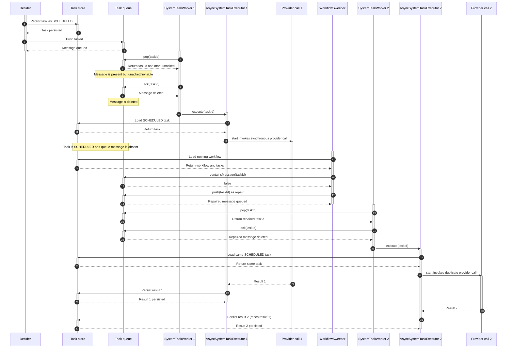
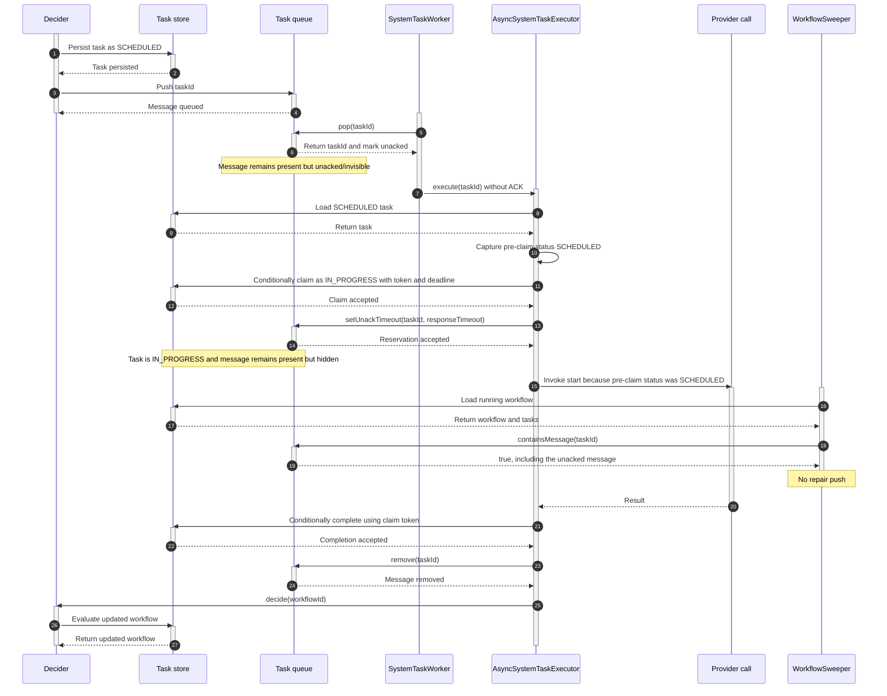
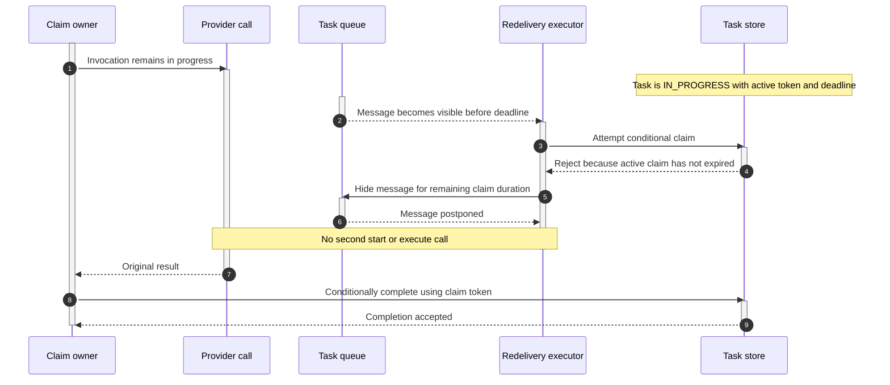
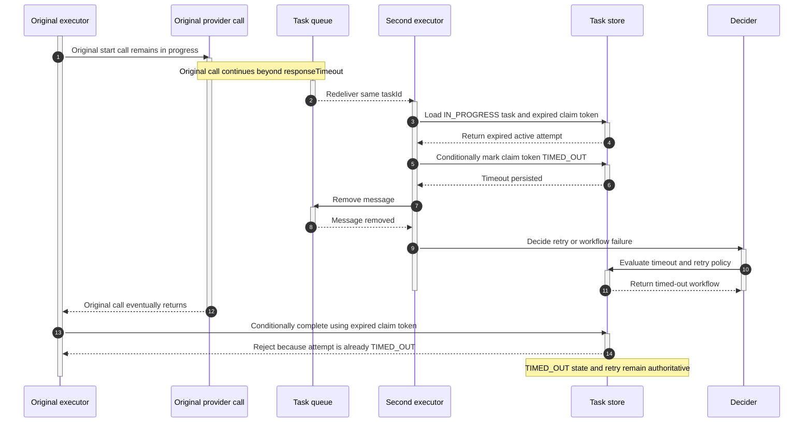

# #1321 — Duplicate execution of async system tasks (queue-message reservation)

Issue: https://github.com/conductor-oss/conductor/issues/1321

## Summary

An async system task whose synchronous execution outlasts the queue's redelivery
window is executed a **second time in parallel** by another `system-task-worker`.
For `LLM_CHAT_COMPLETE` this means duplicate paid provider calls (observed: all 4
agent-loop turns billed twice). The fix keeps a task's queue message **present but
invisible** while it runs, so the scheduler's own repair logic no longer re-queues
a task that is legitimately in flight.

## Background: how a system task's message flows

`SystemTaskWorker.pollAndExecute` (per task-type queue), then `AsyncSystemTaskExecutor`:

1. `queueDAO.pop(queue)` → the message moves to the queue's *unacked* set (invisible).
2. `executionService.ackTaskReceived(taskId)` → `queueDAO.ack` → **the message is removed.**
3. `AsyncSystemTaskExecutor.execute` runs on a worker thread; the task's
   `start()`/`execute()` runs the work (for annotated `@WorkerTask` adapters, the
   provider call runs **synchronously** here).
4. Only in `AsyncSystemTaskExecutor`'s `finally` — *after* the work returns — is the
   message removed (terminal) or re-posted (`postpone`, non-terminal).

Between step 2 and step 4 a **running** task has **no message in the queue**.

## Before: `main` behavior

On `main`, the queue pop itself is not the normal source of the duplicate. A SQL
queue initially represents the popped row as unacked (`popped = true`), but
`SystemTaskWorker` immediately acknowledges it. For SQL implementations, that ACK
deletes the row. The duplicate is created later when `WorkflowSweeper` repairs the
now-missing message.



## Root cause: a violated invariant + the sweeper's repair

`WorkflowSweeper` (`org.conductoross.conductor.core.execution.WorkflowSweeper`, on
by default) enforces on every sweep (~30s): *"every running task MUST be in the
queue."* Its repair re-pushes any repairable task whose message is missing:

```java
if (isTaskRepairable.test(task) && !queueDAO.containsMessage(queue, taskId)) {
    queueDAO.push(queue, taskId, task.getCallbackAfterSeconds());   // re-queue
}
```

For async system tasks `isTaskRepairable` is true in `SCHEDULED` **and**
`IN_PROGRESS`. So while the task runs (message removed at step 2, task still
non-terminal), a sweep sees "running task, no message" → **re-pushes it** → a
second worker pops it and runs the same task again → **duplicate**.

Remote worker tasks never hit this: their poll does **not** remove the message,
and their repair predicate requires `SCHEDULED`. Async system tasks have neither
guard. This is generic to **every** async system task — the message is briefly
absent for all of them; it is only *reliably* hit by long-running (LLM/A2A) tasks
whose window (minutes) is wider than the 30s sweep.

## Fix (what): don't remove the message at poll; reserve it for the run

Two small changes, both on the shared execution path (no per-task-type gating):

1. **`SystemTaskWorker` stops removing the message at poll.** The
   `executionService.ackTaskReceived(taskId)` call is dropped. The popped message
   stays in the queue (invisible while unacked), so a task that is about to run
   still *has* a message — `containsMessage` is true — and the sweeper's repair
   leaves it alone. (This removed the only use of `ExecutionService` in
   `SystemTaskWorker`, so that dependency is gone.)

2. **`AsyncSystemTaskExecutor` reserves the message for the run.** Before invoking
   `start()`/`execute()`, it extends the message's visibility to the task's
   `responseTimeoutSeconds`:

   ```java
   // before the SCHEDULED/IN_PROGRESS invocation:
   queueDAO.setUnackTimeout(queueName, taskId, responseTimeoutSeconds * 1000);
   ```

   The executor already loads the `TaskModel`, so `responseTimeoutSeconds` is in
   hand — no new config property and no extra read. It falls back to the default
   response timeout (`TaskDef.ONE_HOUR`, 3600s) when the task has none (e.g. an
   annotated task with no registered task def).

Together: the message is present from pop (repair can't re-push it — **no
ack→reserve race**), and invisible for `responseTimeout` (the unack sweep won't
redeliver it mid-run). The executor's `finally` still owns the outcome — it
`remove`s (terminal) or `postpone`s (non-terminal / worker-requested callback),
overriding the reservation — so normal completion, the async-complete flow, and
long-running `IN_PROGRESS + callbackAfterSeconds` re-invocation are all unchanged.

3. **An overrun is timed out, not re-executed.** The reservation only lasts
   `responseTimeout`; if the actual run outlives it, the message *does* reappear.
   To avoid re-running it in parallel, the executor persists `startTime` before the
   first invocation (the status is left unchanged so a system task whose `start()`
   branches on `SCHEDULED` — e.g. `SUB_WORKFLOW` — still works), and on any
   redelivery checks whether the task has already started and has not responded
   within `responseTimeout`:

   ```java
   if (task.getStartTime() > 0
           && task.getUpdateTime() > 0                       // skip just-scheduled tasks
           && now - task.getUpdateTime() >= responseTimeoutMs) {
       task.setStatus(TIMED_OUT);   // don't invoke again — let retry/timeout policy decide
   }
   ```

   The `updateTime > 0` guard is required: a task whose mapper sets `startTime` at
   scheduling (e.g. `JOIN`) has `updateTime == 0` until first persisted, so without it
   `now - 0` always exceeds the timeout and the task is wrongly timed out on its first
   poll. Re-polled tasks refresh `updateTime` each poll, so only a run that held the
   worker thread past `responseTimeout` (no intervening poll) is caught.

   So a run that exceeds `responseTimeout` is marked `TIMED_OUT` (retriable) and the
   retry/timeout policy creates a *new* attempt or fails the workflow — it is never
   re-run in parallel under the same taskId. The check uses `updateTime` (time since
   the last response), so a worker that keeps checking in within `responseTimeout`
   (LLM/A2A callback flow) is not timed out.

## Proposed after state: reserved message plus persisted claim

The combined design retains this branch's strongest property—the popped message
is never ACKed before execution—while treating every async-system-task poll as an
explicit task claim. Before invoking task code, the claim path captures the
pre-claim status, conditionally persists `IN_PROGRESS`, assigns a unique claim
token and deadline, and then reserves the queue message. External work begins only
after both persistence operations succeed.

The captured pre-claim status controls lifecycle dispatch:

- A claim from `SCHEDULED` invokes `start()`.
- A claim for a due callback from `IN_PROGRESS` invokes `execute()`.
- A redelivery with an unexpired active claim invokes neither method.
- An expired claim times out that attempt; it does not execute the same task ID
  concurrently.



The claim also closes the early-redelivery window independently of queue timing:



If the reservation and claim expire first, timeout and completion use the same
token to prevent the zombie late write:



The resulting steady-state difference is:

| State while provider call runs | `main` | Proposed combined design |
|---|---|---|
| Persisted task status | `SCHEDULED` | `IN_PROGRESS` |
| Queue row/message | Absent after ACK | Present and unacked |
| Message pollability | N/A until repair pushes one | Hidden until `responseTimeout` |
| Sweeper `containsMessage` | `false` | `true` |
| Normal duplicate trigger | Sweeper repair push | Prevented |
| Early redelivery | Re-enters `start()` | Rejected by active claim |
| Dispatch decision | Current stored status | Captured pre-claim status |
| Late completion after timeout | Can overwrite timeout | Rejected by claim token |

### Claim contract

The minimal implementation on this branch persists the token on `TaskModel` and
checks it again before publishing a result. This closes the observed sequential
redelivery and late-write paths, but it is an integration step toward, not a
substitute for, the persistence-level conditional operations below. Two nodes
that read the same eligible state concurrently can still race while assigning
their tokens.

The persistence abstraction should expose a conditional claim operation in
`core`, with implementations in each persistence module. A successful claim
returns an execution envelope containing at least:

- the loaded `TaskModel`;
- its pre-claim status (`SCHEDULED` or callback-due `IN_PROGRESS`);
- a unique claim token/attempt generation;
- the claim deadline derived from `responseTimeout`;
- whether dispatch must call `start()` or `execute()`.

Claim and completion updates must be conditional. A claim succeeds only when the
task is eligible and does not have another unexpired owner. Completion succeeds
only when the token still owns a non-terminal attempt. This is what makes timeout,
retry, and late completion mutually exclusive rather than last-write-wins.

Queue reservation is fail-closed: if `setUnackTimeout()` throws or returns false,
the executor must not invoke external work. The claimed task remains recoverable,
and the message is allowed to reappear for timeout/reconciliation.

Worker-requested callbacks remain distinct from an active execution claim. When a
worker returns `IN_PROGRESS` with `callbackAfterSeconds`, the current claim ends
and a callback-due timestamp is persisted. A later poll claims that due callback
with a new token and dispatches `execute()`. It is not interpreted as either an
early redelivery or an expired invocation.

## Why `responseTimeout` (not a new property)

`responseTimeout` is exactly "how long the task is allowed to run", which is what
the reservation should cover, and it already exists per task. Adding a dedicated
lease property would duplicate it. It only needs a fallback (the platform default,
`TaskDef.ONE_HOUR`) for tasks with no configured timeout.

## Why not gate to one task type

The race is generic and the reservation is behavior-preserving: the executor's
`finally` always removes/re-posts the message once the task returns, so for a fast
task the reservation is immediately superseded. The one trade-off, uniform across
all tasks: a crash **mid-execute** leaves the message reserved and recovered after
`responseTimeout` instead of by the ~30s repair. That is bounded and acceptable,
and is the price of not letting repair fight in-flight tasks.

## Alternatives considered

- **Adapter-level reserve (PR #1367):** reserve inside `AnnotatedWorkflowSystemTask`.
  Covers only annotated tasks, and reserves *after* the poller's ack — leaving a
  small ack→reserve race (a sweep in that gap still re-queues). This approach
  removes the ack entirely, so there is no such window, and it covers all async
  system tasks.
- **Non-blocking poll model (#1359):** run the method off the worker thread and poll
  a future — eliminates the in-flight window, but a much larger change.

## Risks in the current branch and proposed mitigations

The normal sweeper-driven duplicate is fixed by the current branch, but the
following boundaries remain in its implementation. The combined design above
directly addresses items 1–5; items 6–7 remain operational and verification
requirements.

1. **Reservation failure is fail-open.** `reserveInflightMessage()` catches an
   exception and continues into `start()`, and it does not check a `false` return
   from `setUnackTimeout()`. The message can therefore become visible on the
   backend's default unack schedule while the provider call is still running.
   Because the task remains `SCHEDULED` and is not yet stale by `responseTimeout`,
   the redelivery calls `start()` again. Reservation must succeed before external
   work begins; failure should postpone/requeue without invoking the task.

2. **Visibility before `responseTimeout` still duplicates the invocation.** The
   Redis integration test forced the reserved message visible after one second
   while `responseTimeout` was 45 seconds. The second executor loaded the same
   `SCHEDULED` task, refreshed its reservation, and entered the annotated method;
   the invocation counter changed from one to two. A persisted claim or equivalent
   ownership token is needed to reject an early redelivery independently of queue
   visibility.

3. **An active invocation remains subject to poll timeout.**
   `DeciderService.checkTaskPollTimeout()` applies specifically to `SCHEDULED`
   tasks. Since this branch leaves the task `SCHEDULED` during the provider call,
   a decider evaluation can apply `pollTimeoutSeconds` to work that has already
   been picked up. Persisting `IN_PROGRESS` would avoid this, but the executor must
   separately preserve the pre-claim status so first delivery still dispatches to
   `start()` rather than `execute()`.

4. **Zombie late-write (#1322) is confirmed.** With a two-second response timeout,
   the integration test observed `TIMED_OUT` after redelivery and then `COMPLETED`
   after releasing the original invocation. The original executor writes its stale
   `TaskModel` directly in `finally`. Completion needs an attempt/version-aware
   conditional update so an expired invocation cannot overwrite a terminal attempt
   or its retry state.

5. **Worker callbacks and execution expiry share time arithmetic.** A non-terminal
   worker can request re-evaluation with `callbackAfterSeconds`. On that legitimate
   redelivery, `hasExceededResponseTimeout()` compares only `now - updateTime` with
   `responseTimeout`. If the requested callback delay equals or exceeds the
   response timeout, it can be classified as an overrun rather than a due callback.
   Callback scheduling and the in-flight execution lease need distinguishable
   state, or the allowed interval must account for the callback delay.

6. **Crash recovery is intentionally delayed.** A node crash mid-invocation leaves
   the message hidden until `responseTimeout`; a task without a configured response
   timeout uses the one-hour fallback. This is bounded but slower than the prior
   sweeper repair interval and should be visible operationally.

7. **Queue semantics need backend integration coverage.** Correctness requires
   `containsMessage()` to include unacked messages and `setUnackTimeout()` to move
   their visibility deadline. The current production-path characterization test
   uses Redis. The same scenarios should run against PostgreSQL and MySQL to verify
   their `popped`, `deliver_on`, ACK, and unack-reaper behavior.

## Testing

- `AsyncSystemTaskExecutorTest`: a SCHEDULED task is reserved via
  `queueDAO.setUnackTimeout(queue, taskId, responseTimeout*1000)` before `start()`;
  a task with no `responseTimeout` falls back to `TaskDef.ONE_HOUR` (3600s); a
  redelivered task that outlived `responseTimeout` is marked `TIMED_OUT` and **not**
  re-invoked.
- `TestSystemTaskWorker`: the poll hands the task to the executor and does **not**
  `ack`/`remove` the message.
- `Issue1321DuplicateAsyncSystemTaskSpec` (Redis-backed production path): verifies
  that the normal reservation prevents redelivery, demonstrates that forced early
  visibility invokes the annotated worker twice, and demonstrates the
  `TIMED_OUT` → stale `COMPLETED` overwrite after the original call returns. Its
  state-transition logs use the `ISSUE1321` prefix in the Gradle XML output.
