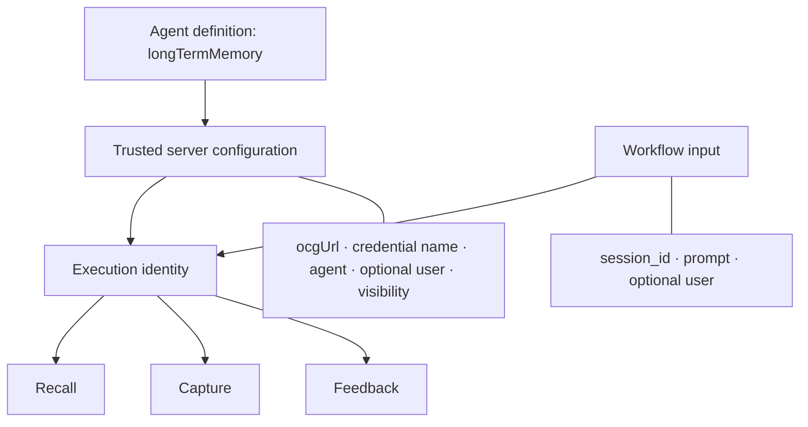
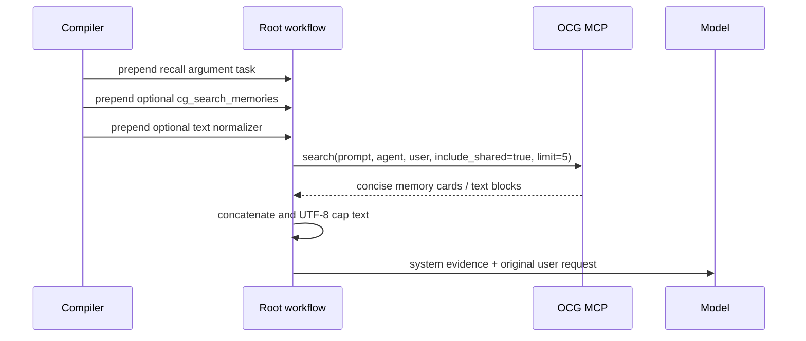
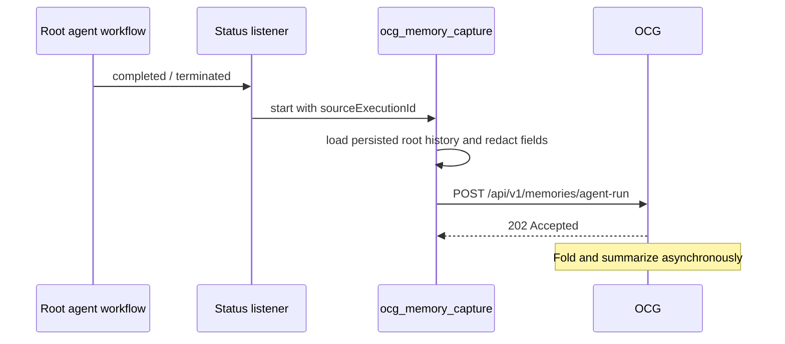
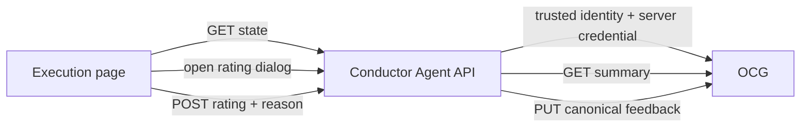
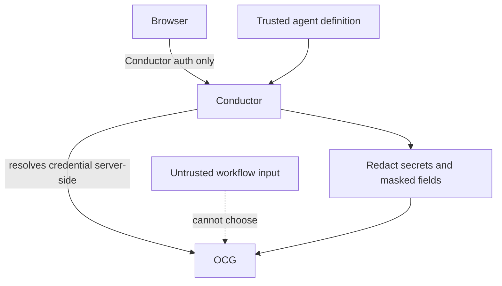

# OCG Agent Memory Lifecycle

**Status:** Implemented on this branch; live OCG contract verification remains.
**Updated:** 2026-08-18
**Scope:** AgentSpan compiler/runtime, Agent API, `ui-next`, OCG

## In one picture

```mermaid
flowchart LR
    A[Start root agent run] --> B[Compiler adds bounded recall]
    B --> C[cg_search_memories via OCG MCP]
    C --> D[Normalize text blocks]
    D --> E[Inject reviewed evidence before model work]
    E --> F[Agent and subagents run]
    F --> G[Root run completes or is terminated]
    G --> H[Start ocg_memory_capture workflow]
    H --> I[POST raw redacted run to OCG]
    I --> J[OCG folds, summarizes, indexes, and ranks]
    J --> K[UI displays summary and collects human feedback]
    K --> L[Conductor proxies feedback to OCG]
```



Conductor orchestrates the lifecycle. OCG owns memory folding, summaries, retention, ranking, and
canonical feedback. Conductor never compiles an LLM summarizer or a memory-write tool.

## What is implemented

| Capability | Current behavior |
|---|---|
| Activation | `longTermMemory.ocgUrl`, `credential`, and `agent` must all be non-blank. |
| Recall | Compiler prepends optional INLINE → `cg_search_memories` → INLINE tasks. The call uses the original `prompt`, configured agent, resolved user scope, `include_shared=true`, and `limit=5`. |
| Prompt safety | Only MCP text blocks are joined; the result is capped to the agent context limit and injected as *human-reviewed evidence*, never instructions. |
| Agent boundaries | Every agent definition with its own OCG config gets its own recall prelude. Parent recall is not forwarded to children. Child runs are never captured or feedback-eligible. |
| Capture | A completed or terminated root run starts an observable `ocg_memory_capture` workflow. Its `OCG_MEMORY_CAPTURE` task posts the redacted source run to OCG. Failed and timed-out runs are not captured. |
| Feedback | Completed or terminated root agent runs can be rated `positive` or `negative`, with a required reason (1–2,000 characters). OCG is the source of truth. |
| UI | `ui-next` shows **Helpful** / **Not helpful**, displays the OCG summary in a feedback dialog, and links to the capture workflow. |

## Configuration and identity



| Value | Source | Rule |
|---|---|---|
| `agent` | `longTermMemory.agent` | Required; stable logical-agent key. |
| `user` | configured user, else workflow input user | Normalized to `user:<id>`; falls back to `agent:<agent>`. |
| `session_id` | workflow input | Falls back to the execution ID. Keep it stable across conversation turns. |
| `execution_id` | root workflow ID | One completed agent turn; used consistently by capture, memory preview, and feedback. |
| `credential` | agent definition | Credential *name* only. The server resolves its value; neither workflows nor browsers receive it. |
| `visibility` | agent definition | `public` by default; set `private` to limit a capture to its owner. |

Memories are scoped by agent and user. By default, a memory is available to every user of the same
agent; set `visibility` to `private` when it must be limited to its owning user.

Minimal definition:

```json
"longTermMemory": {
  "ocgUrl": "https://ocg.example.com",
  "credential": "OCG_API_KEY",
  "agent": "support-agent",
  "user": "user:alice",
  "visibility": "private"
}
```

## Recall happens before domain work



Failures in search or normalization produce empty recall and do not fail the run. The model gets a
clear instruction to validate positive memories against current evidence and to avoid reusing the
conclusions of negative memories. The lifecycle recall is compiler-owned: it does not expose OCG
memory mutation tools to the model or run MCP discovery.

An agent may separately configure the allowlisted OCG graph tools (`cg_query`, neighbor/traversal,
and path operations). Those are model-selected tools, not lifecycle memory.

## Capture is observable and non-blocking to the agent result



The capture payload contains the stable identity, original prompt, final result, ordered tool and
subagent events, outcome, timestamps, and optional `repo`, `branch`, and `cwd`. Masked fields and
credential-like keys are replaced with `[REDACTED]`. To fit OCG's 10 MiB request limit, Conductor
first truncates event detail/output while retaining the prompt and final result. If the request is
still too large, Conductor skips capture and records a redacted warning. A failed capture workflow
is visible for diagnosis but does not alter the already terminal root execution.

## Feedback and memory preview



| Conductor endpoint | Purpose |
|---|---|
| `GET /api/agent/executions/{id}/feedback` | Eligibility and current canonical rating. |
| `POST /api/agent/executions/{id}/feedback` | Upsert `{ "rating": "positive" | "negative", "reason": "..." }`. |
| `GET /api/agent/executions/{id}/feedback/memory` | OCG-generated execution summary and capture-workflow status. |

The service derives all OCG routing fields from the persisted execution and agent definition. It
rejects child, running, failed, timed-out, non-agent, and non-OCG executions. The UI hides controls
when the server reports ineligibility or an older server lacks the endpoints. Upstream failures
become stable API errors; the user can retry without changing workflow state.

## Safety boundaries



- OCG URLs and credential names come only from the trusted agent definition.
- The browser supplies only a rating and reason; it cannot select an agent, user, session, OCG URL,
  credential, or execution identity.
- Recalled content is evidence, not executable instruction.
- Capture and feedback are restricted to completed or terminated root agent executions.
