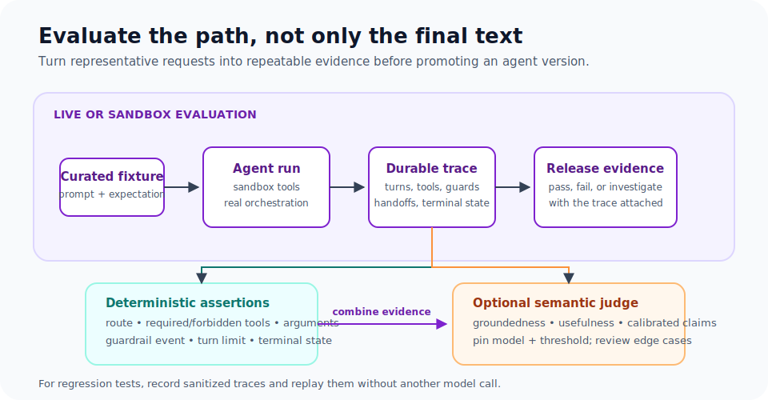

# Agent Evals

<section class="integration-hero integration-hero--evals" aria-labelledby="evals-hero-title">
  <p class="integration-hero__eyebrow">Agent release confidence</p>
  <h2 id="evals-hero-title">Test the path your agent takes—not only its final text.</h2>
  <p>Evals turn representative requests into durable release evidence: tool choices, arguments, handoffs, guardrail events, turns, terminal state, and optionally judged output quality.</p>
  
  <div class="integration-action-grid integration-action-grid--three">
    <a class="integration-action-card" href="#start-with-deterministic-behavior">
      <span class="integration-action-card__title">Assert deterministic behavior</span>
      <span>Verify routing, tool usage, arguments, handoffs, and terminal state.</span>
    </a>
    <a class="integration-action-card" href="#add-a-semantic-judge-deliberately">
      <span class="integration-action-card__title">Judge qualitative output</span>
      <span>Score groundedness and usefulness with a pinned model and threshold.</span>
    </a>
    <a class="integration-action-card" href="#record-a-regression-trace">
      <span class="integration-action-card__title">Replay regressions</span>
      <span>Record sanitized traces for fast, repeatable assertions without a new model call.</span>
    </a>
  </div>
</section>

Evals answer a release question: did the agent take the intended path for a representative scenario? Guardrails enforce policy during a live run; evaluations measure behavior before a version is promoted.

Conductor persists the events an evaluation needs: tool calls and arguments, handoffs, guardrail results, turns, output, retries, and terminal state. That makes behavior checks more useful than text-only assertions.

## What is available today

The Python Agent SDK includes a correctness-evaluation harness for live agent runs:

- `CorrectnessEval` runs a suite of `EvalCase` definitions.
- Cases can require or forbid tools, verify tool arguments, assert a handoff target, check output text or a regex, require a terminal status, and attach custom assertions.
- Strategy validation verifies the recorded orchestration behavior against the configured agent strategy.
- The fluent assertion API can inspect guardrail pass/fail events, tool-call order, event sequence, and maximum turns.
- `record()` and `replay()` save an `AgentResult` trace for deterministic regression assertions without another model call.
- `assert_output_satisfies()` provides an optional LLM-as-judge semantic score.

There is not a server-side evaluation dataset, experiment tracker, or scorecard API. The harness is designed for code and CI. The Java SDK has focused unit and end-to-end agent tests, but does not yet expose an equivalent `CorrectnessEval`/record-replay package.

## Start with deterministic behavior

Make routing and side-effect policy deterministic before judging prose quality. This example runs real agent prompts and checks the durable trace:

```python
from conductor.ai.agents.testing import CorrectnessEval, EvalCase

suite = CorrectnessEval(runtime).run([
    EvalCase(
        name="refund_routes_to_billing",
        agent=support_agent,
        prompt="I need a refund for order 123.",
        expect_handoff_to="billing",
        expect_tools=["lookup_order"],
        expect_tools_not_used=["send_marketing_email"],
        expect_output_contains=["refund"],
        tags=["routing", "safety"],
    ),
])

assert suite.all_passed
```

Run a small deterministic suite on every change. Use tags to separate fast routing checks from provider-backed or slower integration cases.

## Add a semantic judge deliberately

Some requirements cannot be reduced to exact text: “grounded in the retrieved evidence,” “clear escalation summary,” or “does not overstate confidence.” The Python SDK can use a separate model as a judge:

```python
from conductor.ai.agents.testing.semantic import assert_output_satisfies

def is_grounded(result):
    assert_output_satisfies(
        result,
        criterion="The answer cites only supplied evidence and clearly states uncertainty.",
        model="anthropic/claude-sonnet-4-6",
        threshold=0.8,
    )

suite = CorrectnessEval(runtime).run([
    EvalCase(
        name="review_is_grounded",
        agent=review_agent,
        prompt="Review this change.",
        custom_assertions=[is_grounded],
        tags=["semantic"],
    ),
])
```

An LLM judge is probabilistic and has cost. Pin the judge model and threshold, run it separately from fast CI when appropriate, and include deterministic checks that prevent unsafe paths even if the judge is unavailable.

## Test guardrails and side effects

For every write-capable tool, include at least these cases:

| Case | Expected evidence |
|---|---|
| Safe request | Required read tools and the intended write path occur only after approval. |
| Disallowed argument | The tool is not called; the guardrail failure is recorded. |
| Approval rejected | The agent/workflow completes or terminates without the write task. |
| Retryable dependency failure | Only the failed task retries; completed upstream work remains recorded. |
| Cancellation | No new write occurs after cancellation; reconcile ambiguous in-flight writes by idempotency key or marker. |

Use a fixture account, sandbox, or fake tool for tests that could send email, charge money, mutate a repository, or run commands. Do not place production credentials or production records in an eval corpus or an LLM judge prompt.

## Record a regression trace

Use record/replay when the purpose is to preserve a known-good behavior shape, not to retest a live model:

```python
from conductor.ai.agents.testing import expect, record, replay

result = runtime.run(support_agent, "Where is my order?")
record(result, "tests/recordings/order-status.json")

saved = replay("tests/recordings/order-status.json")
expect(saved).completed().used_tool("lookup_order").no_errors()
```

Recorded traces may contain prompts, tool arguments, and outputs. Store only sanitized fixtures and protect the recording directory with the same care as test data.

## A practical release ladder

1. **Unit tests:** custom guardrail, tool, and data-shaping logic against fixed inputs.
2. **Trace assertions:** mocked or replayed agent results for routing, tool, guardrail, and turn-count invariants.
3. **Live correctness evals:** real agent runs against sandbox tools and a small curated prompt set.
4. **Semantic evals:** a separate judge scores groundedness, usefulness, and policy adherence.
5. **Production monitoring:** inspect execution history, approval decisions, failures, retries, and token use; add failed production scenarios to the fixture suite.

Use a failure in layers 1–3 as a release blocker for a safety or routing invariant. Treat semantic scores as a quality signal with a documented threshold and human review for boundary cases.

## Next steps

- **[Agent Guardrails](agent-guardrails.md)** — Runtime policy enforcement for inputs, outputs, and tools.
- **[Conductor Agents](conductor-agents.md)** — Deploy and invoke an SDK-authored agent from a workflow.
- **[Human-in-the-Loop](human-in-the-loop.md)** — Evaluate approval, edit, and rejection paths.
- **[Failure Semantics](failure-semantics.md)** — Test retries, cancellation, and ambiguous external writes.
