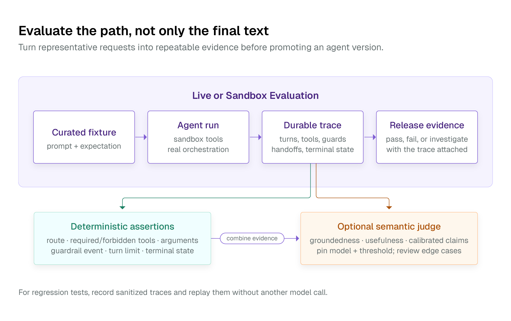

# Agent Evals

<section class="integration-hero integration-hero--evals" aria-label="Agent evals">
  <p>An <strong>eval</strong> is a repeatable test for an agent. It replays a representative request against the agent and asserts on what the agent actually did, not only on the text it produced: which tools it called and with what arguments, how it routed between agents, which guardrails fired, and how the run ended. Run evals before promoting a new agent version, the same way you run tests before shipping code.</p>
  
  <div class="integration-action-grid integration-action-grid--three">
    <a class="integration-action-card" href="#start-with-deterministic-behavior">
      <span class="integration-action-card__title">Assert deterministic behavior</span>
      <span>Verify routing, tool usage, arguments, handoffs, and terminal state.</span>
    </a>
    <a class="integration-action-card" href="#add-a-semantic-judge-deliberately">
      <span class="integration-action-card__title">Judge qualitative output</span>
      <span>Score groundedness and usefulness with a pinned model and threshold.</span>
    </a>
    <a class="integration-action-card" href="#record-a-regression-trace">
      <span class="integration-action-card__title">Replay regressions</span>
      <span>Record sanitized traces for fast, repeatable assertions without a new model call.</span>
    </a>
  </div>
</section>

Evals answer a release question: did the agent take the intended path for a representative scenario? Guardrails enforce policy during a live run; evaluations measure behavior before a version is promoted.

Conductor persists the events an evaluation needs: tool calls and arguments, handoffs, guardrail results, turns, output, retries, and terminal state. That makes behavior checks more useful than text-only assertions.

## What an eval checks

An eval asserts on the **durable trace**, not just the final text. Conductor persists every tool call and its arguments, every handoff, guardrail result, turn, retry, and the terminal state — so a case can assert on the path the agent actually took.

| You can assert on | Examples |
|---|---|
| Tool behaviour | Which tools ran, in what order, with which arguments; which were forbidden |
| Routing | Which sub-agent handled it, which handoff fired |
| Guardrails | That a rule passed, or that it correctly blocked |
| Shape | Terminal status, turn count, output type, text or regex match |
| Quality | An optional LLM judge scoring groundedness or usefulness |

## The building blocks

| Piece | What it does |
|---|---|
| `EvalCase` | One scenario: a prompt plus the assertions it must satisfy |
| `CorrectnessEval` | Runs a suite of cases and returns an `EvalSuiteResult` |
| `expect(result)` | Fluent assertions over a single run |
| `assert_*` helpers | Named assertions for tools, output, status, events, handoffs, guardrails |
| `mock_run()` | Drive an agent through scripted events with no model call |
| `record()` / `replay()` | Save a trace and re-assert against it later |
| `assert_output_satisfies()` | LLM-as-judge score with a pinned model and threshold |

## Start with deterministic behavior

Make routing and side-effect policy deterministic before judging prose quality. This example runs real agent prompts and checks the durable trace:

```python
from conductor.ai.agents.testing import CorrectnessEval, EvalCase

suite = CorrectnessEval(runtime).run([
    EvalCase(
        name="refund_routes_to_billing",
        agent=support_agent,
        prompt="I need a refund for order 123.",
        expect_handoff_to="billing",
        expect_tools=["lookup_order"],
        expect_tools_not_used=["send_marketing_email"],
        expect_output_contains=["refund"],
        tags=["routing", "safety"],
    ),
])

assert suite.all_passed
```

Run a small deterministic suite on every change. Use tags to separate fast routing checks from provider-backed or slower integration cases.

## Add a semantic judge deliberately

Some requirements cannot be reduced to exact text: “grounded in the retrieved evidence,” “clear escalation summary,” or “does not overstate confidence.” The Python SDK can use a separate model as a judge:

```python
from conductor.ai.agents.testing.semantic import assert_output_satisfies

def is_grounded(result):
    assert_output_satisfies(
        result,
        criterion="The answer cites only supplied evidence and clearly states uncertainty.",
        model="anthropic/claude-sonnet-4-6",
        threshold=0.8,
    )

suite = CorrectnessEval(runtime).run([
    EvalCase(
        name="review_is_grounded",
        agent=review_agent,
        prompt="Review this change.",
        custom_assertions=[is_grounded],
        tags=["semantic"],
    ),
])
```

An LLM judge is probabilistic and has cost. Pin the judge model and threshold, run it separately from fast CI when appropriate, and include deterministic checks that prevent unsafe paths even if the judge is unavailable.

## Test guardrails and side effects

For every write-capable tool, include at least these cases:

| Case | Expected evidence |
|---|---|
| Safe request | Required read tools and the intended write path occur only after approval. |
| Disallowed argument | The tool is not called; the guardrail failure is recorded. |
| Approval rejected | The agent/workflow completes or terminates without the write task. |
| Retryable dependency failure | Only the failed task retries; completed upstream work remains recorded. |
| Cancellation | No new write occurs after cancellation; reconcile ambiguous in-flight writes by idempotency key or marker. |

Use a fixture account, sandbox, or fake tool for tests that could send email, charge money, mutate a repository, or run commands. Do not place production credentials or production records in an eval corpus or an LLM judge prompt.

## Assertion helpers

Alongside the fluent `expect(...)` API, `conductor.ai.agents.testing` exports named assertions you can use directly in a test:

| Area | Assertions |
|---|---|
| Tools | `assert_tool_used`, `assert_tool_not_used`, `assert_tool_called_with`, `assert_tool_call_order`, `assert_tools_used_exactly` |
| Output | `assert_output_contains`, `assert_output_matches`, `assert_output_type` |
| Status | `assert_status`, `assert_no_errors`, `assert_max_turns` |
| Events | `assert_events_contain`, `assert_event_sequence` |
| Multi-agent | `assert_handoff_to`, `assert_agent_ran` |
| Guardrails | `assert_guardrail_passed`, `assert_guardrail_failed` |

```python
from conductor.ai.agents.testing import assert_tool_used, assert_no_errors

result = runtime.run(agent, "What's the weather in San Francisco?")
assert_tool_used(result, "get_weather")
assert_no_errors(result)
```

## Test without calling a model

`mock_run()` drives an agent through a scripted sequence of events, so a test can assert on routing and tool selection with no provider call and no cost:

```python
from conductor.ai.agents.testing import mock_run

result = mock_run(agent, "What's the weather?", events=[...])
```

Tools still execute by default; pass `auto_execute_tools=False` to stub those too. Use `mock_run()` for logic that must hold on every commit, and a live `CorrectnessEval` suite for behaviour that only a real model can exercise.

## Record a regression trace

Use record/replay when the purpose is to preserve a known-good behavior shape, not to retest a live model:

```python
from conductor.ai.agents.testing import expect, record, replay

result = runtime.run(support_agent, "Where is my order?")
record(result, "tests/recordings/order-status.json")

saved = replay("tests/recordings/order-status.json")
expect(saved).completed().used_tool("lookup_order").no_errors()
```

Recorded traces may contain prompts, tool arguments, and outputs. Store only sanitized fixtures and protect the recording directory with the same care as test data.

## Run them in pytest

The SDK ships a pytest plugin, registered as `conductor-agents-testing`, providing two fixtures:

- **`mock_agent_run`** — the mock runner, per test
- **`event`** — a builder for the scripted events

```python
def test_weather_routes_to_the_right_tool(mock_agent_run, event):
    result = mock_agent_run(agent, "Weather in SF?", events=[event.tool_call("get_weather")])
    assert_tool_used(result, "get_weather")
```

## A practical release ladder

1. **Unit tests:** custom guardrail, tool, and data-shaping logic against fixed inputs.
2. **Trace assertions:** mocked or replayed agent results for routing, tool, guardrail, and turn-count invariants.
3. **Live correctness evals:** real agent runs against sandbox tools and a small curated prompt set.
4. **Semantic evals:** a separate judge scores groundedness, usefulness, and policy adherence.
5. **Production monitoring:** inspect execution history, approval decisions, failures, retries, and token use; add failed production scenarios to the fixture suite.

Use a failure in layers 1–3 as a release blocker for a safety or routing invariant. Treat semantic scores as a quality signal with a documented threshold and human review for boundary cases.

## Next steps

- **[Production Agent Architecture](production-agent-architecture.md)** — use evaluation evidence as a release gate and operating baseline.
- **[Agent Guardrails](agent-guardrails.md)** — Runtime policy enforcement for inputs, outputs, and tools.
- **[Conductor Agents](conductor-agents.md)** — Deploy and invoke an SDK-authored agent from a workflow.
- **[Human-in-the-Loop](human-in-the-loop.md)** — Evaluate approval, edit, and rejection paths.
- **[Failure Semantics](failure-semantics.md)** — Test retries, cancellation, and ambiguous external writes.
