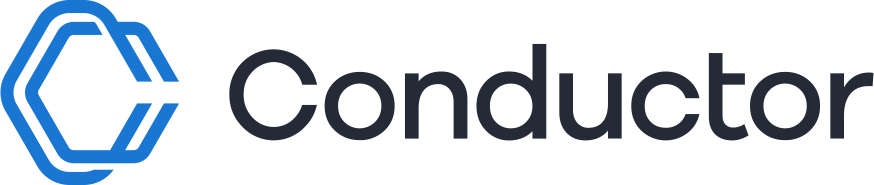

# Framework Agent Recipes

Use these recipes when the agent already exists as a framework object and you want Conductor to compile and operate its durable graph. The framework SDKs remain the source of truth for dependencies, setup, and executable framework code; this page selects the supported Conductor path and lifecycle.

All production recipes follow the same pattern: **create → plan → deploy → serve → invoke**. `run` is the right lifecycle for an interactive session; `deploy` plus `serve` is the production path for a reusable agent that workflow graphs can invoke through `AGENT` with `agentType: "conductor"`.

<section class="framework-hero" aria-labelledby="framework-hero-title">
  
Conductor Agents bridges

  <h2 id="framework-hero-title">Bring your agent. Make it durable.</h2>
  
Keep the framework you already use. Conductor compiles its agent into a durable graph you can inspect, retry, and compose with workflows.

  

    <a class="framework-logo-card" href="#openai-agents" aria-label="OpenAI Agents recipe">
      
      OpenAI Agents
    </a>
    <a class="framework-logo-card" href="#google-adk" aria-label="Google ADK recipe">
      
      Google ADK
    </a>
    <a class="framework-logo-card" href="#langchain-and-langchain4j" aria-label="LangChain recipe">
      
      LangChain
    </a>
    <a class="framework-logo-card" href="#langgraph-and-langgraph4j" aria-label="LangGraph recipe">
      
      LangGraph
    </a>
    <a class="framework-logo-card" href="#vercel-ai-sdk" aria-label="Vercel AI SDK recipe">
      
      Vercel AI SDK
    </a>
    <a class="framework-logo-card" href="#native-conductor-agents" aria-label="Native Conductor Agents recipe">
      
      Native Conductor Agents
    </a>
  

</section>

## Support matrix

| Framework path | SDK / language | Use for | Maintained reference |
|---|---|---|---|
| OpenAI Agents | Python, JavaScript / TypeScript | OpenAI Agents objects, tools, handoffs, and guardrails | [OpenAI Agents Python](https://github.com/openai/openai-agents-python), [Agents JS](https://github.com/openai/openai-agents-js) |
| Google ADK | Python, Java | ADK agents and multi-agent compositions | [Google ADK](https://google.github.io/adk-docs/), [ADK samples](https://github.com/google/adk-python/tree/main/contributing/samples) |
| LangChain / LangChain4j | Python, Java | Chain- or JVM-native agent logic | [LangChain](https://python.langchain.com/docs/tutorials/agents/), [LangChain4j agents](https://docs.langchain4j.dev/tutorials/agents/) |
| LangGraph / LangGraph4j | Python, Java | Stateful graph agents and multi-agent graphs | [LangGraph](https://langchain-ai.github.io/langgraph/), [LangGraph4j examples](https://github.com/langgraph4j/langgraph4j-examples) |
| Vercel AI SDK | JavaScript / TypeScript | TypeScript agents and tool loops | [AI SDK docs](https://ai-sdk.dev/docs/introduction), [AI SDK examples](https://github.com/vercel/ai/tree/main/examples) |
| Native Conductor Agents | Python, Java, JavaScript / TypeScript | Agents authored directly with Conductor's agent SDK model | [Python SDK examples](https://github.com/conductor-oss/python-sdk/tree/main/examples), [Java SDK examples](https://github.com/conductor-oss/java-sdk/tree/main/examples), [JavaScript SDK examples](https://github.com/conductor-oss/javascript-sdk/tree/main/examples) |

The server currently recognizes the framework identifiers `openai`, `google_adk`, `langchain`, `langgraph`, and `vercel_ai` when it normalizes a framework-specific agent definition. The identifiers are SDK and API plumbing, not `AGENT.agentType` values.

## Recipes

###  OpenAI Agents

Create the agent in the OpenAI Agents SDK and use the Conductor bridge supplied by your Conductor SDK to plan or deploy it. Use `run` for interactive experimentation. For production, deploy the definition, start the bridge workers with `serve`, then invoke the registered agent by name from the larger Conductor workflow. Follow the maintained [OpenAI Agents Python examples](https://github.com/openai/openai-agents-python/tree/main/examples) or [Agents JS examples](https://github.com/openai/openai-agents-js/tree/main/examples) rather than copying versions of their framework API here.

###  Google ADK

Pass the Google ADK agent object through the matching Conductor SDK bridge. The compiler turns the agent and its child-agent structure into a Conductor graph. Use direct `run` while iterating locally; use deploy plus serve when the graph will be called by a long-lived business workflow. Start with the maintained [ADK samples](https://github.com/google/adk-python/tree/main/contributing/samples), then compose the deployed result with [the basic workflow recipe](conductor-agents.md#workflow-integration-recipes).

###  LangChain and LangChain4j

Use the Python route for LangChain and the Java route for LangChain4j. These bridges are suited to framework logic that needs to remain in the framework while Conductor owns retry, waits, state, and parent-workflow composition. Use `run` for an interactive agent; deploy and serve it before using it as an `AGENT` step in production. Keep executable code aligned with the maintained [LangChain agent tutorial](https://python.langchain.com/docs/tutorials/agents/) or [LangChain4j agent guide](https://docs.langchain4j.dev/tutorials/agents/).

###  LangGraph and LangGraph4j

Use the Python route for LangGraph or the Java route for LangGraph4j when the existing application expresses its logic as a state graph. Plan the generated Conductor graph during development, then deploy and serve the bridge for production. The maintained [LangGraph examples](https://github.com/langchain-ai/langgraph/tree/main/examples) and [LangGraph4j examples](https://github.com/langgraph4j/langgraph4j-examples) are the executable source of truth; use [the parallel-agent recipe](conductor-agents.md#workflow-integration-recipes) to compose multiple deployed specialists around it.

###  Vercel AI SDK

Use the TypeScript bridge for Vercel AI SDK agent and tool-loop objects. Run directly during interactive development; for production, deploy the compiled graph and serve the bridge process before invoking it by name from a workflow. Keep the AI SDK implementation in the maintained [Vercel AI SDK examples](https://github.com/vercel/ai/tree/main/examples) and use the [human-in-the-loop recipe](conductor-agents.md#workflow-integration-recipes) when the broader process needs durable approval or input.

###  Native Conductor Agents

For a new agent that does not need a foreign framework, author the agent with a Conductor SDK. This uses the same lifecycle and yields the same reusable deployed agent graph. Use `run` for a one-off interactive invocation; deploy plus serve for production. Start from the maintained [Conductor Python](https://github.com/conductor-oss/python-sdk/tree/main/examples), [Java](https://github.com/conductor-oss/java-sdk/tree/main/examples), or [JavaScript](https://github.com/conductor-oss/javascript-sdk/tree/main/examples) examples.

## Other current bridges

The server also includes a `claude_agent_sdk` normalization path and a `skill` path for server-registered skill packages. Treat these as bridge-specific integrations: use their SDK or package documentation for executable code, and use the same deploy/serve lifecycle before composing the result with an `AGENT` task.

## Choose the right path

- Use [Build Your First Agentic Workflow Graph](first-ai-agent.md) when you want to compose a deployed agent with direct Conductor tasks.
- Use [Conductor Agents](conductor-agents.md) when you already have a framework-native agent or want a reusable deployed agent graph.
- Use [A2A Integration](a2a-integration.md) when the agent runs remotely behind the A2A protocol.
