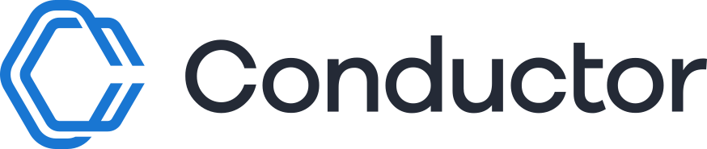
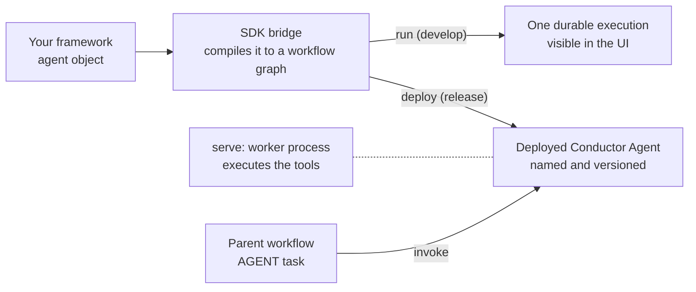

# Framework Agent Bridges

<section class="framework-hero" aria-label="Framework bridges">
  <p>A <strong>bridge</strong> is the SDK adapter that lets Conductor run an agent authored in another framework, such as OpenAI Agents, LangChain, LangGraph, or Google ADK. You keep the agent object your framework defines, and the bridge compiles and runs it as a durable Conductor execution. This page is the reference for the bridges: which frameworks and languages are supported, how a bridged agent becomes a deployable Conductor Agent, and where the maintained examples live for each pairing.</p>
  <div class="framework-logo-grid">
    <a class="framework-logo-card" href="../../quickstart/framework-agents.html#openai-agents-sdk" aria-label="OpenAI Agents quickstart">
      
      <span>OpenAI Agents</span>
    </a>
    <a class="framework-logo-card" href="../../quickstart/framework-agents.html#google-adk" aria-label="Google ADK quickstart">
      
      <span>Google ADK</span>
    </a>
    <a class="framework-logo-card" href="../../quickstart/framework-agents.html#langchain" aria-label="LangChain quickstart">
      
      <span>LangChain</span>
    </a>
    <a class="framework-logo-card" href="../../quickstart/framework-agents.html#langgraph" aria-label="LangGraph quickstart">
      
      <span>LangGraph</span>
    </a>
    <a class="framework-logo-card" href="https://github.com/conductor-oss/javascript-sdk/tree/main/examples/agents/vercel-ai" aria-label="Vercel AI SDK examples on GitHub">
      
      <span>Vercel AI SDK</span>
    </a>
    <a class="framework-logo-card" href="../../quickstart/first-agent.html" aria-label="Conductor Agents quickstart">
      
      <span>Conductor Agents</span>
    </a>
  </div>
</section>

## Choose your bridge

| Framework | Start here |
|---|---|
| OpenAI Agents | [Framework quickstart](../../quickstart/framework-agents.md#openai-agents-sdk) |
| Google ADK | [Google ADK quickstart](../../quickstart/framework-agents.md#google-adk) |
| LangChain / LangChain4j | [LangChain quickstart](../../quickstart/framework-agents.md#langchain) |
| LangGraph / LangGraph4j | [LangGraph quickstart](../../quickstart/framework-agents.md#langgraph) |
| Vercel AI SDK | [Maintained SDK examples](../../quickstart/framework-agents.md#sdk-examples) |
| Conductor Agents | [Run your first Conductor Agent](../../quickstart/first-agent.md) |

Each route keeps the framework-specific code, dependencies, and executable examples in the owning Conductor SDK. The bridge is the boundary: your framework remains the authoring surface, while Conductor provides durable execution around it.

## From framework object to workflow step

Every bridge follows the same path from your code to a reusable workflow step:


```mermaid
flowchart LR
    obj["Your framework<br/>agent object"] --> bridge["SDK bridge<br/>compiles it to a workflow graph"]
    bridge -- "run (develop)" --> devrun["One durable execution<br/>visible in the UI"]
    bridge -- "deploy (release)" --> deployed["Deployed Conductor Agent<br/>named and versioned"]
    workers["serve: worker process<br/>executes the tools"] -.- deployed
    parent["Parent workflow<br/>AGENT task"] -- "invoke" --> deployed
```

1. **Run it while you iterate.** Pass your framework's agent object to the SDK bridge and run it. The bridge compiles the agent and executes it on Conductor, so the durable execution is visible in the UI from the first run.
2. **Deploy it when it stabilizes.** Deploying registers the compiled agent on the server as a named, versioned Conductor Agent. Callers can then invoke it without importing your framework or its dependencies.
3. **Serve its workers.** Where the bridge runs your tools as local functions, a worker process must be running to execute them. Keep it running for as long as the deployed agent is in use.
4. **Invoke it from a workflow.** A parent workflow calls the deployed agent with an `AGENT` task, the same way it calls any other durable step.

In the Python SDK, those steps are four calls on the same runtime. Here they are with the LangChain bridge:

```python
from conductor.ai.agents import AgentRuntime
from langchain.agents import create_agent
from langchain_core.tools import tool

@tool
def check_token() -> str:
    """Check a token."""
    return "available"

agent = create_agent("openai:gpt-4o-mini", tools=[check_token],
                     system_prompt="You are a helpful assistant.")

with AgentRuntime() as runtime:
    runtime.run(agent, "Is the token set?")  # develop: compile and execute once
    runtime.plan(agent)                      # CI: inspect the compiled graph
    runtime.deploy(agent)                    # release: register without executing
    runtime.serve(agent)                     # operate: run tool workers and block
```

`serve()` blocks, so in production it belongs in its own long-lived worker process while `deploy()` runs in CI/CD. Once deployed, a parent workflow invokes the agent by name:

```json
{
  "name": "run_agent",
  "taskReferenceName": "run_agent_ref",
  "type": "AGENT",
  "inputParameters": {
    "agentType": "conductor",
    "name": "<deployed-agent-name>",
    "prompt": "${workflow.input.prompt}"
  }
}
```

The [Conductor Agents](conductor-agents.md) page covers the deployed agent's runtime behavior: invocation, waiting, resume, cancellation, and outputs.

## Maintained SDK examples

| Framework | Python | Java | TypeScript / JavaScript | C# |
|---|---|---|---|---|
| OpenAI Agents | [Examples](https://github.com/conductor-oss/python-sdk/tree/main/examples/agents/openai) | [Examples](https://github.com/conductor-oss/java-sdk/tree/main/agent-examples) | [Examples](https://github.com/conductor-oss/javascript-sdk/tree/main/examples/agents/openai) | [Examples](https://github.com/conductor-oss/csharp-sdk/tree/main/Conductor.AI.Examples) |
| Google ADK | [Examples](https://github.com/conductor-oss/python-sdk/tree/main/examples/agents/adk) | [Examples](https://github.com/conductor-oss/java-sdk/tree/main/agent-examples) | [Examples](https://github.com/conductor-oss/javascript-sdk/tree/main/examples/agents/adk) | [Examples](https://github.com/conductor-oss/csharp-sdk/tree/main/Conductor.AI.Examples) |
| LangChain | [Examples](https://github.com/conductor-oss/python-sdk/tree/main/examples/agents) | [LangChain4j examples](https://github.com/conductor-oss/java-sdk/tree/main/agent-examples) | [Examples](https://github.com/conductor-oss/javascript-sdk/tree/main/examples/agents) | — |
| LangGraph | [Examples](https://github.com/conductor-oss/python-sdk/tree/main/examples/agents/langgraph) | [LangGraph4j examples](https://github.com/conductor-oss/java-sdk/tree/main/agent-examples) | [Examples](https://github.com/conductor-oss/javascript-sdk/tree/main/examples/agents/langgraph) | — |
| Vercel AI SDK | — | — | [Examples](https://github.com/conductor-oss/javascript-sdk/tree/main/examples/agents/vercel-ai) | — |

## Next steps

- [Run a framework quickstart](../../quickstart/framework-agents.md) to execute an existing agent through Conductor.
- [Build an agentic workflow graph](first-ai-agent.md) to compose a deployed agent with direct Conductor tasks.
- [Apply guardrails](agent-guardrails.md) and [evaluate recorded behavior](agent-evals.md) before promotion.
- [Use A2A Integration](a2a-integration.md) when the agent is independently deployed and remains remote.
