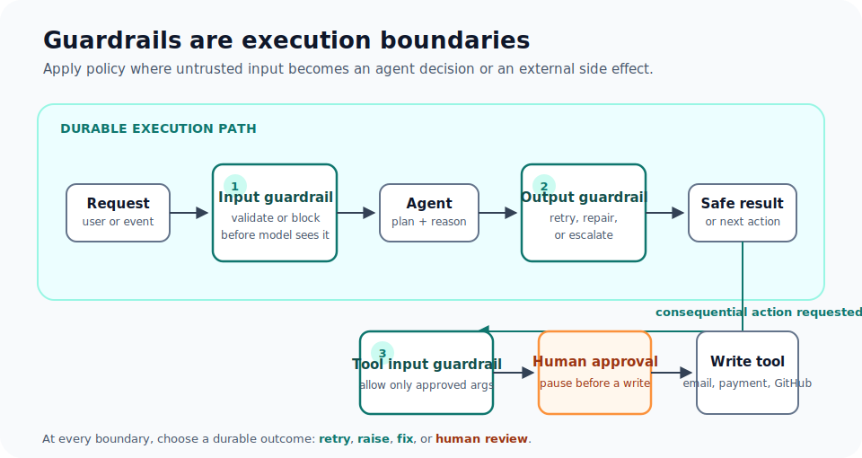

# Agent Guardrails

<section class="integration-hero integration-hero--guardrails" aria-labelledby="guardrails-hero-title">
  <p class="integration-hero__eyebrow">Runtime safety controls</p>
  <h2 id="guardrails-hero-title">Protect every boundary. Pause before consequential action.</h2>
  <p>Guardrails turn policy into durable execution steps: validate requests, constrain model output, block unsafe tool arguments, and route acceptable writes through human approval.</p>
  
  <div class="integration-action-grid integration-action-grid--three">
    <a class="integration-action-card" href="#choose-the-closest-enforcement-point">
      <span class="integration-action-card__title">Place the control</span>
      <span>Put policy at the input, output, or tool boundary where it is enforceable.</span>
    </a>
    <a class="integration-action-card" href="#outcomes-on-failure">
      <span class="integration-action-card__title">Choose the outcome</span>
      <span>Retry, fail, repair, or pause for a reviewer with a durable record.</span>
    </a>
    <a class="integration-action-card" href="human-in-the-loop.html">
      <span class="integration-action-card__title">Design human review</span>
      <span>Use a durable approval point before an email, payment, command, or write.</span>
    </a>
  </div>
</section>

Use guardrails with **Conductor Agents** authored through the SDK. For a declarative workflow built directly from `LLM_CHAT_COMPLETE`, MCP, `HUMAN`, and control-flow tasks, compose the same policy explicitly with schemas, `SWITCH`, `JSON_JQ_TRANSFORM`, and `HUMAN`. See [Durable Adaptive Graphs](dynamic-workflows.md) for that pattern.

## Choose the closest enforcement point

| Need | Put the control here | Typical action |
|---|---|---|
| Reject unsafe user input before the model sees it | Agent input guardrail | Block or return a safe response |
| Keep a model response within policy | Agent output guardrail | Retry, terminate, repair, or ask a reviewer |
| Prevent a dangerous side effect | Tool input guardrail | Reject before the tool runs |
| Validate data returned by a tool | Tool output guardrail | Stop, repair, or escalate |
| Require review before a consequential action | Tool approval or a `HUMAN` task | Pause until an operator decides |

Tool-input guardrails are the critical boundary for writes. Do not rely on prompt instructions alone to protect a database mutation, shell command, payment, email, or GitHub write.

## Guardrail types

Conductor Agent definitions support four guardrail implementations:

| Type | Best for | Execution shape |
|---|---|---|
| Regex | PII patterns, formats, allowlists, known dangerous strings | Deterministic server-side check |
| LLM | Tone, groundedness, policy interpretation, semantic quality | A second model evaluates a policy at temperature zero |
| Custom | Domain policy that needs application state | A registered Conductor worker |
| External | A centrally managed policy service | An existing worker selected by name |

Regex guards run in `block` mode by default: a pattern match fails the check. Use `allow` mode when the content must match at least one allowed pattern, such as a constrained output format. Keep regexes narrow and deterministic; an allowlist for structured tool arguments is usually better expressed as a custom guardrail that parses the arguments by field.

An LLM guardrail receives the candidate content and a policy, then must produce a JSON pass/fail decision. Treat it as a semantic check, not a replacement for deterministic access control. Do not send credentials or raw sensitive records to an LLM judge; validate a redacted representation instead.

Custom and external guards become `SIMPLE` tasks. Register their task definitions and run an idempotent worker before deploying the agent; otherwise the guardrail task cannot be completed.

## Outcomes on failure

Every guardrail declares an `onFail` policy:

| Outcome | Behavior |
|---|---|
| `retry` | Add the failure feedback to the conversation and let the model produce another attempt, up to `maxRetries`. |
| `raise` | Terminate the agent execution as failed. Use for non-negotiable policy violations. |
| `fix` | Accept a corrected `fixed_output` from a custom guardrail. |
| `human` | Pause at a durable review step; the reviewer can approve, edit, or reject the output. |

Use `retry` only when another generation could plausibly satisfy the rule. Regex and LLM guards are validation checks, not rewriters; use a custom guardrail when a deterministic repair is required. A human outcome applies to output review, not input validation.

## Example: protect a write-capable tool

This Python Agent SDK example blocks card-number-shaped text before an email tool can run. The same `RegexGuardrail` can be attached to a tool's output when a response must be checked before downstream use.

```python
from conductor.ai.agents import OnFail, Position, RegexGuardrail, tool

no_card_data = RegexGuardrail(
    patterns=[r"\b(?:\d[ -]?){15}\d\b"],
    name="no_card_data_in_email",
    position=Position.INPUT,
    on_fail=OnFail.RAISE,
    message="Refusing to send payment-card data by email.",
)

@tool(guardrails=[no_card_data], approval_required=True)
def send_email(to: str, subject: str, body: str) -> dict:
    # Invoke the approved mail integration here.
    return {"status": "sent", "to": to}
```

This has two independent controls: the guardrail rejects unsafe arguments before the tool call, and `approval_required=True` creates a human decision point for an otherwise acceptable write. The tool should still be idempotent because retries and ambiguous network failures can occur around external side effects.

## Bound what the agent can do

Guardrails are one layer of a larger policy boundary:

- Define tool input and output schemas so malformed arguments are rejected before execution.
- Set `maxCalls` per tool, `maxTurns` per agent, and task or agent timeouts to bound work and cost.
- Use the plan-and-compile path's known-tool allowlist to reject plans that reference undeclared tools.
- Restrict multi-agent handoffs with `allowedTransitions`, and require declared tools with `requiredTools` where the process depends on a mandatory check.
- For CLI/code execution, use a small command allowlist, disable shell execution unless necessary, and set a short timeout.
- Declare credentials on the agent or tool so they resolve at execution time. Do not pass secrets in prompts, workflow inputs, or ambient worker environment variables.
- Use `maskedFields` to redact sensitive input or output fields from execution history and the UI.

For direct workflow definitions, make the same constraints visible in the graph: validate the model plan, branch only to allowlisted tasks, cap `DO_WHILE` and `FORK_JOIN_DYNAMIC`, and put a `HUMAN` task before an external write.

## Verify the guardrail itself

Test both a passing and a failing case. A good release gate verifies that:

1. Unsafe input never reaches the tool.
2. A blocked output cannot reach a caller or a write task.
3. The retry budget stops when exhausted.
4. A human reviewer can approve, edit, and reject the durable pause.
5. The expected guardrail event appears in the execution history.

Use [Agent Evals](agent-evals.md) to turn those checks into repeatable CI cases.

## Next steps

- **[Agent Evals](agent-evals.md)** — Test routing, tool use, guardrail behavior, and output quality before release.
- **[Human-in-the-Loop](human-in-the-loop.md)** — Durable approval patterns for consequential actions.
- **[Durable Adaptive Graphs](dynamic-workflows.md)** — Guard an adaptive workflow built directly from native tasks.
- **[Failure Semantics](failure-semantics.md)** — Retry, cancellation, and idempotency behavior around side effects.
