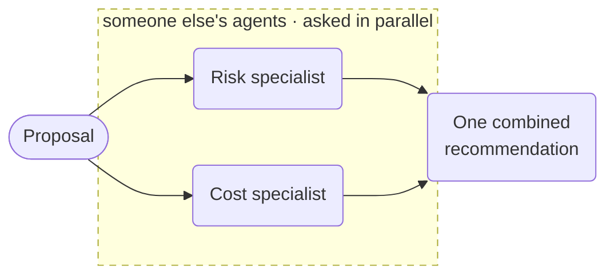

# A2A Agent Orchestration



**Outcome:** a workflow where deterministic tasks own the control flow and remote A2A agents do the specialist reasoning — verified reachable before delegation, called in parallel with idempotency keys, joined, then synthesized.

## The shape

The agents here are independently operated: separately deployed, separately versioned, reachable only over the A2A protocol. The workflow does not know how they reason and does not try to. What it owns is everything around them — whether they are reachable, how long they get, how many run at once, what happens when one fails, and how their outputs combine.

That division is the point. Each `AGENT` branch is an independent durable task: if Conductor restarts mid-flight, both in-flight delegations resume rather than restarting. If the cost agent fails and the risk agent succeeds, the `JOIN` surfaces that asymmetry instead of discarding the good result.

`GET_AGENT_CARD` runs first as a pre-flight check. Delegating to an endpoint that is down produces a timeout several minutes later; discovering it up front produces an immediate, legible failure.

It is marked `optional: true` on purpose. Without that flag the task fails terminally on an unreachable agent and takes the workflow with it, which means the reachability `SWITCH` below it never runs — the branch reads like a safety net but is dead code. With `optional: true` the task lands in `COMPLETED_WITH_ERRORS`, execution continues, and the `SWITCH` terminates with a `remote_agent_unreachable` output you can act on.

## A locally runnable setup

You do not need external endpoints to try this. **Any Conductor workflow can be served as an A2A agent** — set `metadata: {"a2a.enabled": true}` on its definition and it is exposed at `{basePath}/{workflowName}`. The served workflow receives the caller's text as `${workflow.input._a2a_text}`.

The A2A server is opt-in and off by default. Enable it on your server:

```properties
conductor.a2a.server.enabled=true
```

The default `conductor.a2a.server.basePath` is `/a2a`, so the two specialist workflows below are reachable at `http://localhost:8080/a2a/risk_specialist_agent` and `http://localhost:8080/a2a/cost_specialist_agent`.

Save this as `a2a-risk-specialist.json`:

```json
--8<-- "docs/devguide/ai/cookbook/assets/a2a-risk-specialist.json"
```

Save this as `a2a-cost-specialist.json`:

```json
--8<-- "docs/devguide/ai/cookbook/assets/a2a-cost-specialist.json"
```

## Runnable definition

Save this as `a2a-orchestration.json`:

```json
--8<-- "docs/devguide/ai/cookbook/assets/a2a-orchestration.json"
```

## Register and run

!!! warning "Register the two specialists over REST, not with the CLI"

    `conductor workflow create` drops the `metadata` block. The definition registers fine, but `metadata` comes back `{}`, the workflow is never exposed as an A2A agent, and every `/a2a/...` path returns 404. Use the metadata API for any workflow that relies on `metadata`:

    ```bash
    curl -X POST 'http://localhost:8080/api/metadata/workflow?overwrite=true' \
      -H 'Content-Type: application/json' -d @a2a-risk-specialist.json
    curl -X POST 'http://localhost:8080/api/metadata/workflow?overwrite=true' \
      -H 'Content-Type: application/json' -d @a2a-cost-specialist.json
    ```

Confirm each agent is actually exposed before orchestrating — this is also the fastest way to catch the metadata problem above:

```bash
curl -s http://localhost:8080/a2a/risk_specialist_agent/.well-known/agent-card.json
```

A live agent returns a card with `protocolVersion`, `preferredTransport: JSONRPC`, and a `skills` entry whose `tags` are the `a2a.tags` from the definition. A 404 means the metadata did not persist.

The orchestrator has no `metadata`, so the CLI is fine for it:

```bash
conductor workflow create a2a-orchestration.json
conductor workflow start -w a2a_agent_orchestration -i '{"proposal":"Migrate the billing service to a new payments provider in Q3.","riskAgentUrl":"http://localhost:8080/a2a/risk_specialist_agent","costAgentUrl":"http://localhost:8080/a2a/cost_specialist_agent","requestId":"proposal-1042"}'
```

Open **[Executions](http://localhost:8080/executions)** in the Conductor UI and select the new execution to review the task graph, and each task's inputs and outputs.

The two `AGENT` tasks should show overlapping start and end times — that is the fan-out working. Each also records the remote `taskId`, which is what you reconcile against if a delegation has to be retried.

Against two locally served specialists the whole run takes roughly 12–18 seconds, with each delegation about 5 seconds and the two overlapping. Point `riskAgentUrl` at a workflow that does not exist to see the unreachable path: the card task lands in `COMPLETED_WITH_ERRORS` and the workflow fails in about 3 seconds with `remote_agent_unreachable`.

## Production notes

- **`agentType` picks the protocol, not the framework.** Only `a2a` and `conductor` exist; there's no vendor-specific type.
- **Idempotency keys must survive a retry.** They come from the caller, and each branch derives its own from that.
- **A remote agent is someone else's code.** Validate what it returns; a prompt is not a schema.
- **Register anything using `metadata` over REST.** The CLI drops the block, and the agent silently never gets exposed.
- **Bound each delegation on its own** so a slow agent can't eat the other's budget.
- **Synthesis is advice.** Route consequential actions through [HITL approval](hitl-approval.md).
