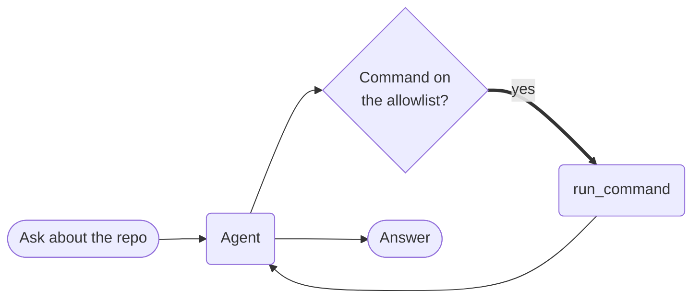

# Agent with CLI Tools



**Outcome:** the agent can run real shell commands to answer questions about a checkout, but only the commands you listed, and each run is a durable task you can inspect afterwards.

## How it works

- **`cli_commands=True` attaches a `run_command` tool.** You don't write the wrapper.
- **`cli_allowed_commands` is the boundary.** Anything outside the list is refused before it executes.
- **Shell mode is off by default,** so the model can't chain commands with pipes or `;`.
- **Every command is its own Conductor task,** so you can see exactly what ran and what it returned.

## Prerequisites

A Conductor server with an LLM provider, and `CONDUCTOR_SERVER_URL` set. The commands you allow must be on `PATH` where the worker runs.

## The agent

Save this as `agent_cli_tools.py`:

```python
--8<-- "docs/devguide/ai/cookbook/assets/agent_cli_tools.py"
```

## Run it

```bash
python agent_cli_tools.py
```

A verified run made two tool calls, used `ls`, and reported the file count for the working directory. Open **[Executions](http://localhost:8080/executions)** to see each `run_command` invocation with its arguments and output.

## The same example in other SDKs

The agent API is the same shape in every SDK. These are the upstream sources this recipe was derived from — the Java entry is an end-to-end test suite rather than a numbered example, but it exercises the same `CliConfig` API:

| SDK | Example |
|---|---|
| Python | [`16c_credentials_cli_tools.py`](https://github.com/conductor-oss/python-sdk/blob/main/examples/agents/16c_credentials_cli_tools.py) |
| Java | [`Suite3CliTools.java`](https://github.com/conductor-oss/java-sdk/blob/main/e2e/src/test/java/Suite3CliTools.java) |
| TypeScript | [`16c-credentials-cli-tools.ts`](https://github.com/conductor-oss/javascript-sdk/blob/main/examples/agents/16c-credentials-cli-tools.ts) |
| C# | [`Program.cs`](https://github.com/conductor-oss/csharp-sdk/blob/main/Conductor.AI.Examples/16c_CredentialsCliTools/Program.cs) |

## Production notes

- **The allowlist is the blast radius.** `git` includes `git push` — list the narrowest set that works.
- **Run the worker somewhere disposable.** Treat the working directory as untrusted output, not a source of truth.
- **Leave `allow_shell` off.** Enabling it hands the model arbitrary command composition.
- **Secrets go through `credentials=[...]` on the tool,** injected for the duration of the call — never into the prompt.
- **Set a timeout.** A hung command otherwise occupies a worker slot indefinitely.
