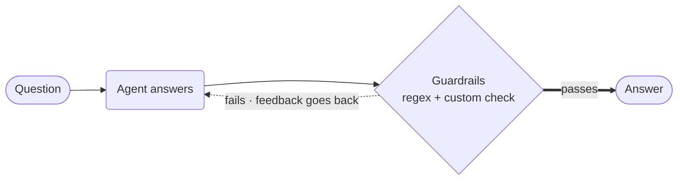

# Agent with Guardrails



**Outcome:** the agent's own output is checked before you ever see it, and a failed check sends the model back to try again with the reason attached.

## How it works

- **A `RegexGuardrail` costs nothing.** It compiles to a Conductor `INLINE` task and runs on the server — no Python process involved.
- **A `@guardrail` function runs as a worker task,** for checks a regex can't express.
- **Both live in the same durable retry loop.** `on_fail=OnFail.RETRY` appends the failure message to the conversation and regenerates.
- **`max_retries` bounds it.** Without a cap, an agent that can't satisfy a rule loops until the workflow times out.

## Prerequisites

A Conductor server with an LLM provider, and `CONDUCTOR_SERVER_URL` set. Install the SDK with `python -m pip install conductor-python`.

## The agent

Save this as `agent_guardrails.py`:

```python
--8<-- "docs/devguide/ai/cookbook/assets/agent_guardrails.py"
```

## Run it

```bash
python agent_guardrails.py
```

The prompt asks for an explanation, the instructions forbid bullet points, and `min_length` demands at least 50 words. A verified run returned three prose paragraphs at 260 completion tokens — both guardrails passed on the first attempt, so no retry was needed.

Open **[Executions](http://localhost:8080/executions)** in the Conductor UI to see the guardrail tasks inside the agent's loop, each with its own pass/fail output.

## The same example in other SDKs

The agent API is the same shape in every SDK. These are the upstream sources this recipe was derived from:

| SDK | Example |
|---|---|
| Python | [`36_simple_agent_guardrails.py`](https://github.com/conductor-oss/python-sdk/blob/main/examples/agents/36_simple_agent_guardrails.py) |
| Java | [`Example36SimpleAgentGuardrails.java`](https://github.com/conductor-oss/java-sdk/blob/main/agent-examples/src/main/java/org/conductoross/conductor/ai/examples/Example36SimpleAgentGuardrails.java) |
| TypeScript | [`36-simple-agent-guardrails.ts`](https://github.com/conductor-oss/javascript-sdk/blob/main/examples/agents/36-simple-agent-guardrails.ts) |
| C# | [`Program.cs`](https://github.com/conductor-oss/csharp-sdk/blob/main/Conductor.AI.Examples/36_SimpleGuardrails/Program.cs) |

## Production notes

- **`OnFail` has four modes:** `retry`, `raise`, `fix`, and `human` — the last creates a durable approval point.
- **Prefer regex on the server for anything cheap.** It rejects before you pay for a model call.
- **Guardrails run on every response,** so keep custom checks fast and side-effect free.
- **A model-based guardrail can be talked around.** Use it for tone and policy, not as a security control.
- **Log the passes too.** Failure-only logs can't tell you a check has stopped rejecting anything.
