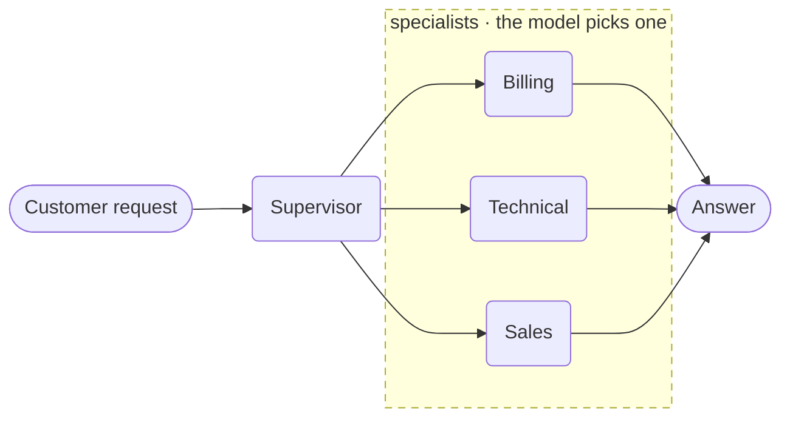

# Multi-Agent Handoff



**Outcome:** one supervisor agent fronts a team of specialists. The supervisor's model sees each specialist as a callable tool and delegates; each delegation is its own durable execution.

## How it works

- **Sub-agents become tools.** With `Strategy.HANDOFF` the supervisor's model chooses one by name.
- **Each specialist keeps its own tools and instructions,** so their reach stays separate.
- **Every delegation is a durable execution.** A specialist can retry without re-running the routing decision.

## Handoff strategies

`strategy=` accepts any of these. The values come from `Strategy` in the SDK:

| Strategy | What the parent does |
|---|---|
| `handoff` | The model picks one sub-agent and hands the conversation over |
| `router` | The model classifies the request and routes it, without conversing |
| `sequential` | Runs sub-agents in order, each seeing the previous output |
| `parallel` | Runs all sub-agents at once and collects every answer |
| `swarm` | Sub-agents pass control between themselves until one finishes |
| `round_robin` | Takes the next sub-agent in rotation |
| `random` | Picks a sub-agent at random — useful for A/B comparison |
| `plan_execute` | Plans a sequence of sub-agent calls, then executes and replans |
| `manual` | You choose the sub-agent in code, not the model |

## Prerequisites

A Conductor server with an LLM provider, and `CONDUCTOR_SERVER_URL` set.

## The agents

Save this as `agent_handoff.py`:

```python
--8<-- "docs/devguide/ai/cookbook/assets/agent_handoff.py"
```

## Run it

```bash
python agent_handoff.py
```

Asking for an account balance routes to `billing`, which calls `check_balance`. Open **[Executions](http://localhost:8080/executions)** to see the supervisor and the chosen specialist as separate executions.

## The same example in other SDKs

The agent API is the same shape in every SDK. These are the upstream sources this recipe was derived from:

| SDK | Example |
|---|---|
| Python | [`05_handoffs.py`](https://github.com/conductor-oss/python-sdk/blob/main/examples/agents/05_handoffs.py) |
| Java | [`Example05Handoffs.java`](https://github.com/conductor-oss/java-sdk/blob/main/agent-examples/src/main/java/org/conductoross/conductor/ai/examples/Example05Handoffs.java) |
| TypeScript | [`05-handoffs.ts`](https://github.com/conductor-oss/javascript-sdk/blob/main/examples/agents/05-handoffs.ts) |
| C# | [`Program.cs`](https://github.com/conductor-oss/csharp-sdk/blob/main/Conductor.AI.Examples/05_Handoffs/Program.cs) |

## Production notes

- **Specialist instructions are the routing signal.** Overlapping descriptions cause wrong handoffs.
- **Scope each specialist's tools separately.** A billing agent should not reach order-fulfilment tools.
- **Pick the strategy for the shape of the problem,** not for novelty — `router` is cheaper than `handoff` when no conversation is needed.
- **Bound each specialist independently** so one can't consume the whole budget.
- **Handoff decisions are model output.** Log which specialist ran and why.
