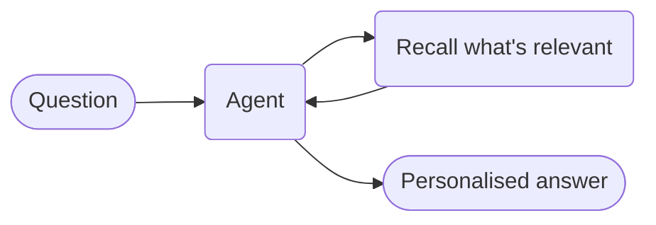

# Agent with Memory



**Outcome:** the agent remembers facts across sessions and pulls only the ones relevant to the current question, instead of replaying an ever-growing transcript.

## How it works

- **`SemanticMemory` stores facts and retrieves by similarity.** `max_results` caps how many come back.
- **Recall is a tool the agent calls,** so retrieval shows up in the execution like any other step.
- **Only relevant facts enter the prompt.** Cost stays flat as memory grows.
- **The store is swappable.** Point it at your own backend without changing the agent.

## Prerequisites

A Conductor server with an LLM provider, and `CONDUCTOR_SERVER_URL` set.

## The agent

Save this as `agent_memory.py`:

```python
--8<-- "docs/devguide/ai/cookbook/assets/agent_memory.py"
```

## Run it

```bash
python agent_memory.py
```

Asking about an invoice recalls the Enterprise plan, the open discrepancy on #1042, and the 1-hour SLA — not the timezone or language facts, which aren't relevant. Open **[Executions](http://localhost:8080/executions)** to see the recall call and exactly which facts it returned.

## The same example in other SDKs

The agent API is the same shape in every SDK. These are the upstream sources this recipe was derived from — Java has the `SemanticMemory` type but no numbered example yet, so that row links the class:

| SDK | Example |
|---|---|
| Python | [`25_semantic_memory.py`](https://github.com/conductor-oss/python-sdk/blob/main/examples/agents/25_semantic_memory.py) |
| Java | [`SemanticMemory.java`](https://github.com/conductor-oss/java-sdk/blob/main/conductor-client-ai/src/main/java/org/conductoross/conductor/ai/model/SemanticMemory.java) |
| TypeScript | [`25-semantic-memory.ts`](https://github.com/conductor-oss/javascript-sdk/blob/main/examples/agents/25-semantic-memory.ts) |
| C# | [`Program.cs`](https://github.com/conductor-oss/csharp-sdk/blob/main/Conductor.AI.Examples/25_SemanticMemory/Program.cs) |

## Production notes

- **Memory is an injection surface.** Anything stored gets read back into a prompt — validate before writing.
- **Decide what's worth remembering.** Storing whole transcripts makes retrieval worse, not better.
- **Give facts a source and a timestamp** so you can expire or correct them later.
- **Scope memory per customer or tenant.** A shared store leaks context between users.
- **`max_results` is a cost control.** Raising it grows every prompt.
