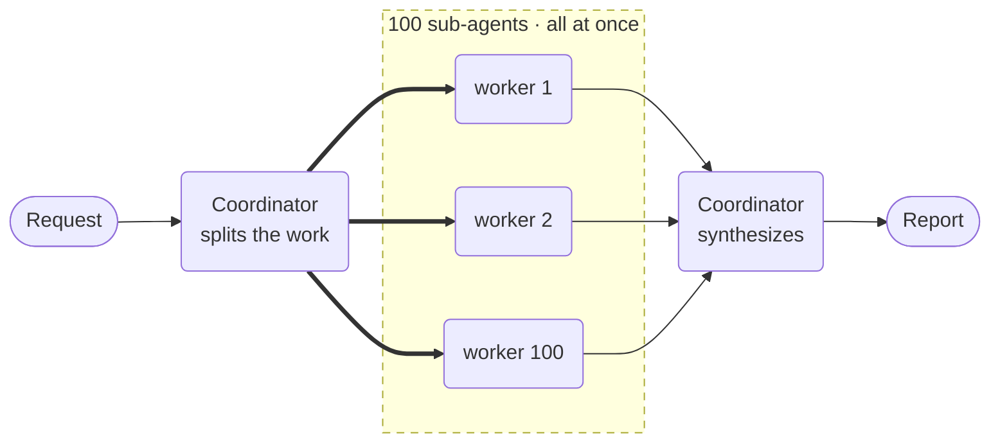

# Massively Parallel Agents



**Outcome:** a coordinator decomposes one request into a hundred independent sub-tasks, runs them all in parallel as durable sub-workflows, and writes up the combined result.

## How it works

- **`scatter_gather()` builds the coordinator for you** — decompose, fan out, synthesize.
- **The fan-out width is decided at runtime** by the model, not hardcoded in the graph.
- **Each sub-task is its own sub-workflow** with its own retries.
- **Partial results are the default.** `fail_fast=False` means one dead worker doesn't sink the batch.
- **Use a bigger model to synthesize.** It has to read all hundred results at once.

## Prerequisites

A Conductor server with an LLM provider, and `CONDUCTOR_SERVER_URL` set. This run makes roughly 100 worker calls plus one large synthesis call — check your provider's rate limits first.

## The agents

Save this as `agent_scatter_gather.py`:

```python
--8<-- "docs/devguide/ai/cookbook/assets/agent_scatter_gather.py"
```

## Run it

```bash
python agent_scatter_gather.py
```

A verified run finished in **41 seconds** using 56,371 tokens. Inspecting the execution shows what actually happened: **100 `SUB_WORKFLOW` tasks** under a single `FORK`/`JOIN`, all dispatched together.

Open **[Executions](http://localhost:8080/executions)** and open the coordinator — the parallel branches are laid out side by side, and you can drill into any one of the hundred.

## The same example in other SDKs

The agent API is the same shape in every SDK. These are the upstream sources this recipe was derived from:

| SDK | Example |
|---|---|
| Python | [`58_scatter_gather.py`](https://github.com/conductor-oss/python-sdk/blob/main/examples/agents/58_scatter_gather.py) |
| Java | [`Example58ScatterGather.java`](https://github.com/conductor-oss/java-sdk/blob/main/agent-examples/src/main/java/org/conductoross/conductor/ai/examples/Example58ScatterGather.java) |
| TypeScript | [`58-scatter-gather.ts`](https://github.com/conductor-oss/javascript-sdk/blob/main/examples/agents/58-scatter-gather.ts) |
| C# | [`Program.cs`](https://github.com/conductor-oss/csharp-sdk/blob/main/Conductor.AI.Examples/58_ScatterGather/Program.cs) |

## Production notes

- **Rate limits bite before Conductor does.** A hundred simultaneous calls will hit a provider quota long before the engine struggles.
- **Cap the worker's turns.** `max_turns` stops one worker looping and holding the join open.
- **Watch the synthesis context.** A hundred verbose workers can exceed the coordinator's window; keep worker output short.
- **Partial success needs a decision.** Decide what an 97-of-100 result means for your caller before you ship it.
- **Cost scales linearly.** Test the shape with five workers before running a hundred.
