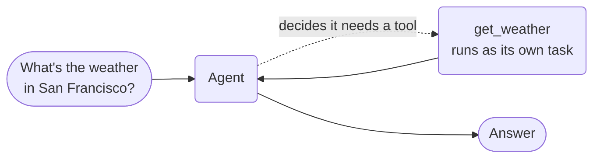

# Tool calling agent



**Outcome:** an agent declares two tools, the model picks the one that answers the question, and each tool call executes as a separate durable Conductor task you can inspect, retry, and time out independently.

## How it works

You register two tools on the agent. You do not write the routing logic — the model reads each tool's name, description, and parameter types, then decides which one the question needs. Here `get_weather` is called and `get_stock_price` is not.

What makes this different from an in-process tool loop is where the tool runs. Each tool call is dispatched as its own Conductor task, so in the UI you see the call, its inputs, and its output as a discrete unit of work. That is also the unit of retry and timeout: a flaky weather API retries without re-running the model's reasoning, and a hung tool call fails on its own timeout rather than stalling the whole agent.

## Prerequisites

A Conductor server with an LLM provider configured, and a model available to the agent runtime.

Each SDK reads its own environment variables. Use the row for your language:

| SDK | Model variable | Server variable |
|---|---|---|
| Python | `CONDUCTOR_AGENT_LLM_MODEL` | `CONDUCTOR_SERVER_URL` |
| Java | `CONDUCTOR_AGENT_LLM_MODEL` | `CONDUCTOR_SERVER_URL` |
| TypeScript | `CONDUCTOR_AGENT_LLM_MODEL` | `CONDUCTOR_SERVER_URL` |
| C# | `CONDUCTOR_AGENT_LLM_MODEL` | `CONDUCTOR_SERVER_URL` |

The examples below pass `model` explicitly so they do not depend on which variable your SDK reads.

## The agent

=== "Python"

    ```python
    from conductor.ai.agents import Agent, AgentRuntime, tool

    @tool
    def get_weather(city: str) -> dict:
        """Get the current weather for a city."""
        return {"city": city, "temp_f": 72, "condition": "Sunny"}

    @tool
    def get_stock_price(symbol: str) -> dict:
        """Get the current stock price for a ticker symbol."""
        return {"symbol": symbol, "price": 182.50, "change": "+1.2%"}

    agent = Agent(
        name="weather_stock_agent",
        model="openai/gpt-4o",
        tools=[get_weather, get_stock_price],
        instructions="You are a helpful assistant. Use tools to answer questions.",
    )

    if __name__ == "__main__":
        with AgentRuntime() as runtime:
            # The model will call get_weather, not get_stock_price.
            result = runtime.run(agent, "What's the weather like in San Francisco?")
            result.print_result()
    ```

=== "TypeScript"

    ```typescript
    import { Agent, AgentRuntime, tool } from '@io-orkes/conductor-javascript/agents';

    const getWeather = tool(
      async (args: { city: string }) => {
        return { city: args.city, temp_f: 72, condition: 'Sunny' };
      },
      {
        name: 'get_weather',
        description: 'Get the current weather for a city.',
        inputSchema: {
          type: 'object',
          properties: {
            city: { type: 'string', description: 'The city to get weather for' },
          },
          required: ['city'],
        },
      },
    );

    const getStockPrice = tool(
      async (args: { symbol: string }) => {
        return { symbol: args.symbol, price: 182.5, change: '+1.2%' };
      },
      {
        name: 'get_stock_price',
        description: 'Get the current stock price for a ticker symbol.',
        inputSchema: {
          type: 'object',
          properties: {
            symbol: { type: 'string', description: 'The stock ticker symbol' },
          },
          required: ['symbol'],
        },
      },
    );

    export const agent = new Agent({
      name: 'weather_stock_agent',
      model: 'openai/gpt-4o',
      tools: [getWeather, getStockPrice],
      instructions: 'You are a helpful assistant. Use tools to answer questions.',
    });

    async function main() {
      const runtime = new AgentRuntime();
      try {
        // The model will call get_weather, not get_stock_price.
        const result = await runtime.run(
          agent,
          "What's the weather like in San Francisco?",
        );
        result.printResult();
      } finally {
        await runtime.shutdown();
      }
    }

    main().catch(console.error);
    ```

=== "Java"

    ```java
    import java.util.List;
    import java.util.Map;

    import org.conductoross.conductor.ai.Agent;
    import org.conductoross.conductor.ai.AgentRuntime;
    import org.conductoross.conductor.ai.annotations.Tool;
    import org.conductoross.conductor.ai.internal.ToolRegistry;
    import org.conductoross.conductor.ai.model.AgentResult;
    import org.conductoross.conductor.ai.model.ToolDef;

    public class SimpleToolAgent {

        static class AssistantTools {
            @Tool(name = "get_weather", description = "Get the current weather for a city")
            public Map<String, Object> getWeather(String city) {
                return Map.of("city", city, "temp_f", 72, "condition", "Sunny");
            }

            @Tool(name = "get_stock_price", description = "Get the current stock price for a ticker symbol")
            public Map<String, Object> getStockPrice(String symbol) {
                return Map.of("symbol", symbol, "price", 182.50, "change", "+1.2%");
            }
        }

        public static void main(String[] args) {
            AgentRuntime runtime = new AgentRuntime();
            List<ToolDef> tools = ToolRegistry.fromInstance(new AssistantTools());

            Agent agent = Agent.builder()
                .name("weather_stock_agent")
                .model("openai/gpt-4o")
                .tools(tools)
                .instructions("You are a helpful assistant. Use tools to answer questions.")
                .build();

            // The model will call get_weather, not get_stock_price.
            AgentResult result = runtime.run(agent, "What's the weather like in San Francisco?");
            result.printResult();

            runtime.shutdown();
        }
    }
    ```

=== "C#"

    ```csharp
    using Conductor.AI;

    var tools = ToolRegistry.FromInstance(new SimpleToolHost());

    var agent = new Agent("weather_stock_agent")
    {
        Model = "openai/gpt-4o",
        Instructions = "You are a helpful assistant. Use tools to answer questions.",
        Tools = tools,
    };

    // The model will call GetWeather, not GetStockPrice.
    await using var runtime = new AgentRuntime();
    var result = await runtime.RunAsync(agent, "What's the weather like in San Francisco?");
    result.PrintResult();

    internal sealed class SimpleToolHost
    {
        [Tool("Get the current weather for a city.")]
        public Dictionary<string, object> GetWeather(string city)
            => new() { ["city"] = city, ["temp_f"] = 72, ["condition"] = "Sunny" };

        [Tool("Get the current stock price for a ticker symbol.")]
        public Dictionary<string, object> GetStockPrice(string symbol)
            => new() { ["symbol"] = symbol, ["price"] = 182.50, ["change"] = "+1.2%" };
    }
    ```

## Install and run

Save the agent above as `weather_agent.py`, `weather-agent.ts`, `SimpleToolAgent.java`, or `Program.cs`, then install the SDK and run it.

=== "Python"

    The core agent API ships in the base package. The `[agents]` extra is only needed for the LangChain, ADK, and OpenAI Agents bridges.

    ```bash
    python -m pip install conductor-python
    python weather_agent.py
    ```

=== "TypeScript"

    ```bash
    npm install @io-orkes/conductor-javascript
    npx tsx weather-agent.ts
    ```

=== "Java"

    Add the AI agent SDK to your build, then run `SimpleToolAgent`.

    ```groovy
    dependencies {
        implementation 'org.conductoross:conductor-client-ai:<version>'
    }
    ```

=== "C#"

    ```bash
    dotnet add package conductor-ai
    dotnet run
    ```

## The same example in other SDKs

The tabs above are adapted from these upstream sources:

| SDK | Example |
|---|---|
| Python | [`02a_simple_tools.py`](https://github.com/conductor-oss/python-sdk/blob/main/examples/agents/02a_simple_tools.py) |
| Java | [`Example02aSimpleTools.java`](https://github.com/conductor-oss/java-sdk/blob/main/agent-examples/src/main/java/org/conductoross/conductor/ai/examples/Example02aSimpleTools.java) |
| TypeScript | [`02a-simple-tools.ts`](https://github.com/conductor-oss/javascript-sdk/blob/main/examples/agents/02a-simple-tools.ts) |
| C# | [`Program.cs`](https://github.com/conductor-oss/csharp-sdk/blob/main/Conductor.AI.Examples/02a_SimpleTools/Program.cs) |

## Production notes

- **Tool descriptions are the routing contract.** Vague descriptions cause wrong tool picks far more often than a weak model does.
- **Keep tools read-only until there's an approval step.** A tool that writes needs a human in front of it — see [Agent approval](human-approved-action.md).
- **Make every tool idempotent.** A tool call is a retryable task, so a retry must not double-charge or double-send.
- **The tools you register are the blast radius.** Add them one at a time; don't expose a whole client library.
- **Keep payloads out of the agent.** Pass references to documents and images, not the bytes.
