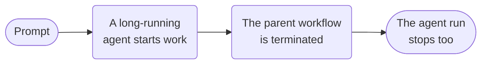

# Agent cancellation



**Outcome:** terminate the parent workflow and propagate cancellation to a long-running deployed Conductor Agent.

Start the local MCP Testkit server and deploy the cookbook agents before running this fixture. The deployed agent uses `gpt-4o` and exposes the complete Testkit catalog only for local demonstration; production deployments must use a scoped allowlist and per-tool policy.

## Runnable definition

Save this as `conductor-agent-cancellation.json`:

```json
--8<-- "docs/devguide/ai/cookbook/assets/conductor-agent-cancellation.json"
```

## Register and run

Download [`deploy_local_cookbook_agents.py`](assets/deploy_local_cookbook_agents.py) into the same directory, then:

```bash
python3 deploy_local_cookbook_agents.py deploy
python3 deploy_local_cookbook_agents.py serve
conductor workflow create conductor-agent-cancellation.json
conductor workflow start -w conductor_agent_cancellation -i '{"prompt":"Investigate a long-running incident."}'
```

The `TERMINATE` branch is intentionally part of the copied source graph. Confirm the parent is `TERMINATED` and inspect the agent execution record to verify cancellation propagation; do not count this negative-path execution as a successful agent action.
