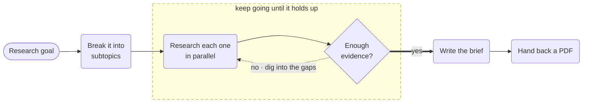

# Deep Research Agent



**Outcome:** turn a research goal into a decision-ready brief — decomposed into subtopics, researched in parallel with provider-native web search, reviewed for coverage after each round, and rendered as a PDF once the evidence holds up.

## The loop is the recipe

A single research prompt with web search enabled returns something that reads well and stops at whatever the model found on its first pass. There is no notion of "this is thin" because nothing is checking.

This workflow separates finding from judging, and lets judging drive the next round:

1. **`decompose_goal`** splits the goal into 3–5 independently searchable subtopics.
2. **`prepare_research_fanout`** builds one `LLM_CHAT_COMPLETE` input per open subtopic in JQ — the subtopic count determines the width of the fan-out at runtime.
3. **`research_subtopics`** is a `FORK_JOIN_DYNAMIC` over `LLM_CHAT_COMPLETE` with `webSearch: true`. Subtopics are researched concurrently, each as its own durable, retryable task.
4. **`review_coverage`** runs on `gpt-4o` and is explicitly forbidden from writing the brief. It returns `{sufficient, gaps, nextSubtopics}`.
5. When `sufficient` is false, `nextSubtopics` becomes the next round's fan-out — the loop researches the *gaps*, not the original list again.

The loop condition bounds both dimensions:

```text
$.research_loop['iteration'] < 5 && $.sufficient !== true
```

Five rounds maximum, and `!== true` means an absent or malformed verdict keeps the loop from exiting on a false positive. Whatever the state when the loop ends, `write_brief` receives the accumulated evidence *and* the unresolved `gaps`, and is instructed to carry them into an Open questions section rather than resolving them from its own knowledge. A brief that admits what it could not find is the useful output.

## Prerequisites

An OpenAI integration whose model supports `webSearch`. PDF rendering is built in — `GENERATE_PDF` needs no external service.

Cost scales as rounds × subtopics, so the worst case here is 5 × 5 = 25 web-search calls plus 5 review calls. The research calls use `gpt-4o-mini`; only `review_coverage` and `write_brief` use `gpt-4o`. Lower the round cap before widening the fan-out if you need to cut spend.

## Runnable definition

Save this as `deep-research-agent.json`:

```json
--8<-- "docs/devguide/ai/cookbook/assets/deep-research-agent.json"
```

## Register and run

```bash
conductor workflow create deep-research-agent.json
conductor workflow start -w deep_research_agent --sync -i '{"goal":"Assess the market category for organic coffee in North America","audience":"engineering leadership"}'
```

Open **[Executions](http://localhost:8080/executions)** in the Conductor UI and select the new execution to review the task graph, and each task's inputs and outputs.

`rounds` in the output tells you how much work the goal actually needed. A vague goal typically burns all five rounds and still reports gaps; a narrow one converges in one or two. That number is a useful signal about the question, not just the run.

## Production notes

- **Cap the evidence you carry.** Unbounded accumulation runs past the context window and the review call starts failing.
- **Use your best model for the review.** It's the only thing deciding whether the work is done.
- **Store the PDF, pass a URI.** Don't push binaries through workflow state.
- **Keep the source URLs.** A conclusion you can't re-derive in six months isn't evidence.
- **Cost is rounds x subtopics.** Lower the round cap before widening the fan-out.
- **Web results are untrusted input.** Review the Sources section before circulating anything regulated.
- **It publishes nothing.** Put an approval in front of external delivery.
