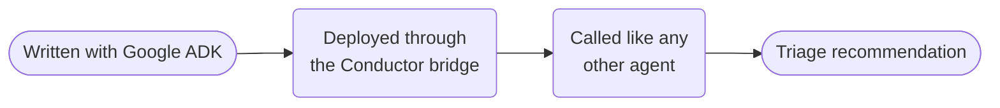

# ADK triage



**Outcome:** author a non-mutating order-exception triage agent with Google ADK and invoke it through Conductor.

## Prerequisites and authoring bridge

The current Python SDK quickstart uses `python -m pip install 'conductor-python[adk]'`, `google.adk.agents.Agent`, and `AgentRuntime`. Verify the owning [Python SDK framework guide](https://github.com/conductor-oss/python-sdk/blob/main/docs/agents/framework-agents.md) before changing installation or bridge calls.

```python
from conductor.ai.agents import AgentRuntime
from google.adk.agents import Agent
from google.adk.tools.mcp_tool import McpToolset, StreamableHTTPConnectionParams

agent = Agent(
    name="adk_order_exception_triage",
    model="openai/gpt-4o",
    instruction="Use MCP evidence to recommend a disposition; never execute it.",
    tools=[McpToolset(connection_params=StreamableHTTPConnectionParams(url="http://127.0.0.1:3001/mcp"))],
)
with AgentRuntime() as runtime:
    runtime.run(agent, "Order O-42 arrived damaged.")
```

Download the companion [`deploy_local_cookbook_agents.py`](assets/deploy_local_cookbook_agents.py) into your working directory; it creates this ADK-authored capability. Deploy once and keep the bridge worker running before invoking the parent:

```bash
python3 deploy_local_cookbook_agents.py deploy
python3 deploy_local_cookbook_agents.py serve
```

Input is `orderId` and `exception`; output is a recommendation. The agent must not hold refund, fulfillment, or customer-notification credentials.

## Runnable definition

Save this as `google-adk-order-triage.json`:

```json
--8<-- "docs/devguide/ai/cookbook/assets/google-adk-order-triage.json"
```

## Register and run

```bash
conductor workflow create google-adk-order-triage.json
conductor workflow start -w google_adk_order_exception_triage --sync -i '{"orderId":"O-42","exception":"Package damaged in transit."}'
```

## Production notes

- **`agentType` is `conductor`, not `adk`.** The bridge runs it.
- **Use a model your server actually has configured** — `gemini-2.0-flash` if Gemini is set up.
- **Cap tool access and the iteration budget in the deployment.**
- **This recommends a disposition; it never applies one.** Route the action through an approval.
- **Reconcile by order ID plus exception event ID.**
