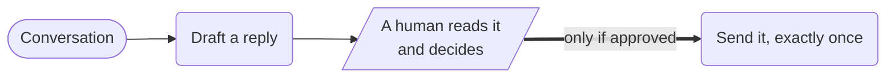

# HITL Workflow



**Outcome:** a model drafts a customer-facing action, the workflow pauses durably for a human decision, and only an explicit approval reaches the send — with rejection and expiry recorded as distinct outcomes rather than silently treated as consent.

## Absence of approval is not approval

The failure mode this recipe is built against is a workflow that reads `${human_decision.output.approved}` directly and routes on it. If the reviewer completes the task without that field, or the field arrives as the string `"false"`, or the task times out, a truthiness check can let the action through. The default must be refusal.

`normalize_decision` exists for exactly that. It coerces the human's payload into a strict shape before any routing happens:

```text
{approved: ((.decision.approved // false) == true), approver: (.decision.approver // "unknown"), note: (.decision.note // "")}
```

An absent field becomes `false`. A non-boolean becomes `false`. Only a literal `true` is approval. The `SWITCH` then routes on that normalized value, never on the raw human output.

The three outcomes are all durable and all distinguishable in the output:

| Outcome | `delivery.status` |
|---|---|
| Reviewer approved | `sent`, with the idempotency key used |
| Reviewer declined | `withheld_by_reviewer`, with their note |
| Nobody decided in time | Workflow times out; `approval.status` stays `pending` |

## Prerequisites

An OpenAI integration, and an endpoint to deliver to. `send_approved_action` posts to the `deliveryUrl` you pass in, with an `Idempotency-Key` header carrying `actionKey` — point it at your own service, which must honor that header. `https://httpbin.org/post` works for a trial run and echoes back exactly what was sent.

The `HUMAN` task carries a 20-hour timeout inside an 86,400-second (24-hour) workflow, which is what makes a real review queue viable. A one-hour timeout on an approval that needs a human awake in another timezone will expire every night.

## Runnable definition

Save this as `hitl-approval.json`:

```json
--8<-- "docs/devguide/ai/cookbook/assets/hitl-approval.json"
```

## Register and run

```bash
conductor workflow create hitl-approval.json
conductor workflow start -w hitl_approved_action -i '{"customerId":"C-123","conversation":"Customer reports being charged twice for a returned order. Order 8891, two charges of $49.00 on 12 July.","actionKey":"refund-note-C-123-0001","deliveryUrl":"https://httpbin.org/post"}'
```

Open **[Executions](http://localhost:8080/executions)** in the Conductor UI and select the new execution to review the task graph, and each task's inputs and outputs.

The run pauses at `human_decision`. Review the draft and its `riskFlags` first, then complete the task. In the UI you can complete it from the execution view; on OSS Conductor the equivalent call is (replace the workflow ID):

```bash
curl -X POST 'http://localhost:8080/api/tasks/WORKFLOW_ID/human_decision/COMPLETED' \
  -H 'Content-Type: application/json' \
  -d '{"approved":true,"approver":"support-oncall","note":"Verified duplicate charge in the ledger."}'
```

Three completions worth trying, because all three must refuse to send:

```bash
{"approved":false,"approver":"support-oncall","note":"Amount not verified."}   # explicit rejection
{}                                                                             # reviewer sent nothing
{"approved":"false","approver":"bot"}                                          # string, not boolean
```

Each one completes the workflow successfully with `delivery.status: withheld_by_reviewer` and no `send_action` task in the execution at all. Completing successfully while sending nothing is the correct outcome, not a failure.

## Production notes

- **Approve exactly what ships.** Don't re-run the model after approval, or the human approved something else.
- **The idempotency key comes from the caller.** Generate it inside the workflow and a retry becomes a second message.
- **Anything that isn't a literal `true` is a no.** Missing fields and the string `"false"` both withhold.
- **Record who approved, and when.** For regulated work, add the policy version and a digest of what they saw.
- **Constrain the draft, not just the review.** A reviewer clearing twenty drafts an hour won't catch an invented refund amount.
- **Redact before prompting.** Strip payment details and pass attachments by reference.
