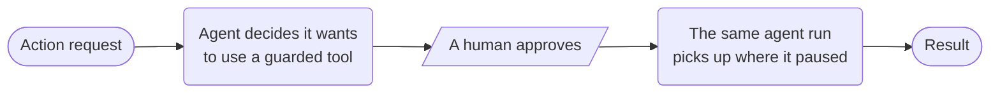

# Agent approval



**Outcome:** pause a deployed agent at an explicit tool-approval boundary, collect the human decision, then resume the same agent execution.

## Prerequisites and contract

Start the local MCP Testkit server and deploy the cookbook agents. The input is `prompt`; the first AGENT task returns `waiting: true` when the native `request_notification` tool needs approval. The local demo tool records only a notification request—it does not prove an external write. Never use a secret in workflow input.

## Runnable definition

Save this as `human-approved-action.json`:

```json
--8<-- "docs/devguide/ai/cookbook/assets/human-approved-action.json"
```

## Register and run

```bash
conductor workflow create human-approved-action.json
conductor workflow start -w human_approved_external_action --sync -u collect_answer_ref -i '{"prompt":"Request a notification to oncall@example.com that incident INC-1001 needs attention."}'
```

Complete `collect_answer_ref` only after reviewing the pending tool request. On OSS Conductor, use the task-by-reference endpoint and provide the answer the agent should receive:

```bash
curl -X POST 'http://localhost:8080/api/tasks/WORKFLOW_ID/collect_answer_ref/COMPLETED/sync' \
  -H 'Content-Type: application/json' \
  -d '{"answer":"approved"}'
```

## Production notes

- **The agent resumes by `executionId`,** so it can't re-plan a different action after approval.
- **Record who approved, the policy version, and what they saw.**
- **Before swapping in a write-capable tool,** add an idempotency key and a check-before-retry.
- **The Testkit tool only records a request.** It is not proof that a real write works.
