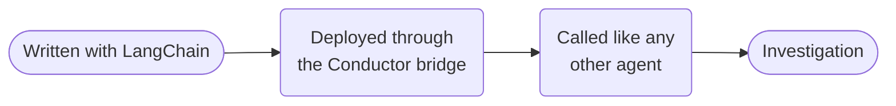

# LangChain investigator



**Outcome:** author an entitlement investigator with LangChain, deploy it through the Conductor bridge, and invoke it as a durable capability.

## Prerequisites and authoring bridge

The current Python SDK quickstart documents the bridge installation as `pip install 'conductor-python[langchain]'`, `AgentRuntime`, and `runtime.run(agent, input)`. Verify the owning [Python SDK framework guide](https://github.com/conductor-oss/python-sdk/blob/main/docs/agents/framework-agents.md) before upgrading packages or bridge APIs.

```python
from langchain.agents import create_agent

# The companion deployment provides these two real MCP adapters.
agent = create_agent(
    "openai:gpt-4o",
    tools=[list_mcp_testkit_tools, call_mcp_testkit_tool],
    system_prompt="Investigate entitlements from MCP evidence; recommend only.",
)
```

Download the companion [`deploy_local_cookbook_agents.py`](assets/deploy_local_cookbook_agents.py) into your working directory; it creates this LangChain-authored capability and its read-only fixture tool. Deploy once and keep the bridge worker running before invoking the parent:

```bash
python3 deploy_local_cookbook_agents.py deploy
python3 deploy_local_cookbook_agents.py serve
```

Inputs are `customerId` and `question`; output is investigation data plus the agent execution ID. Give the agent read-only entitlement tools; any change must go to [human-approved external action](human-approved-action.md).

## Runnable definition

Save this as `langchain-entitlement-investigator.json`:

```json
--8<-- "docs/devguide/ai/cookbook/assets/langchain-entitlement-investigator.json"
```

## Register and run

```bash
conductor workflow create langchain-entitlement-investigator.json
conductor workflow start -w langchain_entitlement_investigator --sync -i '{"customerId":"C-123","question":"Which plan features are enabled?"}'
```

## Production notes

- **`agentType` is `conductor`, not `langchain`.** The bridge runs it; the protocol doesn't change.
- **Bound tokens and tool calls in the deployed agent,** where the loop actually runs.
- **Pass document references, not payloads.**
- **Reconcile duplicate runs by customer ID plus request ID.**
- **Check the SDK source before bumping package versions.** The bridge API moves.
