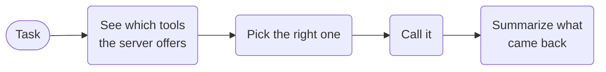

# MCP Tool Calling



**Outcome:** discover what an MCP server actually exposes, strip mutating verbs deterministically, have a small model shortlist the five relevant tools, intersect that shortlist with what was really discovered, then let a capable model pick one — and verify that pick again before the call happens.

## How it works

- **Discover, don't hardcode.** The tool list is read at runtime, so a renamed tool fails loudly instead of silently.
- **Strip anything that writes.** A plain filter drops delete/create/send-style tools before a model ever sees the list.
- **A small model shortlists five, a bigger one picks.** Fewer candidates means cheaper prompts and better choices.
- **The workflow checks the pick, not the prompt.** A tool that isn't on the shortlist can't be called.

## Prerequisites

An OpenAI integration, and an MCP server. For a deterministic local one, use [mcp-testkit](https://pypi.org/project/mcp-testkit/), which ships 65 fixed tools:

```bash
python -m pip install mcp-testkit
mcp-testkit --transport http
```

It listens at `http://localhost:3001/mcp`. Its tools are all pure read-only helpers (`get_weather`, `math_*`, `string_*`, `conversion_*`, `validation_*`, `encoding_*`, `datetime_*`, `collection_*`), so the mutating-verb filter excludes none of them — which is what you want from a test server, and why the relevance shortlist is doing the real narrowing here.

Never put the MCP credential in workflow input. Pass it as a header sourced from your platform's secret store.

## Runnable definition

Save this as `mcp-tool-calling.json`:

```json
--8<-- "docs/devguide/ai/cookbook/assets/mcp-tool-calling.json"
```

## Register and run

```bash
conductor workflow create mcp-tool-calling.json
conductor workflow start -w mcp_tool_calling --sync -i '{"mcpServerUrl":"http://localhost:3001/mcp","task":"What is the current weather in San Francisco?"}'
```

Open **[Executions](http://localhost:8080/executions)** in the Conductor UI and select the new execution to review the task graph, and each task's inputs and outputs.

On mcp-testkit this completes in about 20 seconds: 65 tools discovered, `excludedMutating: 0`, the shortlist narrowed to `get_weather`, and `evidence` carrying the tool's deterministic payload (`77°F, sunny`). Inspect `shortlist` to see what the model was offered and what was `rejected`, and `select_tool` for the `reason` it gave — together they are your audit trail for why a particular tool ran.

## Production notes

- **Reads are safe to retry. Writes are not.** If you add a write tool, it needs an idempotency key and a check before retrying.
- **Keep the raw tool result.** The summary is model output and can't be audited; the raw result can.
- **Tighten the filter for your server.** Prefix matching is a convenience, not a guarantee — list the tools you actually allow.
- **The summary is not a decision.** Anything consequential belongs behind [HITL approval](hitl-approval.md).
- **Secrets go in headers, never in workflow input.** Source them from your secret store.
