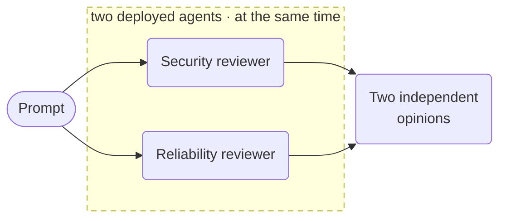

# Specialist review



**Outcome:** obtain independent security and reliability recommendations concurrently, then join their durable results.

## Prerequisites and contract

Download the companion [`deploy_local_cookbook_agents.py`](assets/deploy_local_cookbook_agents.py) into your working directory; it deploys and serves `security-reviewer` and `reliability-reviewer` alongside the other cookbook agents:

```bash
python3 deploy_local_cookbook_agents.py deploy
python3 deploy_local_cookbook_agents.py serve
```

Input is `prompt`; output contains both recommendations. The recipe intentionally has no synthesis or write: keep a human/policy boundary between recommendations and actions.

## Runnable definition

Save this as `parallel-specialist-review.json`:

```json
--8<-- "docs/devguide/ai/cookbook/assets/parallel-specialist-review.json"
```

## Register and run

```bash
conductor workflow create parallel-specialist-review.json
conductor workflow start -w parallel_specialist_agent_review --sync -i '{"prompt":"Review this architecture proposal."}'
```

## Production notes

- **Bound each agent separately** so one specialist can't consume the other's budget.
- **Scope tool permissions per agent.** Independent reviewers should not share reach.
- **Keep each execution ID** and reconcile reruns by correlation ID.
- **This produces opinions, not actions.** Put a decision step after it.
