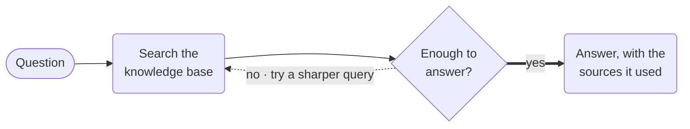

# RAG Agent



**Outcome:** retrieve context for a question, have a model grade whether that context can actually answer it, rewrite the query and retry when it cannot, and refuse to answer when grounding never arrives.

## Why the loop matters

A two-step RAG chain — search, then answer — has no idea whether what it retrieved is relevant. The model is handed weak context and a question, and its instructions tell it to answer, so it does. That failure is silent and looks exactly like success.

This recipe splits the two jobs. `grade_retrieved_context` is a separate call that is explicitly forbidden from answering; it only decides whether the evidence is sufficient and, if not, proposes a better search phrasing. The loop then re-searches with that phrasing. Three outcomes are possible, and all three are recorded:

| Grading result | What happens |
|---|---|
| Sufficient | Answer with citations, then verify at least one citation exists |
| Insufficient, attempts left | Rewrite the query and search again |
| Insufficient after 3 rounds | `TERMINATE` with `insufficient_grounding` and the reason |

That third row is the production-relevant one. A workflow that fails loudly is recoverable; one that returns a confident ungrounded answer is not.

## Prerequisites

A configured vector database and an OpenAI integration. Index-time and query-time embedding models must match exactly — different embedding spaces produce meaningless similarity scores.

Populate the index before running this. Use `LLM_INDEX_TEXT` with a stable `docId` and a `metadata` object per document, so the citations this workflow returns point at something you can resolve later:

```json
{
  "name": "index_policy_doc",
  "taskReferenceName": "index_policy_doc",
  "type": "LLM_INDEX_TEXT",
  "inputParameters": {
    "vectorDB": "REPLACE_VECTOR_DB",
    "index": "REPLACE_INDEX",
    "namespace": "REPLACE_NAMESPACE",
    "docId": "retention-policy-v4",
    "text": "REPLACE with the document body",
    "embeddingModelProvider": "openai",
    "embeddingModel": "text-embedding-3-small",
    "dimensions": 1536,
    "metadata": { "sourceVersion": "v4", "category": "policy" }
  }
}
```

Keep ingestion in its own workflow. Re-indexing on every question wastes embedding spend and makes the answer path depend on write availability.

## Runnable definition

Save this as `rag-agent.json`:

```json
--8<-- "docs/devguide/ai/cookbook/assets/rag-agent.json"
```

## Register and run

```bash
conductor workflow create rag-agent.json
conductor workflow start -w rag_agent --sync -i '{"question":"What is our data retention policy?","vectorDB":"REPLACE_VECTOR_DB","index":"REPLACE_INDEX","namespace":"REPLACE_NAMESPACE"}'
```

Open **[Executions](http://localhost:8080/executions)** in the Conductor UI and select the new execution to review the task graph, and each task's inputs and outputs.

Look at how many times `retrieval_loop` iterated. One iteration means the first query was good enough. Three plus a `FAILED` status means your index does not contain the answer — which is a real, useful signal about your corpus rather than a workflow bug.

## Production notes

- **`maxResults` defaults to 1.** Get the name wrong and you silently retrieve one document, which looks like a bad retriever.
- **Grade with a cheap model, answer with a good one.** Grading runs up to three times per question, so it drives the cost.
- **Treat citations as a contract.** Reject answers whose citations don't resolve against your index rather than showing them.
- **Index once, in its own workflow.** Re-indexing per question wastes embedding spend and couples answering to write availability.
- **Match the embedding model at index and query time.** Different embedding spaces make similarity scores meaningless.
- **Cache on the question plus index version** so a re-indexed corpus invalidates it.
