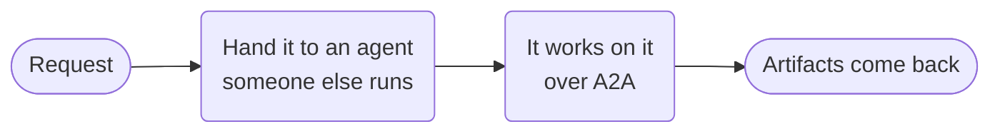

# A2A delegation



**Outcome:** call an independently deployed A2A agent while preserving a durable, observable workflow boundary.

## Prerequisites and contract

The remote endpoint must expose a compatible A2A Agent Card and honor idempotent request IDs. Input is `agentUrl`, `request`, and `idempotencyKey`; output is remote state and artifacts. `agentType: "a2a"` selects the remote protocol runtime; it does not identify the remote authoring framework.

## Runnable definition

Save this as `remote-a2a-delegation.json`:

```json
--8<-- "docs/devguide/ai/cookbook/assets/remote-a2a-delegation.json"
```

## Register and run

```bash
conductor workflow create remote-a2a-delegation.json
conductor workflow start -w remote_a2a_agent_delegation --sync -i '{"agentUrl":"https://REPLACE.example/a2a","request":"Research durable execution.","idempotencyKey":"research-REPLACE"}'
```

## Production notes

- **Reuse the same idempotency key on retry,** and query the remote task before sending again.
- **Treat what comes back as untrusted.** Validate artifacts before using them.
- **`pollIntervalSeconds` controls how often Conductor checks in.** Tune it to how long the remote agent usually takes.
- **Put consequential actions after a local approval,** not inside the delegation.
