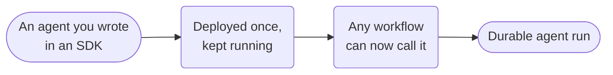

# Conductor agent



**Outcome:** deploy an SDK-authored agent as a stable capability and invoke it from a parent workflow.

## Author a guarded Conductor Agent (Python)

The Python SDK’s current guardrail API uses `RegexGuardrail`, `Position`, `OnFail`, and `@tool`. This starter blocks payment-card-shaped input before an otherwise approved write-capable tool can run; `approval_required=True` creates a durable human decision point.

```python
from conductor.ai.agents import Agent, AgentRuntime, OnFail, Position, RegexGuardrail, mcp_tool, tool

no_card_data = RegexGuardrail(
    patterns=[r"\b(?:\d[ -]?){15}\d\b"],
    name="no_card_data_in_email",
    position=Position.INPUT,
    on_fail=OnFail.RAISE,
    message="Refusing to send payment-card data by email.",
)

@tool(guardrails=[no_card_data], approval_required=True)
def notify_ops(summary: str) -> dict:
    # Call your idempotent, approved notification integration here.
    return {"status": "queued", "summary": summary}

agent = Agent(
    name="guarded-incident-planner",
    model="openai/gpt-4o",
    instructions="Summarize incidents and request approval before notification.",
    tools=[mcp_tool("http://127.0.0.1:3001/mcp"), notify_ops],
)

with AgentRuntime() as runtime:
    runtime.run(agent, "Summarize the incident and notify ops.").print_result()
```

For a runnable local deployment, download the companion [`deploy_local_cookbook_agents.py`](assets/deploy_local_cookbook_agents.py) into your working directory. It deploys this capability as `guarded-incident-planner` and keeps its tool worker available:

```bash
python3 deploy_local_cookbook_agents.py deploy
python3 deploy_local_cookbook_agents.py serve
```

The parent workflow pins `guarded-incident-planner`. See [Agent Guardrails](../agent-guardrails.md) for policy modes and test the guardrail before promotion.

## Runnable definition

Save this as `reusable-conductor-agent.json`:

```json
--8<-- "docs/devguide/ai/cookbook/assets/reusable-conductor-agent.json"
```

## Register and run

```bash
conductor workflow create reusable-conductor-agent.json
conductor workflow start -w invoke_reusable_conductor_agent --sync -i '{"prompt":"Summarize the incident evidence."}'
```

## Production notes

- **Pin the agent name and version in your release process.** Parent workflows resolve it by name.
- **Use the execution ID to reconcile retries and cancellation.**
- **Don't retry an agent side effect** unless its tools are idempotent.
- **Attach large artifacts by reference,** not inline.
