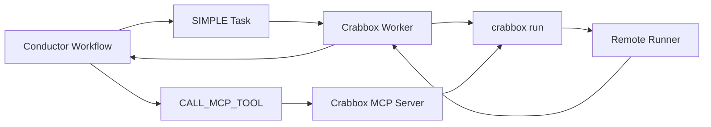

# Crabbox Remote Execution

[Crabbox](https://crabbox.sh/) is a remote software testing and execution
control plane. A `crabbox run` command leases or delegates to a remote box,
syncs the tracked and non-ignored local checkout, executes a command, streams
output back, and releases the target.

In Conductor, Crabbox fits best as an **external execution provider** for
trusted agent, build, and test workflows. Conductor owns durable orchestration,
state, retries, and task history. Crabbox owns remote execution capacity,
checkout sync, command streaming, and lease cleanup.

Do not treat Crabbox as Conductor's hard security boundary for hostile code or
mutually untrusted tenants. Crabbox's security model is designed for trusted
operators on a shared team. Per-lease and per-tenant isolation is not the
current security boundary.

## Architecture



There are two integration modes:

- Use a `SIMPLE` worker when a workflow has a known build, test, or command step
  and the task definition should control timeouts and retries.
- Use an MCP server when an agent workflow already discovers and invokes tools
  with `LIST_MCP_TOOLS` and `CALL_MCP_TOOL`.

The example implementation lives in
[`integrations/crabbox`](https://github.com/conductor-oss/conductor/tree/main/integrations/crabbox).

## Quick Start

The simplest smoke test uses Crabbox's `local-container` provider. It requires a
Docker-compatible runtime, but no cloud credentials:

```bash
crabbox run --provider local-container --shell 'python3 --version'
```

Use `provider: islo`, `aws`, `hetzner`, or another Crabbox provider when remote
capacity is configured.

The bridge passes the `provider` value through to Crabbox, so it supports any
provider available in the installed `crabbox` binary. Provider-specific
credentials stay in the worker environment or Crabbox config files.

## SIMPLE Worker

The `conductor_crabbox_worker.py` example polls a task named `crabbox_run`.
For each task, it:

1. Builds an allowlisted `crabbox run` command from task input.
2. Streams Crabbox output into Conductor task logs.
3. Sends `IN_PROGRESS` updates with `callbackAfterSeconds` while output is
   streaming.
4. Maps the final Crabbox result to a Conductor task status.

Register the task definition:

```bash
curl -X POST 'http://localhost:8080/api/metadata/taskdefs' \
  -H 'Content-Type: application/json' \
  -d @integrations/crabbox/taskdefs/crabbox_run_taskdef.json
```

Start the worker:

```bash
export CONDUCTOR_SERVER_URL=http://localhost:8080
python3 integrations/crabbox/conductor_crabbox_worker.py
```

Route Crabbox tasks to dedicated worker capacity with task domains:

```json
{
  "name": "crabbox_simple_worker_workflow",
  "version": 1,
  "input": {
    "command": "python3 -m pytest",
    "workspaceDir": "/path/to/repo"
  },
  "taskToDomain": {
    "crabbox_run": "remote-sandbox"
  }
}
```

Then start the worker with `CONDUCTOR_CRABBOX_DOMAIN=remote-sandbox`.

## MCP Bridge

The `crabbox_mcp_server.py` example exposes two tools:

| Tool | Purpose |
|---|---|
| `crabbox_run_command` | Run a trusted command through `crabbox run`. |
| `crabbox_doctor` | Check local Crabbox configuration for a provider. |

Start the MCP server:

```bash
python3 -m pip install -r integrations/crabbox/requirements.txt
python3 integrations/crabbox/crabbox_mcp_server.py --host 127.0.0.1 --port 3001
```

Conductor can call it with a `CALL_MCP_TOOL` task:

```json
{
  "name": "run_with_crabbox",
  "taskReferenceName": "crabbox_run",
  "type": "CALL_MCP_TOOL",
  "inputParameters": {
    "mcpServer": "http://localhost:3001/mcp",
    "method": "crabbox_run_command",
    "arguments": {
      "provider": "local-container",
      "command": "python3 -m pytest",
      "workspace_dir": "/path/to/repo",
      "shell": true,
      "timeout_seconds": 900
    }
  }
}
```

## Task Contract

The `crabbox_run` worker accepts this input:

| Field | Type | Default | Description |
|---|---|---|---|
| `command` | string or string array | required | Command to run remotely. Strings use `--shell` by default. |
| `provider` | string | `local-container` | Any provider supported by the installed `crabbox` binary. |
| `workspaceDir` | string | worker current directory | Checkout to sync. |
| `profile` | string | none | Crabbox profile name. |
| `leaseId` / `id` | string | none | Existing lease or sandbox to reuse. |
| `class` / `machineClass` | string | none | Crabbox machine class. |
| `target` | string | provider default | Crabbox target OS. |
| `ttl` | string | provider default | Maximum lease lifetime. |
| `idleTimeout` | string | provider default | Idle lease timeout. |
| `keep` | boolean | `false` | Keep the lease after success. |
| `keepOnFailure` | boolean | `false` | Keep a failed one-shot lease for debugging. |
| `noSync` | boolean | `false` | Skip sync when the provider supports it. |
| `fullResync` | boolean | `false` | Force fresh sync when the provider supports it. |
| `preflight` | boolean | `false` | Run Crabbox preflight before the command. |
| `timeoutSeconds` | number | none | Local timeout for the Crabbox process. |
| `env` | object | `{}` | Environment for the local Crabbox CLI process. |

The worker output contains:

| Field | Description |
|---|---|
| `status` | Conductor terminal status selected by the bridge. |
| `exitCode` | Crabbox process exit code. |
| `reason` | Human-readable completion or failure reason. |
| `retryable` | Whether the bridge classified the failure as retryable. |
| `provider` | Crabbox provider used for the run. |
| `durationSeconds` | Local wall-clock duration. |
| `timing` | Parsed `--timing-json` record when Crabbox emits one. |
| `output` | Captured output, bounded by the bridge. |
| `outputTail` | Last lines of output for workflow summaries. |
| `truncated` | Whether captured output hit the bridge limit. |

## Failure And Retry Semantics

The bridge maps failures conservatively:

| Crabbox outcome | Conductor status | Retry guidance |
|---|---|---|
| Exit code `0` | `COMPLETED` | No retry. |
| Auth, config, usage, or invalid provider errors | `FAILED_WITH_TERMINAL_ERROR` | Fix configuration before rerun. |
| Capacity, provisioning, sync, stream, timeout, or remote command failures | `FAILED` | Conductor may retry if the task definition allows it. |

Conductor retries can duplicate the remote command. Use retries only for
idempotent commands or commands that are safe to rerun from a fresh remote
sandbox.

## Operational Guardrails

- Keep Crabbox broker tokens and provider credentials in worker or user config,
  not in workflow definitions.
- Use a self-hosted Crabbox broker for shared teams when using brokered cloud
  providers so provider credentials, cost caps, usage accounting, and cleanup
  are centralized.
- Make source upload explicit. `crabbox run` syncs tracked and non-ignored files
  unless configuration narrows the manifest.
- Prefer narrow `sync.include`, `sync.exclude`, `env.allow`, TTL, and idle
  timeout settings in a project-specific Crabbox config.
- Put Crabbox-backed tasks in a Conductor task domain or dedicated worker pool
  so remote execution work does not starve normal workers.
- Do not forward secrets by default. Crabbox forwards remote environment values
  by name allowlist; keep that allowlist short.
- Review captured logs, artifacts, and failure bundles before sharing them
  outside the trusted team.

## Examples

- [`ai/examples/23-crabbox-mcp-run.json`](https://github.com/conductor-oss/conductor/blob/main/ai/examples/23-crabbox-mcp-run.json)
  calls Crabbox through an MCP tool.
- [`ai/examples/24-crabbox-simple-worker.json`](https://github.com/conductor-oss/conductor/blob/main/ai/examples/24-crabbox-simple-worker.json)
  schedules a `SIMPLE` task for the external Crabbox worker.
