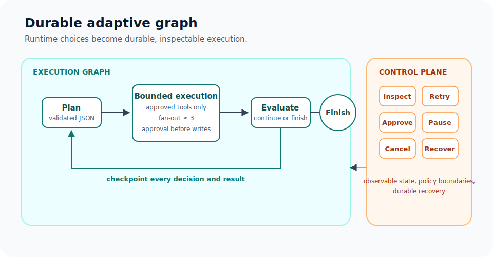
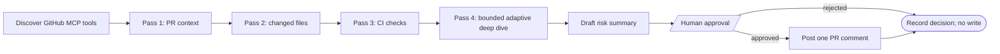

# Durable Adaptive Graphs

**Build agents that adapt. Run graphs that endure.**

An adaptive agent can choose an approved next path at runtime. A durable graph makes that choice persisted, inspectable, and governable instead of transient control flow inside one process.



The flagship example is a **governed GitHub PR reviewer**. It runs four durable evidence passes before it can ask a human to publish one review summary:

1. Read the PR context and intent.
2. Inspect the changed-file surface.
3. Inspect CI check runs.
4. Use the first three persisted assessments to choose one or two approved deep-dive reads—diff, reviews, or review comments—and run them in bounded parallel.

Each pass produces a compact, validated assessment in a workflow variable. The final comment is synthesized from that durable ledger, not from an unbounded chat history.

## Build the governed graph

The complete runnable definition is `35-governed-adaptive-agent.json` in the [AI examples directory](https://github.com/conductor-oss/conductor/tree/main/ai/examples).



The graph uses built-in tasks only: `LIST_MCP_TOOLS`, `CALL_MCP_TOOL`, `LLM_CHAT_COMPLETE`, `JSON_JQ_TRANSFORM`, `FORK_JOIN_DYNAMIC`, `JOIN`, `HUMAN`, `SWITCH`, `SET_VARIABLE`, and `DO_WHILE`. It has no `SIMPLE` task, so it needs no custom worker registration.

### Prerequisites

Use an HTTP-accessible, already authenticated GitHub MCP endpoint that exposes `pull_request_read` and `add_issue_comment`. The official GitHub MCP server documents both tools and the available `pull_request_read` methods, including `get`, `get_files`, `get_check_runs`, `get_diff`, `get_reviews`, and `get_review_comments`. [GitHub MCP Server](https://github.com/github/github-mcp-server)

Run this against an owned fixture PR. Keep the GitHub credential outside workflow input and source control. This example reads `workflow.env.GH_TOKEN` into the MCP `Authorization` header. With the default environment-backed configuration, set `CONDUCTOR_ENV_GH_TOKEN` in the **Conductor server process** before it starts (or configure an equivalent server-side environment provider). Do not add a token as `workflow.input.githubToken`—workflow inputs are recorded with the execution. For stronger secret isolation, use a credential-injecting MCP gateway or a server-side secrets provider instead; `workflow.env` resolution is eager when the task is scheduled.

### Run it

```shell
conductor workflow create ai/examples/35-governed-adaptive-agent.json
conductor workflow start -w governed_github_pr_reviewer -i '{
  "mcpServerUrl": "https://your-authenticated-github-mcp.example/mcp",
  "owner": "your-org",
  "repo": "pr-review-fixture",
  "pullNumber": 42,
  "llmProvider": "openai",
  "model": "gpt-4o-mini"
}'
```

The run pauses after the fourth pass at the human approval task. Inspect the proposed comment and the durable ledger, then complete that task on OSS Conductor with:

```shell
conductor task update-execution \
  --workflow-id <workflow-id> \
  --task-ref-name approve_pr_comment \
  --status COMPLETED \
  --output '{"approved":true,"reviewer":"operator@example.com","feedback":"Approved after review"}'
```

To reject the comment, send `{"approved":false,"reviewer":"operator@example.com","feedback":"Needs manual follow-up"}`. A rejection completes the workflow with a durable decision and does not call GitHub.

## Why this graph is adaptive—and still governed

The first three passes are intentionally non-negotiable. They make every execution comparable and guarantee that the example visibly completes four loop iterations. The fourth pass is adaptive: the model can select only one or two entries from the fixed deep-dive set, and a JQ guard validates, deduplicates, and caps those inputs before `FORK_JOIN_DYNAMIC` creates `CALL_MCP_TOOL` tasks.

That distinction matters. The agent selects approved paths and fan-out at runtime; it does not mutate the running workflow snapshot or invent a new capability. PR text, comments, and diffs are treated as untrusted evidence in every LLM prompt, never as instructions.

## Safety and durability model

| Concern | Guardrail in the example |
|---|---|
| Missing capability | Tool discovery verifies both required GitHub MCP tools before the loop starts. |
| Runaway agent | `DO_WHILE` is fixed at four iterations; deep dive fan-out is capped at two calls; the workflow has a 20-minute timeout. |
| Oversized context | Each MCP result is retained durably but reduced to a bounded evidence excerpt before an LLM evaluates it. |
| Malformed model output | Invalid JSON fails and retries at the LLM task; a parseable but invalid assessment becomes an explicit unknown result through the JQ contract guard. An invalid final draft fail-closes before approval. |
| External write | A `HUMAN` task must return `approved: true` before `add_issue_comment` can run. |
| Duplicate comment | The generated comment includes a workflow-ID marker; the graph checks existing PR comments for that marker before publishing. |
| Ambiguous write failure | Comment creation has no idempotency key, so its retry count is zero. Reconcile an ambiguous failure by searching for the marker; do not blindly retry the write. |
| Cancellation | Terminating before the approved write produces no comment. Cancellation during an in-flight write also requires marker-based reconciliation. |

The reviewer intentionally keeps all four iterations. Do not set `keepLastN` here: `keepLastN` removes older loop output and task history, which is the wrong trade-off for a short audit trail. For long-running loops, use it only when that loss of history is acceptable.

## Recovery and operations

- Infrastructure recovery and ordinary task-scoped retries preserve completed upstream tasks. Failed reads and LLM calls have bounded retry policies.
- Retrying a failed `DO_WHILE` is different: it restarts that loop's iteration history. Use the recorded evidence ledger and idempotent external interfaces when designing longer loops.
- Pause, resume, inspect, or terminate an execution from the UI or CLI. The output exposes `passesCompleted`, the evidence ledger, risk level, approval decision, and publication status.

## Next steps

- **[Production Agent Architecture](production-agent-architecture.md)** — the broader architecture for retries, memory, waits, and compensation.
- **[Failure Semantics](failure-semantics.md)** — task retries, at-least-once delivery, waits, and loop failure behavior.
- **[MCP Guide](mcp-guide.md)** — configure and call MCP tools from a workflow.
- **[JSON + Code Native Workflow Orchestration](../../architecture/json-native.md)** — snapshots, versioning, and safe runtime-generated definitions.
