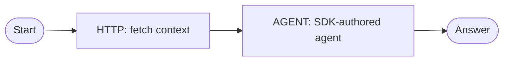

# Build Your First Agentic Workflow Graph

<section class="integration-hero integration-hero--first-agent" aria-labelledby="first-agent-hero-title">
  <div class="integration-hero__identity" aria-hidden="true">
    
    <span class="integration-hero__connector">→</span>
    
  </div>
  <p class="integration-hero__eyebrow">Your first agentic workflow graph</p>
  <h2 id="first-agent-hero-title">Keep the agent in an SDK. Put it in a durable graph.</h2>
  <p>Author an agent with the SDK or framework you prefer, then compose it with ordinary Conductor tasks. This first graph fetches context over HTTP and sends it to a reusable <code>AGENT</code> task.</p>
  <div class="integration-action-grid integration-action-grid--three">
    <a class="integration-action-card" href="#step-1-build-and-deploy-an-agent-with-the-sdk">
      <span class="integration-action-card__title">Author the agent</span>
      <span>Create and deploy a reusable Conductor Agent with an SDK.</span>
    </a>
    <a class="integration-action-card" href="#step-2-create-the-agentic-workflow-graph">
      <span class="integration-action-card__title">Compose the graph</span>
      <span>Use an HTTP task and an <code>AGENT</code> task in one workflow.</span>
    </a>
    <a class="integration-action-card" href="#step-3-register-and-run-the-graph">
      <span class="integration-action-card__title">Run and inspect</span>
      <span>See every step, retry, and output in Conductor.</span>
    </a>
  </div>
</section>



This is the useful division of responsibility:

- **SDK agent:** framework-native reasoning, tools, and model behavior.
- **Workflow graph:** context gathering, branching, retries, human gates, fan-out/join, schedules, and cancellation.

## Step 1: Build and deploy an agent with the SDK

Use the Conductor Agent SDK path to create your reusable agent. During interactive development, use `run`; for a graph that other workflows will invoke, use `deploy` and keep required workers available with `serve`.

Start with one of these maintained, runnable SDK paths:

- [Run Your First Conductor Agent](../../quickstart/first-agent.md) — native Python Conductor Agent.
- [Framework Agent Quickstarts](../../quickstart/framework-agents.md) — OpenAI Agents, Google ADK, LangChain/LangChain4j, LangGraph/LangGraph4j, and Vercel AI SDK.
- [Framework Agent Recipes](agent-framework-recipes.md) — the supported SDK, lifecycle, and executable example for every bridge.

For this tutorial, deploy an agent named `greeter`. The agent takes a prompt and returns a concise answer. The framework code belongs in the maintained SDK example; the workflow below needs only the stable deployed-agent contract.

### Define and deploy `greeter` with the Python Agent SDK

Install and point the SDK at your local server:

```shell
pip install 'conductor-python[agents]'
export CONDUCTOR_SERVER_URL=http://localhost:8080/api
export CONDUCTOR_AGENT_LLM_MODEL=openai/gpt-4o-mini
```

Configure the model provider credential on the Conductor server. Then save this as `greeter.py` and run it once as part of your deployment step:

```python
from conductor.ai.agents import Agent, AgentRuntime

greeter = Agent(
    name="greeter",
    model="openai/gpt-4o-mini",
    instructions="You are a friendly assistant. Keep responses brief.",
)

if __name__ == "__main__":
    with AgentRuntime() as runtime:
        runtime.deploy(greeter)
```

Keep the agent available in a long-lived worker process:

```python
from conductor.ai.agents import AgentRuntime
from greeter import greeter

with AgentRuntime() as runtime:
    runtime.serve(greeter)
```

`deploy` registers the reusable `greeter` graph without executing it; `serve` runs the required local workers until interrupted. For an interactive one-off, replace `deploy` with `runtime.run(greeter, "Say hello.")`.

!!! note "Use the right `agentType`"
    An SDK-authored Conductor Agent uses `agentType: "conductor"`. The A2A mode (`agentType: "a2a"`) is for calling a remote Agent2Agent service; it does not select LangChain, OpenAI Agents, or another framework.

## Step 2: Create the agentic workflow graph

Save this definition as `first_agentic_graph.json`. The public HTTP task makes the graph easy to understand and run; the `AGENT` task turns the fetched context into an answer with the deployed SDK agent.

```json
{
  "name": "first_agentic_graph",
  "description": "Fetch public context, then ask a deployed Conductor Agent to explain it",
  "version": 1,
  "schemaVersion": 2,
  "inputParameters": ["question"],
  "tasks": [
    {
      "name": "fetch_example_context",
      "taskReferenceName": "fetch_context",
      "type": "HTTP",
      "inputParameters": {
        "http_request": {
          "uri": "https://jsonplaceholder.typicode.com/todos/1",
          "method": "GET"
        }
      }
    },
    {
      "name": "ask_greeter",
      "taskReferenceName": "ask_agent",
      "type": "AGENT",
      "inputParameters": {
        "agentType": "conductor",
        "name": "greeter",
        "prompt": "Question: ${workflow.input.question}\n\nContext fetched by the workflow: ${fetch_context.output.response.body.title}",
        "pollIntervalSeconds": 5
      }
    }
  ],
  "outputParameters": {
    "context": "${fetch_context.output.response.body}",
    "answer": "${ask_agent.output.text}",
    "agentExecutionId": "${ask_agent.output.executionId}"
  }
}
```

### What the graph does

| Step | Type | Why it belongs in the graph |
|---|---|---|
| `fetch_context` | `HTTP` | Retrieves context before the agent runs. Replace it with your API, database worker, search, or retrieval step. |
| `ask_agent` | `AGENT` | Invokes the deployed SDK-authored `greeter` agent and records its child execution ID, state, text, and structured output. |

The `AGENT` task starts the deployed agent by `name`. Set `version` to pin an agent version; omit it to use the latest deployment. On completion, its output includes `executionId`, `agentName`, `state`, `text`, and structured `output` when the agent supplies one.

## Step 3: Register and run the graph

Register the workflow, then run it synchronously:

```shell
conductor workflow create first_agentic_graph.json

curl -s -X POST 'http://localhost:8080/api/workflow/execute/first_agentic_graph/1' \
  -H 'Content-Type: application/json' \
  -d '{
    "question": "What does this fetched task ask someone to do?"
  }' | jq .
```

Or use the CLI:

```shell
conductor workflow start -w first_agentic_graph --sync \
  --input '{"question":"What does this fetched task ask someone to do?"}'
```

Open [http://localhost:8080](http://localhost:8080) to inspect the graph. You will see the HTTP response, the `AGENT` task's child execution ID, and the final answer as separate durable records.

## What you built

You now have an agentic workflow graph that combines deterministic workflow work with agent reasoning:

- Fetch context before the agent starts.
- Invoke a reusable, SDK-authored agent as one workflow step.
- Inspect and retry the HTTP and agent steps independently.
- Return both the deterministic context and the agent's answer as a stable workflow output contract.

From here, add ordinary Conductor capabilities around the same agent: a `HUMAN` approval gate, `SWITCH` routing, parallel specialist agents with `FORK_JOIN`, schedules, or cancellation propagation.

## Next steps

- [Conductor Agents](conductor-agents.md) — complete `AGENT` input, output, wait/resume, timeout, and cancellation contract.
- [Framework Agent Recipes](agent-framework-recipes.md) — choose the supported SDK bridge for your framework.
- [Human-in-the-Loop](human-in-the-loop.md) — pause a graph for review and resume an agent safely.
- [A2A Integration](a2a-integration.md) — use a remote A2A agent instead of an SDK-authored Conductor Agent.
