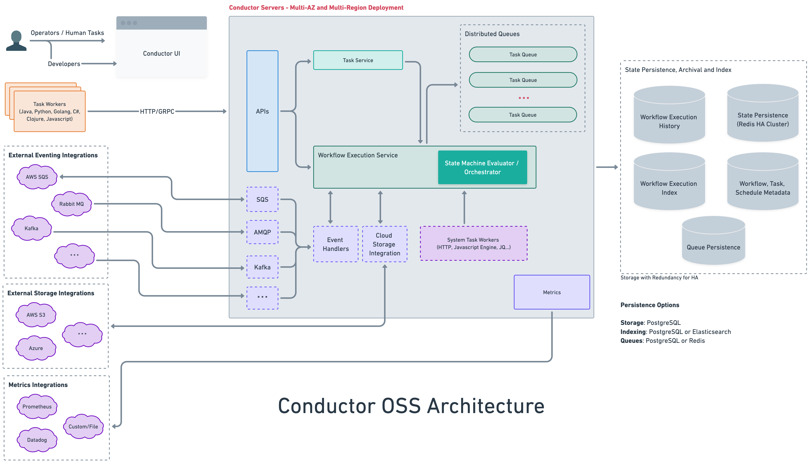

# Architecture Overview

This diagram showcases an overview of Conductor's system architecture:

In Conductor, workflows are executed on a worker-task queue architecture, where each task type (HTTP, Event, Wait, *example_simple_task* and so on) has its own dedicated task queue. The key components of Conductor’s core orchestration engine include:

* **State machine evaluator**—Orchestrates workflows by scheduling tasks to their relevant queues and assigning them to active workers when polled. Monitors each task's state and ensures it is completed, retried, or failed as required.
* **Task queues**—Distributed queues for each task type, where tasks are completed on a first-in-first-out basis.
* **Task workers**—Poll the Conductor server via HTTP or gRPC for tasks, execute tasks, and update the server on the task status. Each worker is responsible for carrying out a specific task type.
* **Data stores** (Redis by default)—High-availability persistence stores that maintain workflow and task metadata, task queues, and execution history
* **APIs**—REST APIs for programmatic access to the Conductor server. 

By default, Conductor uses Redis as its data store, with Elasticsearch used for its indexing backend. These [storage layers are pluggable](../../documentation/advanced/extend.md), allowing you to work with alternative backends and queue service providers.

## Task execution

With a worker-task queue architecture, Conductor schedules and assigns tasks to its designated task queues based on its task type. Conductor follows an RPC-based communication model where task workers run on a separate machine from the server and communicate over HTTP-based endpoints with the server. 

The workers employ a polling model for managing their designated queues, and update Conductor with the task status.

### Worker-server polling mechanism

Each worker declares beforehand what task(s) it can execute. At runtime, task workers poll its designated task queue(s) to receive and execute scheduled work. Conductor passes task inputs to the worker for execution and collects the task outputs, continuing the process according to the workflow definition. 

By default, workers infinitely poll Conductor every 100ms. The polling interval value for each type of worker can be adjusted accordingly based on factors like workload. Here is the polling mechanism in detail:

1. The application starts a workflow execution by interacting with Orkes Conductor, which returns a workflow (execution) ID. It can be used to track the workflow's progress and manage its execution.
2. Conductor schedules the first task in the workflow to its task queue.
3. The workers responsible for executing the first task within the workflow are polling Orkes Conductor for tasks to execute via HTTP or gRPC. When a task is scheduled, Conductor sends it to the next available worker, which then performs the required work.
4. Periodically, the worker returns the task status to Conductor (e.g. IN PROGRESS, FAILED, COMPLETED, etc).
5. Once the first task in the workflow instance is completed, the worker returns the task output to the server, and Conductor schedules the next set of tasks to be performed.

Conductor manages and maintains the workflow state, keeping track of which tasks have been completed and which are still pending. This ensures that the workflow is executed correctly, with each task triggered precisely at the right time.

Using the workflow ID, the application can check the Conductor server for the workflow status at any time. This is particularly useful for asynchronous or long-running workflows, as it allows the application to monitor the workflow's progress and take appropriate action, such as pausing or terminating the workflow if needed.