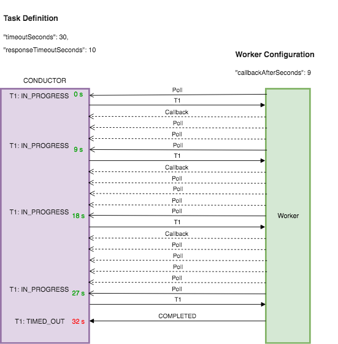

# Task Lifecycle

During a workflow execution, each task will go through the state transitions illustrated in the figure below:

## Task statuses

In general, a task will be in a scheduled, ongoing, or terminal state. Here is a detailed breakdown of the different task statuses in Conductor.

| Status | Description |
| --------------------------------- | --------------------------------- |
| SCHEDULED | The task has been scheduled to be picked up by a worker. |
| IN_PROGRESS | The task is being executed by a worker. | 
| SKIPPED | The task is skipped without executing, and the workflow continues to the subsequent tasks.    Occurs if the Skip Task API is used for an ongoing workflow. |
| TIMED_OUT | The task times out without being completed.    Occurs if the task has been configured with the following timeout parameters in its task definition: <ul><li>`timeOutPolicy`</li><li>`timeOutSeconds`</li><li>`pollTimeoutSeconds`</li><li>`responseTimeoutSeconds`</li></ul> |
| CANCELED | The scheduled task has been canceled without being completed because the workflow has been terminated. |
| FAILED | The task failed to complete due to an error, and the workflow can be retried from the failed task. |
| FAILED_WITH_TERMINAL_ERROR | The task failed to complete due to an error and cannot be retried. |
| COMPLETED_WITH_ERRORS | The task has encountered some errors but is completed.    Occurs only when a task is set as optional in the workflow definition and fails during execution. The workflow will continue even when there are errors.  |
| COMPLETED | The task has been successfully completed without any errors. | 

## Scenarios for task retries and timeouts

Conductor handles automatic retries and timeouts as configured in the **task definition**. Explore the different scenarios for how retries and timeouts are handled in a task's lifecycle.

### Retry

If a task fails to complete due to a transient error, the Conductor server will make the task available for polling again after a given duration.

Based on the task's retry configuration in the above figure, the following sequence of events will occur in the event of a retry:

1. Worker (W1) polls the Conductor server for task T1 and receives the task.
2. After processing the task, the worker determines that the task execution is a failure and reports to the server with a FAILED status after 10 seconds.
3. The server will persist this failed execution of T1.
4. A new task T1 execution is created and scheduled for polling. Based on the retry configuration, the task will be available for polling after 5 seconds

### Poll timeout

Poll timeout is the maximum duration that a worker has to poll a task before it gets marked as TIMED_OUT. If you are encountering poll timeouts frequently, it can indicate a backlogged task queue with insufficient workers.

In the figure above, task T1 isn’t polled by the worker within 60 seconds, so Conductor marks it as TIMED_OUT.

### Response timeout

Response timeout is the maximum duration that a worker has to respond to the server with a status update before it gets marked as TIMED_OUT. If a task requires more time to complete, the worker can respond with the IN_PROGRESS status. 

Based on the timeout configuration in the above figure, the following sequence of events will occur in the event of a delayed worker response:

1. At 0 seconds, the worker polls the Conductor server for task T1 and receives it. T1 is marked as IN_PROGRESS by the server.
2. The worker starts processing the task, but the worker instance dies during the execution.
3. At 20 seconds (T1’s `responseTimeoutSeconds`), the server marks T1 as TIMED_OUT since the worker has not updated the task within the configured duration.
4. A new instance of task T1 is scheduled based on the retry configuration.
5. At 25 seconds, the retried instance of T1 is available for polling after the `retryDelaySeconds` set to 5 has elapsed.

### Timeout seconds

Timeout is the maximum duration for the task to reach a terminal state before it gets marked as TIMED_OUT, which is useful for governing the overall SLA for task completion.

Based on the timeout configuration in the above figure, the following sequence of events will occur when a task cannot be completed within the given duration:

1. At 0 seconds, a worker polls the Conductor server for task T1 and receives the task. T1 is marked as IN_PROGRESS by the server.
2. The worker starts processing the task but is unable to complete it within the response timeout. The worker updates the server with T1 set to an IN_PROGRESS status and a callback of 9 seconds.
3. The server puts T1 back in the queue but makes it invisible and the worker continues to poll for the task but does not receive T1 for 9 seconds.
4. After 9 seconds, the worker receives T1 from the server but is still unable to finish processing the task. As such, the worker updates the server again with a callback of 9 seconds.
5. The same cycle repeats for the next few seconds.
6. At 30 seconds (T1 timeout), the server marks T1 as TIMED_OUT because it is not in a terminal state after first being moved to IN_PROGRESS status. The server schedules a new task based on the retry count.
7. At 32 seconds, the worker finishes processing T1 and updates the server with a COMPLETED status. The server ignores this update since T1 has already been moved to a terminal status (TIMED_OUT).