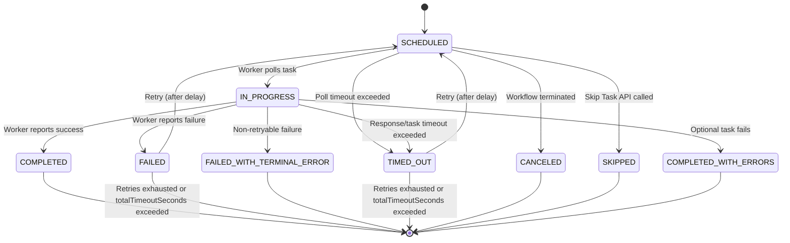
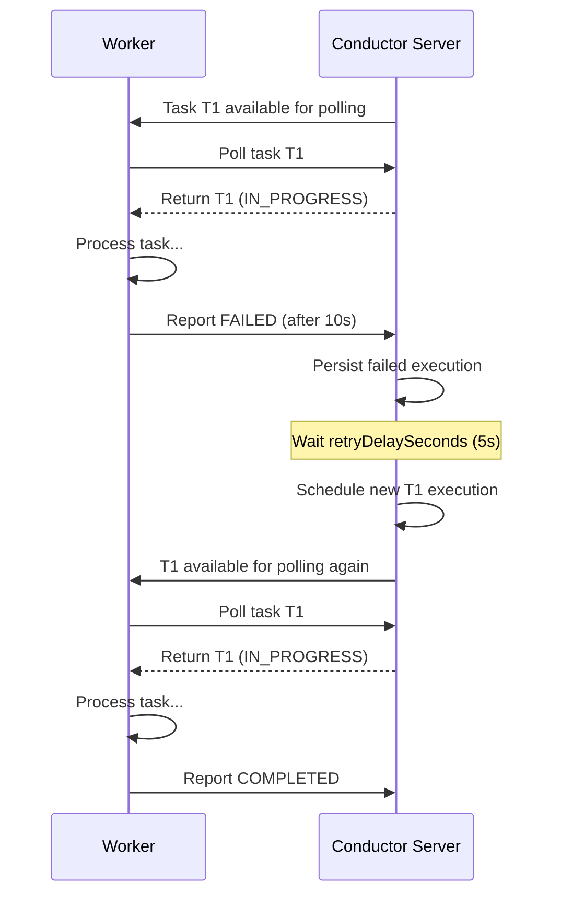
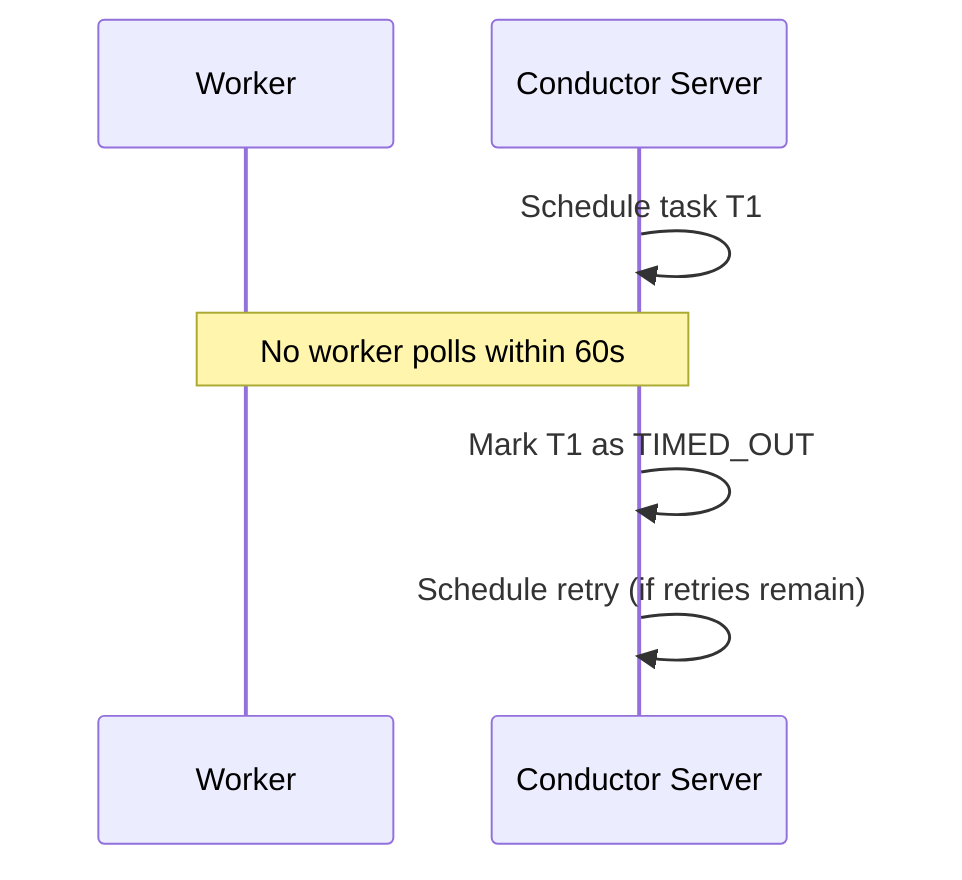
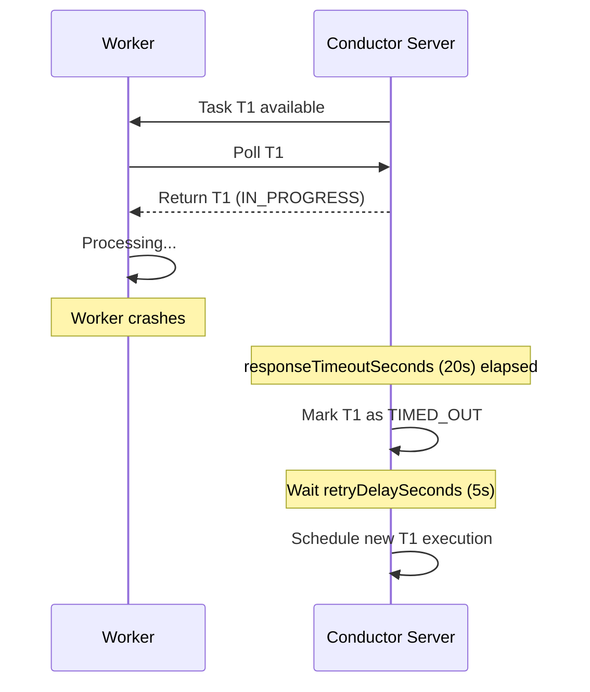
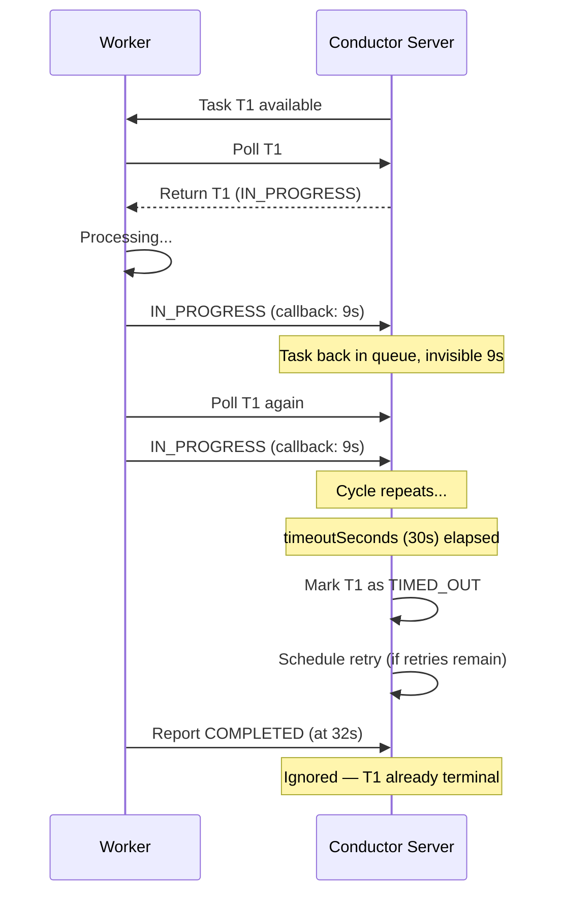
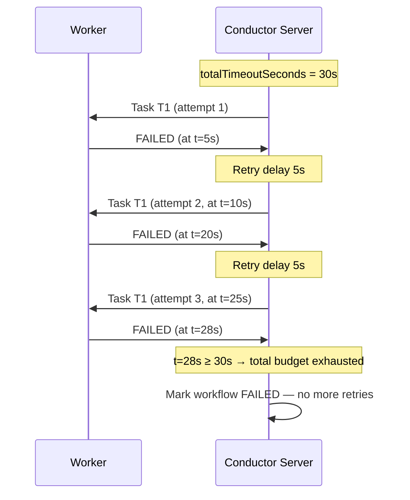

# Task Lifecycle

During a workflow execution, each task transitions through a series of states. Understanding these transitions is key to configuring retries, timeouts, and error handling correctly.

## State diagram

```mermaid
stateDiagram-v2
    [*] --> SCHEDULED
    SCHEDULED --> IN_PROGRESS : Worker polls task
    SCHEDULED --> TIMED_OUT : Poll timeout exceeded
    SCHEDULED --> CANCELED : Workflow terminated
    IN_PROGRESS --> COMPLETED : Worker reports success
    IN_PROGRESS --> FAILED : Worker reports failure
    IN_PROGRESS --> FAILED_WITH_TERMINAL_ERROR : Non-retryable failure
    IN_PROGRESS --> TIMED_OUT : Response/task timeout exceeded
    IN_PROGRESS --> COMPLETED_WITH_ERRORS : Optional task fails
    SCHEDULED --> SKIPPED : Skip Task API called
    FAILED --> SCHEDULED : Retry (after delay)
    TIMED_OUT --> SCHEDULED : Retry (after delay)
    COMPLETED --> [*]
    FAILED --> [*] : Retries exhausted or totalTimeoutSeconds exceeded
    FAILED_WITH_TERMINAL_ERROR --> [*]
    TIMED_OUT --> [*] : Retries exhausted or totalTimeoutSeconds exceeded
    CANCELED --> [*]
    SKIPPED --> [*]
    COMPLETED_WITH_ERRORS --> [*]
```

## Task statuses

| Status | Description |
| :--- | :--- |
| `SCHEDULED` | Task is queued and waiting for a worker to poll it. |
| `IN_PROGRESS` | A worker has picked up the task and is executing it. |
| `COMPLETED` | Task completed successfully. |
| `FAILED` | Task failed due to an error. Conductor will retry based on the task definition's retry configuration. |
| `FAILED_WITH_TERMINAL_ERROR` | Task failed with a non-retryable error. No retries will be attempted. |
| `TIMED_OUT` | Task exceeded its configured timeout. Conductor will retry based on the retry configuration. |
| `CANCELED` | Task was canceled because the workflow was terminated. |
| `SKIPPED` | Task was skipped via the Skip Task API. The workflow continues to the next task. |
| `COMPLETED_WITH_ERRORS` | Task failed but is marked as optional in the workflow definition. The workflow continues. |

## Retry behavior

When a task fails with a retryable error, Conductor automatically reschedules it after the configured delay.

```mermaid
sequenceDiagram
    participant W as Worker
    participant C as Conductor Server

    C->>W: Task T1 available for polling
    W->>C: Poll task T1
    C-->>W: Return T1 (IN_PROGRESS)
    W->>W: Process task...
    W->>C: Report FAILED (after 10s)
    C->>C: Persist failed execution
    Note over C: Wait retryDelaySeconds (5s)
    C->>C: Schedule new T1 execution
    C->>W: T1 available for polling again
    W->>C: Poll task T1
    C-->>W: Return T1 (IN_PROGRESS)
    W->>W: Process task...
    W->>C: Report COMPLETED
```

Retry behavior is controlled by the task definition:

| Parameter | Description |
| :--- | :--- |
| `retryCount` | Maximum number of retry attempts. |
| `retryLogic` | `FIXED`, `EXPONENTIAL_BACKOFF`, or `LINEAR_BACKOFF`. See [Retry Logic](../../../documentation/configuration/taskdef.md#retry-logic). |
| `retryDelaySeconds` | Base delay between retries. |
| `maxRetryDelaySeconds` | Caps the computed delay. Prevents exponential growth from becoming arbitrarily large. |
| `backoffJitterMs` | Adds random milliseconds to each delay to spread concurrent retries over time. |
| `totalTimeoutSeconds` | Hard wall-clock budget across all attempts. See [Total timeout](#total-timeout). |

## Timeout scenarios

### Poll timeout

If no worker polls the task within `pollTimeoutSeconds`, it is marked as `TIMED_OUT`.

```mermaid
sequenceDiagram
    participant W as Worker
    participant C as Conductor Server

    C->>C: Schedule task T1
    Note over C,W: No worker polls within 60s
    C->>C: Mark T1 as TIMED_OUT
    C->>C: Schedule retry (if retries remain)
```

This typically indicates a backlogged task queue or insufficient workers.

### Response timeout

If a worker polls a task but doesn't report back within `responseTimeoutSeconds`, the task is marked as `TIMED_OUT`. This handles cases where a worker crashes mid-execution.

```mermaid
sequenceDiagram
    participant W as Worker
    participant C as Conductor Server

    C->>W: Task T1 available
    W->>C: Poll T1
    C-->>W: Return T1 (IN_PROGRESS)
    W->>W: Processing...
    Note over W: Worker crashes
    Note over C: responseTimeoutSeconds (20s) elapsed
    C->>C: Mark T1 as TIMED_OUT
    Note over C: Wait retryDelaySeconds (5s)
    C->>C: Schedule new T1 execution
```

Workers can extend the response timeout by sending `IN_PROGRESS` status updates with a `callbackAfterSeconds` value.

### Task timeout

`timeoutSeconds` is the overall SLA for task completion. Even if a worker keeps sending `IN_PROGRESS` updates, the task is marked as `TIMED_OUT` once this duration is exceeded.

```mermaid
sequenceDiagram
    participant W as Worker
    participant C as Conductor Server

    C->>W: Task T1 available
    W->>C: Poll T1
    C-->>W: Return T1 (IN_PROGRESS)
    W->>W: Processing...
    W->>C: IN_PROGRESS (callback: 9s)
    Note over C: Task back in queue, invisible 9s
    W->>C: Poll T1 again
    W->>C: IN_PROGRESS (callback: 9s)
    Note over C: Cycle repeats...
    Note over C: timeoutSeconds (30s) elapsed
    C->>C: Mark T1 as TIMED_OUT
    C->>C: Schedule retry (if retries remain)
    W->>C: Report COMPLETED (at 32s)
    Note over C: Ignored — T1 already terminal
```

### Total timeout

`totalTimeoutSeconds` limits the total wall-clock time across **all** retry attempts. Once this budget is consumed, no further retries are scheduled regardless of how many remain in `retryCount`.

```mermaid
sequenceDiagram
    participant W as Worker
    participant C as Conductor Server

    Note over C: totalTimeoutSeconds = 30s
    C->>W: Task T1 (attempt 1)
    W->>C: FAILED (at t=5s)
    Note over C: Retry delay 5s
    C->>W: Task T1 (attempt 2, at t=10s)
    W->>C: FAILED (at t=20s)
    Note over C: Retry delay 5s
    C->>W: Task T1 (attempt 3, at t=25s)
    W->>C: FAILED (at t=28s)
    Note over C: t=28s ≥ 30s → total budget exhausted
    C->>C: Mark workflow FAILED — no more retries
```

This is useful when you need a hard SLA on how long a task can run across all its attempts, independent of how many retries are configured.

## Timeout configuration summary

| Parameter | Description | Default |
| :--- | :--- | :--- |
| `pollTimeoutSeconds` | Max time for a worker to poll the task. | No timeout |
| `responseTimeoutSeconds` | Max time for a worker to respond after polling. | 600s |
| `timeoutSeconds` | SLA per individual attempt (from first `IN_PROGRESS` to terminal). | No timeout |
| `totalTimeoutSeconds` | Hard budget across all attempts combined. Overrides `retryCount`. | No timeout |
| `timeoutPolicy` | Action on timeout: `RETRY`, `TIME_OUT_WF` (fail workflow), or `ALERT_ONLY`. | `TIME_OUT_WF` |
