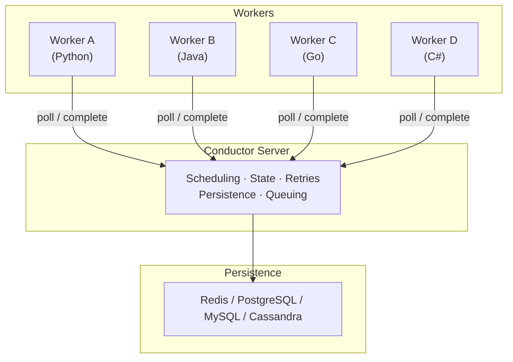

# Why Conductor

Conductor is an open source workflow engine built for workflow orchestration at scale. It orchestrates distributed workflows across services, languages, and infrastructure — tracking every state transition, retrying failures automatically, and giving you full visibility into what happened and why. Whether you need microservice orchestration, AI agent orchestration, or workflow automation, Conductor provides a self-hosted, code-first platform with no vendor lock-in.

## The problem

Distributed systems fail. Services crash, networks drop, deployments roll mid-flight. Without a workflow orchestration platform, you end up writing retry logic, state tracking, timeout handling, and compensation flows into every service. That logic is scattered, inconsistent, and invisible.

**Choreography** (peer-to-peer events) makes this worse at scale:

- Business processes are implicit — embedded across dozens of services with no single view of the flow.
- Tight coupling through assumed message contracts makes changes risky.
- "How far along is order #12345?" requires querying every service in the chain.
- Debugging a failure means correlating logs across services, queues, and time.

**Orchestration** centralizes the flow definition while keeping execution distributed. Conductor is the orchestrator — your workers stay stateless and independent.

## What Conductor gives you

### Durable execution
Conductor is a durable execution engine — every workflow execution is persisted. If a task fails, Conductor retries it with configurable backoff including exponential backoff. If a worker crashes, the task is rescheduled. If the server restarts, execution resumes exactly where it left off. Your code doesn't need to handle retry logic — Conductor provides it out of the box. This same durable execution guarantee powers durable agents that survive infrastructure failures.

### Language-agnostic workers
Write workers in Python, Java, Go, JavaScript, C#, or Clojure. Each task in a workflow can use a different language — pick the best tool for each job. Workers communicate with Conductor via REST or gRPC and can run anywhere: containers, VMs, serverless, or your laptop.

### Built-in system tasks
HTTP calls, inline JavaScript execution, JSON transforms, event publishing, wait timers, and human approval gates — all available without writing a single worker. See [System Tasks](../../documentation/configuration/workflowdef/systemtasks/index.md).

### Flow control operators
Fork/join for parallelism, switch for conditional branching, do-while for loops, sub-workflows for composition, and dynamic tasks resolved at runtime. See [Operators](../../documentation/configuration/workflowdef/operators/index.md).

### AI agent orchestration and LLM orchestration
Conductor provides LLM orchestration and AI agent orchestration as native system tasks. Configure a supported provider and model on the task, or bring a framework-authored agent into a durable Conductor graph. The [LLM orchestration guide](../ai/llm-orchestration.md) is the maintained provider and capability reference.

MCP (Model Context Protocol) integration is built in: use `LIST_MCP_TOOLS` to discover available tools and `CALL_MCP_TOOL` to invoke them — enabling function calling and tool use within workflows with full retry and state tracking.

For RAG pipelines, Conductor supports three vector databases natively — Pinecone, pgvector, and MongoDB Atlas — so you can index embeddings, run similarity search, and feed results to an LLM in a single workflow definition.

Content generation tasks cover image, audio, video, and PDF creation using AI models. Every AI task runs with the same durability guarantees as any other Conductor task: automatic retries, timeout handling, and a complete audit trail.

### Event-driven workflows
Publish to and consume from Kafka, NATS, AMQP (RabbitMQ), and SQS. Trigger workflows from external events or emit events from within workflows. See [Event orchestration](../how-tos/event-bus.md).

### Full operational control
Pause, resume, restart, retry, and terminate any workflow execution. Search and filter executions by status, time, correlation ID, or custom tags. Every task has a complete audit trail — inputs, outputs, timestamps, retry history, and worker identity.

### Horizontal scaling
Conductor servers and workers scale independently. Use task domains, rate limits, concurrency limits, persistence configuration, and metrics to match throughput and isolation to your environment.

## When to use Conductor

| Use case | Example |
| :--- | :--- |
| **Microservice orchestration** | Order processing: payment → inventory → shipping → notification |
| **Workflow automation** | Automate business processes with durable execution, retries, and full observability |
| **Durable agents** | Multi-step LLM chains with function calling, tool use, RAG, and human-in-the-loop — durable agents that survive crashes |
| **Long-running workflows** | Insurance claims, loan approvals, onboarding flows spanning days or weeks — async workflows that survive deploys |
| **Event-driven automation** | React to Kafka events, trigger workflows, publish results back |
| **Batch processing** | Fan-out work across thousands of parallel workers with dynamic fork |
| **Saga pattern** | Distributed transactions with compensation on failure |
| **RAG applications** | Build retrieval-augmented generation pipelines with vector search, embedding generation, and LLM completion as workflow tasks |
| **Content generation pipelines** | Generate images, audio, video, and PDFs using AI models orchestrated as durable workflows |

## The Conductor execution model

- **Native AI tasks** — LLM, MCP, vector, media, and PDF tasks compose with standard workflow control flow.
- **MCP (Model Context Protocol) native integration** — discover and call tools directly from workflow definitions.
- **Vector workflows for RAG** — Embed, index, search, and generate in one workflow; see the supported integration reference for configuration.
- **Content generation tasks** — image, audio, video, and PDF generation as system tasks.
- **Event and persistence choices** — Deploy with the persistence, queue, and worker topology appropriate for your environment.
- **Polyglot implementation** — Build workers and clients with the supported SDKs while keeping the execution graph visible.
- **JSON-native and code-first workflow definitions** — define workflows as JSON or as code using SDKs. Workflow as code for developers who want type safety; JSON for runtime generation and LLM-driven workflows.
- **Self-hosted and open source** — deploy Conductor on your own infrastructure under the Apache 2.0 license.
- **Human-in-the-loop as a first-class task type** — pause execution for approvals, reviews, or manual intervention with built-in timeout and escalation.

## How it works

Workers poll for tasks, execute business logic, and report results. Conductor handles everything else — scheduling, retries, timeouts, state persistence, and flow control. See [Architecture](../architecture/index.md) for details.

## Next steps

- [Quickstart](../../quickstart/first-workflow.md) — run your first workflow in 2 minutes
- [Workflows](workflows.md) — how workflow definitions work
- [Tasks](tasks.md) — task types and configuration
- [Workers](workers.md) — building workers in any language
