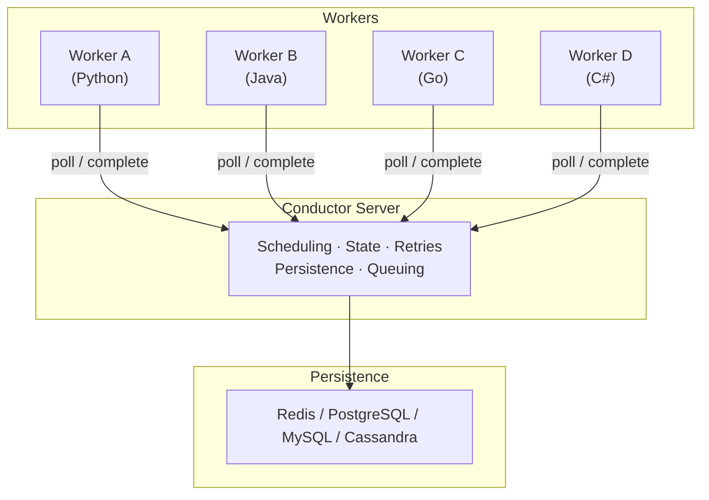

# Why Conductor

Conductor is an open source engine that orchestrates workflows across services and languages. It records every state transition, retries failures automatically, and keeps a full history of what happened and why.

## The problem

Every distributed process has to survive failure. Without coordination, each service carries its own retry, timeout, and recovery logic. That logic gets duplicated everywhere and owned by no one.

One common proposed solution is **choreography**, where services react to each other's events with no central coordinator. This keeps services decoupled on paper, but the logic of the overall business process is not visible. The flow exists only as an implied chain of event contracts, so changing one service can break consumers it cannot see. Observing the process is also hard. For example debugging a failure means correlating logs across all of the services.

**Orchestration** is Conductor's approach. The overall business process is defined in one place, while the work itself stays distributed. Conductor is the orchestrator. It owns the flow, the state, and the recovery, so workers stay stateless and independent.

## How it works

Conductor runs as a server that your workers connect to. The server schedules tasks, persists every state change, and applies retries and timeouts. Workers poll the server for tasks, run your business logic in any supported language, and report results back. State lives in the persistence store you choose.

See [Architecture](../architecture/index.md) for details.

## What Conductor gives you

### Durable execution
Every workflow execution is persisted, so progress survives failure. A failed task is retried under a configurable backoff policy, a crashed worker's task is rescheduled to another worker, and a server restart resumes executions from their last recorded state. Your code carries no retry logic, because Conductor applies it for you. The same guarantee extends to agents.

### Language-agnostic workers
Workers can be written in Python, Java, Go, JavaScript, C#, or Clojure, and each task in a workflow can use a different language. Workers talk to Conductor over REST or gRPC, so they can run in containers, VMs, serverless functions, or on a laptop.

### Built-in system tasks
Common steps ship with the server: HTTP calls, inline scripts, JSON transforms, event publishing, wait timers, and human approval gates. None of them require a worker. See [System Tasks](../../documentation/configuration/workflowdef/systemtasks/index.md).

### Flow control operators
Operators express control flow in the definition itself: fork and join for parallelism, switch for branching, do-while for loops, and sub-workflows for composition. Dynamic tasks let the graph be resolved at runtime. See [Operators](../../documentation/configuration/workflowdef/operators/index.md).

### AI tasks and agents
LLM calls run as native system tasks. Configure a provider and model on the task, or bring a framework-authored agent into a durable Conductor graph. The [LLM orchestration guide](../ai/llm-orchestration.md) is the provider and capability reference.

MCP support is built in. `LIST_MCP_TOOLS` discovers a server's tools and `CALL_MCP_TOOL` invokes one, with the same retries and state tracking as any other task.

Vector search tasks support Pinecone, pgvector, and MongoDB Atlas, so a single workflow can index embeddings, run similarity search, and pass the results to an LLM. Content generation tasks produce images, audio, video, and PDFs. All AI tasks share the standard durability guarantees: automatic retries, timeouts, and a complete execution record.

### Event-driven workflows
Workflows can be triggered by external events and can publish events of their own. Kafka, NATS, AMQP, and SQS are supported. See [Event orchestration](../how-tos/event-bus.md).

### Full operational control
Any execution can be paused, resumed, restarted, retried, or terminated. Executions are searchable by status, time, correlation ID, or custom tags, and every task records its inputs, outputs, timestamps, retry history, and worker identity.

### Horizontal scaling
Servers and workers scale independently. Task domains, rate limits, concurrency limits, and persistence configuration control throughput and isolation, and metrics expose how each queue is behaving.

## When to use Conductor

| Use case | Example |
| :--- | :--- |
| **[Microservice orchestration](../cookbook/microservice-orchestration.md)** | Order processing: payment → inventory → shipping → notification |
| **[Workflow automation](../workflows/index.md)** | Automate business processes with durable execution, retries, and full observability |
| **[Durable agents](../ai/durable-agents.md)** | Multi-step LLM chains with function calling, tool use, RAG, and human-in-the-loop — durable agents that survive crashes |
| **[Long-running workflows](../cookbook/wait-and-timers.md)** | Insurance claims, loan approvals, onboarding flows spanning days or weeks — async workflows that survive deploys |
| **[Event-driven automation](../cookbook/event-driven.md)** | React to Kafka events, trigger workflows, publish results back |
| **[Batch processing](../cookbook/dynamic-parallelism.md)** | Fan-out work across thousands of parallel workers with dynamic fork |
| **[Saga pattern](../cookbook/saga-compensation.md)** | Distributed transactions with compensation on failure |
| **[RAG applications](../ai/cookbook/rag-agent.md)** | Build retrieval-augmented generation pipelines with vector search, embedding generation, and LLM completion as workflow tasks |
| **[Content generation pipelines](../ai/llm-orchestration.md)** | Generate images, audio, video, and PDFs using AI models orchestrated as durable workflows |

## The Conductor execution model

- **Native AI tasks** — LLM, MCP, vector, media, and PDF tasks compose with standard workflow control flow.
- **MCP (Model Context Protocol) native integration** — discover and call tools directly from workflow definitions.
- **Vector workflows for RAG** — Embed, index, search, and generate in one workflow; see the supported integration reference for configuration.
- **Content generation tasks** — image, audio, video, and PDF generation as system tasks.
- **Event and persistence choices** — Deploy with the persistence, queue, and worker topology appropriate for your environment.
- **Polyglot implementation** — Build workers and clients with the supported SDKs while keeping the execution graph visible.
- **JSON-native and code-first workflow definitions** — define workflows as JSON or as code using SDKs. Workflow as code for developers who want type safety; JSON for runtime generation and LLM-driven workflows.
- **Self-hosted and open source** — deploy Conductor on your own infrastructure under the Apache 2.0 license.
- **Human-in-the-loop as a first-class task type** — pause execution for approvals, reviews, or manual intervention with built-in timeout and escalation.

## Next steps

- [Quickstart](../../quickstart/first-workflow.md) — run your first workflow in 2 minutes
- [Workflows](workflows.md) — how workflow definitions work
- [Tasks](tasks.md) — task types and configuration
- [Workers](workers.md) — building workers in any language
