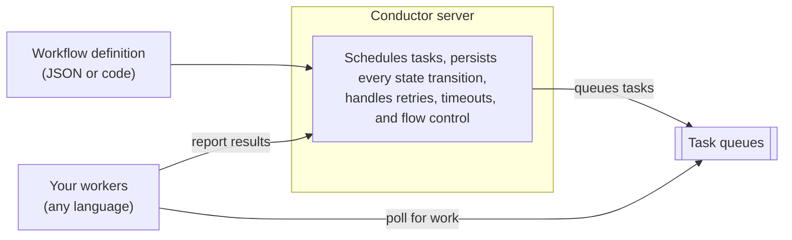

# Core Concepts

## What is Conductor?

**Conductor is an open source orchestration engine that runs workflows durably.** You define a workflow
as a series of tasks — with branching, loops, parallelism, and failure handling — and Conductor executes it:
it decides which task runs next, records every state transition, and retries or resumes automatically when
something fails. Processes survive crashes, restarts, and network partitions without losing progress.

The fundamental division of labor:

- **The server orchestrates.** It reads the workflow definition, schedules each task in order, enforces
  retries and timeouts, and persists state at every step — orchestration logic stays out of your
  application code.
- **Your workers execute.** Business logic lives in workers: plain functions in your own services, written
  in any language with an SDK (Java, Python, Go, JavaScript, C#, Clojure, Ruby, Rust). Workers poll the
  server for work, run your code, and report results back — no inbound ports required, so they can run
  anywhere.
- **System tasks run on the server.** Common operations — HTTP calls, event publishing, inline transforms,
  sub-workflows, LLM calls — are built in, so many workflow steps need no custom code at all.

Workflow definitions are JSON-native — version them in source control, diff changes across releases,
generate them programmatically, or let LLMs create and modify them at runtime.

AI capabilities are part of the same task library: native support for 14+ LLM providers, MCP tool calling,
function calling, vector databases, and durable agents — AI steps get the same retries, persistence, and
observability as every other task.

## What can Conductor do?

  

    

      
Create Workflows

      
Define workflows consisting of multiple tasks that are executed in a specific order. <a href="../../documentation/configuration/workflowdef/index.html">Learn more</a>

    

    

      
Branch Your Flows

      
Use switch-case operators to make branching decisions. <a href="../../documentation/configuration/workflowdef/operators/switch-task.html">Learn more</a>

    

    

      
Run Loops

      
Use the Do-While loop operator to iterate through a set of tasks. <a href="../../documentation/configuration/workflowdef/operators/do-while-task.html">Learn more</a>

    

    

      
Parallelize Your Tasks

      
Execute tasks in parallel using either static or dynamic forks. <a href="../../documentation/configuration/workflowdef/operators/fork-task.html">Learn more</a>

    

    

      
Run Your Tasks Externally

      
Implement tasks using external workers in microservices, serverless functions, or applications. <a href="workers.html">Workers</a> · <a href="../../documentation/clientsdks/index.html">SDKs</a>

    

    

      
Use Built-In Tasks

      
Use built-in tasks for common actions such as calling HTTP endpoints, writing to event queues, and executing inline code. <a href="../../documentation/configuration/workflowdef/systemtasks/index.html">Learn more</a>

    

    

      
Use LLM Tasks

      
Use LLM tasks to build AI-powered workflows, including agentic workflows. <a href="../ai/index.html">Learn more</a>

    

    

      
Orchestrate Agents

      
Build and run Conductor Agents, or orchestrate deployed and remote A2A agents as durable workflow steps. <a href="agents.html">Learn more</a>

    

    

      
Human in the Loop

      
Plug in manual steps in your workflows using Human tasks. <a href="../../documentation/configuration/workflowdef/systemtasks/human-task.html">Human tasks</a> · <a href="../../documentation/configuration/workflowdef/systemtasks/wait-task.html">Wait tasks</a>

    

    

      
Handle Failures

      
Set timeouts and rate limits to manage failures for tasks and workflows. <a href="../how-tos/Workflows/handling-errors.html">Learn more</a>

    

    

      
Replay Any Workflow

      
Replay completed or failed workflows from the beginning, from any task, or retry just the failed step — even months later. Full execution history is always preserved. <a href="../how-tos/Workflows/debugging-workflows.html">Learn more</a>

    

    

      
Integrate With Applications

      
Connect Conductor to your ecosystem with event-driven triggers using Kafka, NATS, SQS, AMQP, and webhooks. <a href="../cookbook/event-driven.html">Learn more</a>

    

    

      
Debug Visually

      
Track and debug workflows from Conductor UI. View inputs, pull logs, and restart from any point. <a href="../../quickstart/first-workflow.html">Get started</a>

    

    

      
Scale Horizontally

      
Run multiple server instances behind a load balancer with shared backends for high availability. <a href="../running/deploy.html">Deployment guide</a>

    

    

      <button class="wcc-control" data-wcc-direction="previous" type="button">
        ←Previous
      </button>
      <button class="wcc-control" data-wcc-direction="next" type="button">
        Next→
      </button>
    

  

  

    <!-- 0: Create Workflows — linear -->
    <svg class="wcc-diagram wcc-visible" data-wcc-diagram="0" viewBox="0 0 220 420" xmlns="http://www.w3.org/2000/svg">
      <circle cx="110" cy="30" r="22" fill="#e2e8f0" stroke="#4a5568" stroke-width="1.5"/><text x="110" y="35" text-anchor="middle" font-size="11" fill="#2e3545" font-family="sans-serif">Start</text>
      <line x1="110" y1="52" x2="110" y2="80" stroke="#a0aec0" stroke-width="1.5" marker-end="url(#wcc-arrow)"/>
      <rect x="35" y="80" width="150" height="40" rx="6" fill="#e2e8f0" stroke="#4a5568" stroke-width="1.5"/><text x="110" y="105" text-anchor="middle" font-size="12" fill="#2e3545" font-family="sans-serif">Task A</text>
      <line x1="110" y1="120" x2="110" y2="155" stroke="#a0aec0" stroke-width="1.5" marker-end="url(#wcc-arrow)"/>
      <rect x="35" y="155" width="150" height="40" rx="6" fill="#e2e8f0" stroke="#4a5568" stroke-width="1.5"/><text x="110" y="180" text-anchor="middle" font-size="12" fill="#2e3545" font-family="sans-serif">Task B</text>
      <line x1="110" y1="195" x2="110" y2="230" stroke="#a0aec0" stroke-width="1.5" marker-end="url(#wcc-arrow)"/>
      <rect x="35" y="230" width="150" height="40" rx="6" fill="#e2e8f0" stroke="#4a5568" stroke-width="1.5"/><text x="110" y="255" text-anchor="middle" font-size="12" fill="#2e3545" font-family="sans-serif">Task C</text>
      <line x1="110" y1="270" x2="110" y2="305" stroke="#a0aec0" stroke-width="1.5" marker-end="url(#wcc-arrow)"/>
      <circle cx="110" cy="327" r="22" fill="#e2e8f0" stroke="#4a5568" stroke-width="1.5"/><text x="110" y="332" text-anchor="middle" font-size="11" fill="#2e3545" font-family="sans-serif">End</text>
      <defs><marker id="wcc-arrow" viewBox="0 0 10 10" refX="9" refY="5" markerWidth="6" markerHeight="6" orient="auto-start-reverse"><path d="M 0 0 L 10 5 L 0 10 z" fill="#a0aec0"/></marker></defs>
    </svg>
    <!-- 1: Branch — switch -->
    <svg class="wcc-diagram" data-wcc-diagram="1" viewBox="0 0 260 420" xmlns="http://www.w3.org/2000/svg">
      <circle cx="130" cy="30" r="22" fill="#e2e8f0" stroke="#4a5568" stroke-width="1.5"/><text x="130" y="35" text-anchor="middle" font-size="11" fill="#2e3545" font-family="sans-serif">Start</text>
      <line x1="130" y1="52" x2="130" y2="80" stroke="#a0aec0" stroke-width="1.5" marker-end="url(#wcc-arrow)"/>
      <rect x="55" y="80" width="150" height="40" rx="6" fill="#e2e8f0" stroke="#4a5568" stroke-width="1.5"/><text x="130" y="105" text-anchor="middle" font-size="12" fill="#2e3545" font-family="sans-serif">Task A</text>
      <line x1="130" y1="120" x2="130" y2="150" stroke="#a0aec0" stroke-width="1.5" marker-end="url(#wcc-arrow)"/>
      <polygon points="130,150 170,185 130,220 90,185" fill="#e2e8f0" stroke="#4a5568" stroke-width="1.5"/><text x="130" y="188" text-anchor="middle" font-size="10" fill="#2e3545" font-family="sans-serif">Switch</text><text x="130" y="200" text-anchor="middle" font-size="10" fill="#2e3545" font-family="sans-serif">Case</text>
      <line x1="90" y1="185" x2="50" y2="185" stroke="#a0aec0" stroke-width="1.5"/><line x1="50" y1="185" x2="50" y2="260" stroke="#a0aec0" stroke-width="1.5" marker-end="url(#wcc-arrow)"/>
      <line x1="170" y1="185" x2="210" y2="185" stroke="#a0aec0" stroke-width="1.5"/><line x1="210" y1="185" x2="210" y2="260" stroke="#a0aec0" stroke-width="1.5" marker-end="url(#wcc-arrow)"/>
      <rect x="0" y="260" width="100" height="40" rx="6" fill="#e2e8f0" stroke="#4a5568" stroke-width="1.5"/><text x="50" y="285" text-anchor="middle" font-size="12" fill="#2e3545" font-family="sans-serif">Task B</text>
      <rect x="160" y="260" width="100" height="40" rx="6" fill="#e2e8f0" stroke="#4a5568" stroke-width="1.5"/><text x="210" y="285" text-anchor="middle" font-size="12" fill="#2e3545" font-family="sans-serif">Task C</text>
      <line x1="50" y1="300" x2="50" y2="340" stroke="#a0aec0" stroke-width="1.5"/><line x1="50" y1="340" x2="130" y2="340" stroke="#a0aec0" stroke-width="1.5"/>
      <line x1="210" y1="300" x2="210" y2="340" stroke="#a0aec0" stroke-width="1.5"/><line x1="210" y1="340" x2="130" y2="340" stroke="#a0aec0" stroke-width="1.5"/>
      <line x1="130" y1="340" x2="130" y2="360" stroke="#a0aec0" stroke-width="1.5" marker-end="url(#wcc-arrow)"/>
      <circle cx="130" cy="382" r="22" fill="#e2e8f0" stroke="#4a5568" stroke-width="1.5"/><text x="130" y="387" text-anchor="middle" font-size="11" fill="#2e3545" font-family="sans-serif">End</text>
    </svg>
    <!-- 2: Run Loops — do-while highlighted -->
    <svg class="wcc-diagram" data-wcc-diagram="2" viewBox="-30 0 330 440" xmlns="http://www.w3.org/2000/svg">
      <circle cx="110" cy="30" r="22" fill="#e2e8f0" stroke="#4a5568" stroke-width="1.5"/><text x="110" y="35" text-anchor="middle" font-size="11" fill="#2e3545" font-family="sans-serif">Start</text>
      <line x1="110" y1="52" x2="110" y2="80" stroke="#a0aec0" stroke-width="1.5" marker-end="url(#wcc-arrow)"/>
      <rect x="35" y="80" width="150" height="40" rx="6" fill="#e2e8f0" stroke="#4a5568" stroke-width="1.5"/><text x="110" y="105" text-anchor="middle" font-size="12" fill="#2e3545" font-family="sans-serif">Task A</text>
      <line x1="110" y1="120" x2="110" y2="150" stroke="#a0aec0" stroke-width="1.5" marker-end="url(#wcc-arrow)"/>
      <polygon points="110,150 150,185 110,220 70,185" fill="#e2e8f0" stroke="#4a5568" stroke-width="1.5"/><text x="110" y="188" text-anchor="middle" font-size="10" fill="#2e3545" font-family="sans-serif">Switch</text><text x="110" y="200" text-anchor="middle" font-size="10" fill="#2e3545" font-family="sans-serif">Case</text>
      <line x1="70" y1="185" x2="30" y2="185" stroke="#a0aec0" stroke-width="1.5"/><line x1="30" y1="185" x2="30" y2="270" stroke="#a0aec0" stroke-width="1.5" marker-end="url(#wcc-arrow)"/>
      <rect x="-20" y="270" width="100" height="40" rx="6" fill="#e2e8f0" stroke="#4a5568" stroke-width="1.5"/><text x="30" y="295" text-anchor="middle" font-size="12" fill="#2e3545" font-family="sans-serif">Task B</text>
      <line x1="150" y1="185" x2="210" y2="185" stroke="#a0aec0" stroke-width="1.5"/><line x1="210" y1="185" x2="210" y2="250" stroke="#a0aec0" stroke-width="1.5" marker-end="url(#wcc-arrow)"/>
      <rect x="155" y="250" width="120" height="75" rx="8" fill="rgba(6,214,160,0.10)" stroke="#06d6a0" stroke-width="2"/><text x="215" y="272" text-anchor="middle" font-size="10" font-weight="600" fill="#06d6a0" font-family="sans-serif">Do While Loop</text>
      <rect x="170" y="282" width="90" height="32" rx="5" fill="#e2e8f0" stroke="#4a5568" stroke-width="1.5"/><text x="215" y="303" text-anchor="middle" font-size="11" fill="#2e3545" font-family="sans-serif">Task C</text>
      <path d="M 260 298 C 280 298 280 268 260 268" stroke="#06d6a0" stroke-width="1.5" fill="none" marker-end="url(#wcc-arrow-teal)"/>
      <line x1="30" y1="310" x2="30" y2="370" stroke="#a0aec0" stroke-width="1.5"/><line x1="30" y1="370" x2="110" y2="370" stroke="#a0aec0" stroke-width="1.5"/>
      <line x1="215" y1="325" x2="215" y2="370" stroke="#a0aec0" stroke-width="1.5"/><line x1="215" y1="370" x2="110" y2="370" stroke="#a0aec0" stroke-width="1.5"/>
      <line x1="110" y1="370" x2="110" y2="390" stroke="#a0aec0" stroke-width="1.5" marker-end="url(#wcc-arrow)"/>
      <circle cx="110" cy="412" r="22" fill="#e2e8f0" stroke="#4a5568" stroke-width="1.5"/><text x="110" y="417" text-anchor="middle" font-size="11" fill="#2e3545" font-family="sans-serif">End</text>
      <defs><marker id="wcc-arrow-teal" viewBox="0 0 10 10" refX="9" refY="5" markerWidth="6" markerHeight="6" orient="auto-start-reverse"><path d="M 0 0 L 10 5 L 0 10 z" fill="#06d6a0"/></marker></defs>
    </svg>
    <!-- 3: Parallelize — fork/join -->
    <svg class="wcc-diagram" data-wcc-diagram="3" viewBox="-25 0 370 440" xmlns="http://www.w3.org/2000/svg">
      <circle cx="140" cy="30" r="22" fill="#e2e8f0" stroke="#4a5568" stroke-width="1.5"/><text x="140" y="35" text-anchor="middle" font-size="11" fill="#2e3545" font-family="sans-serif">Start</text>
      <line x1="140" y1="52" x2="140" y2="80" stroke="#a0aec0" stroke-width="1.5" marker-end="url(#wcc-arrow)"/>
      <rect x="65" y="80" width="150" height="40" rx="6" fill="#e2e8f0" stroke="#4a5568" stroke-width="1.5"/><text x="140" y="105" text-anchor="middle" font-size="12" fill="#2e3545" font-family="sans-serif">Task A</text>
      <line x1="140" y1="120" x2="140" y2="148" stroke="#a0aec0" stroke-width="1.5" marker-end="url(#wcc-arrow)"/>
      <polygon points="140,148 180,178 140,208 100,178" fill="#e2e8f0" stroke="#4a5568" stroke-width="1.5"/><text x="140" y="181" text-anchor="middle" font-size="10" fill="#2e3545" font-family="sans-serif">Switch</text><text x="140" y="193" text-anchor="middle" font-size="10" fill="#2e3545" font-family="sans-serif">Case</text>
      <line x1="100" y1="178" x2="40" y2="178" stroke="#a0aec0" stroke-width="1.5"/><line x1="40" y1="178" x2="40" y2="240" stroke="#a0aec0" stroke-width="1.5" marker-end="url(#wcc-arrow)"/>
      <line x1="140" y1="208" x2="140" y2="240" stroke="#a0aec0" stroke-width="1.5" marker-end="url(#wcc-arrow)"/>
      <line x1="180" y1="178" x2="255" y2="178" stroke="#a0aec0" stroke-width="1.5"/><line x1="255" y1="178" x2="255" y2="230" stroke="#a0aec0" stroke-width="1.5" marker-end="url(#wcc-arrow)"/>
      <rect x="-10" y="240" width="100" height="40" rx="6" fill="#e2e8f0" stroke="#4a5568" stroke-width="1.5"/><text x="40" y="265" text-anchor="middle" font-size="12" fill="#2e3545" font-family="sans-serif">Task B</text>
      <rect x="90" y="240" width="100" height="40" rx="6" fill="#dc2626" stroke="#dc2626" stroke-width="1.5"/><text x="140" y="265" text-anchor="middle" font-size="12" fill="#fff" font-family="sans-serif" font-weight="600">Task D</text>
      <rect x="200" y="230" width="120" height="70" rx="8" fill="rgba(6,214,160,0.10)" stroke="#06d6a0" stroke-width="2"/><text x="260" y="250" text-anchor="middle" font-size="10" font-weight="600" fill="#06d6a0" font-family="sans-serif">Do While Loop</text>
      <rect x="215" y="258" width="90" height="32" rx="5" fill="#e2e8f0" stroke="#4a5568" stroke-width="1.5"/><text x="260" y="279" text-anchor="middle" font-size="11" fill="#2e3545" font-family="sans-serif">Task C</text>
      <line x1="40" y1="280" x2="40" y2="340" stroke="#a0aec0" stroke-width="1.5"/><line x1="40" y1="340" x2="140" y2="340" stroke="#a0aec0" stroke-width="1.5"/>
      <line x1="140" y1="280" x2="140" y2="340" stroke="#a0aec0" stroke-width="1.5"/>
      <line x1="260" y1="300" x2="260" y2="340" stroke="#a0aec0" stroke-width="1.5"/><line x1="260" y1="340" x2="140" y2="340" stroke="#a0aec0" stroke-width="1.5"/>
      <line x1="140" y1="340" x2="140" y2="370" stroke="#a0aec0" stroke-width="1.5" marker-end="url(#wcc-arrow)"/>
      <circle cx="140" cy="392" r="22" fill="#e2e8f0" stroke="#4a5568" stroke-width="1.5"/><text x="140" y="397" text-anchor="middle" font-size="11" fill="#2e3545" font-family="sans-serif">End</text>
    </svg>
    <!-- 4: External Workers -->
    <svg class="wcc-diagram" data-wcc-diagram="4" viewBox="0 0 320 440" xmlns="http://www.w3.org/2000/svg">
      <circle cx="90" cy="30" r="22" fill="#e2e8f0" stroke="#4a5568" stroke-width="1.5"/><text x="90" y="35" text-anchor="middle" font-size="11" fill="#2e3545" font-family="sans-serif">Start</text>
      <line x1="90" y1="52" x2="90" y2="80" stroke="#a0aec0" stroke-width="1.5" marker-end="url(#wcc-arrow)"/>
      <rect x="30" y="80" width="120" height="40" rx="6" fill="#e2e8f0" stroke="#4a5568" stroke-width="1.5"/><text x="90" y="105" text-anchor="middle" font-size="12" fill="#2e3545" font-family="sans-serif">Task A</text>
      <line x1="150" y1="100" x2="200" y2="100" stroke="#a0aec0" stroke-width="1.5" stroke-dasharray="5,3" marker-end="url(#wcc-arrow)"/>
      <rect x="200" y="80" width="110" height="40" rx="6" fill="#06d6a0" stroke="#05c792" stroke-width="1.5"/><text x="255" y="98" text-anchor="middle" font-size="10" fill="#fff" font-weight="600" font-family="sans-serif">Worker A</text><text x="255" y="112" text-anchor="middle" font-size="9" fill="#fff" font-family="sans-serif">Microservice</text>
      <line x1="90" y1="120" x2="90" y2="160" stroke="#a0aec0" stroke-width="1.5" marker-end="url(#wcc-arrow)"/>
      <rect x="30" y="160" width="120" height="40" rx="6" fill="#e2e8f0" stroke="#4a5568" stroke-width="1.5"/><text x="90" y="185" text-anchor="middle" font-size="12" fill="#2e3545" font-family="sans-serif">Task B</text>
      <line x1="150" y1="180" x2="200" y2="180" stroke="#a0aec0" stroke-width="1.5" stroke-dasharray="5,3" marker-end="url(#wcc-arrow)"/>
      <rect x="200" y="160" width="110" height="40" rx="6" fill="#f59e0b" stroke="#d97706" stroke-width="1.5"/><text x="255" y="178" text-anchor="middle" font-size="10" fill="#fff" font-weight="600" font-family="sans-serif">Worker B</text><text x="255" y="192" text-anchor="middle" font-size="9" fill="#fff" font-family="sans-serif">Serverless</text>
      <line x1="90" y1="200" x2="90" y2="240" stroke="#a0aec0" stroke-width="1.5" marker-end="url(#wcc-arrow)"/>
      <rect x="30" y="240" width="120" height="40" rx="6" fill="#e2e8f0" stroke="#4a5568" stroke-width="1.5"/><text x="90" y="265" text-anchor="middle" font-size="12" fill="#2e3545" font-family="sans-serif">Task C</text>
      <line x1="150" y1="260" x2="200" y2="260" stroke="#a0aec0" stroke-width="1.5" stroke-dasharray="5,3" marker-end="url(#wcc-arrow)"/>
      <rect x="200" y="240" width="110" height="40" rx="6" fill="#3b82f6" stroke="#2563eb" stroke-width="1.5"/><text x="255" y="258" text-anchor="middle" font-size="10" fill="#fff" font-weight="600" font-family="sans-serif">Worker C</text><text x="255" y="272" text-anchor="middle" font-size="9" fill="#fff" font-family="sans-serif">Legacy App</text>
      <line x1="90" y1="280" x2="90" y2="320" stroke="#a0aec0" stroke-width="1.5" marker-end="url(#wcc-arrow)"/>
      <circle cx="90" cy="342" r="22" fill="#e2e8f0" stroke="#4a5568" stroke-width="1.5"/><text x="90" y="347" text-anchor="middle" font-size="11" fill="#2e3545" font-family="sans-serif">End</text>
    </svg>
    <!-- 5: Built-in Tasks -->
    <svg class="wcc-diagram" data-wcc-diagram="5" viewBox="0 0 260 420" xmlns="http://www.w3.org/2000/svg">
      <circle cx="130" cy="30" r="22" fill="#e2e8f0" stroke="#4a5568" stroke-width="1.5"/><text x="130" y="35" text-anchor="middle" font-size="11" fill="#2e3545" font-family="sans-serif">Start</text>
      <line x1="130" y1="52" x2="130" y2="80" stroke="#a0aec0" stroke-width="1.5" marker-end="url(#wcc-arrow)"/>
      <rect x="30" y="80" width="200" height="40" rx="6" fill="#e2e8f0" stroke="#4a5568" stroke-width="1.5"/><text x="130" y="105" text-anchor="middle" font-size="11" fill="#2e3545" font-family="sans-serif">HTTP: Call API endpoint</text>
      <line x1="130" y1="120" x2="130" y2="160" stroke="#a0aec0" stroke-width="1.5" marker-end="url(#wcc-arrow)"/>
      <rect x="30" y="160" width="200" height="40" rx="6" fill="#e2e8f0" stroke="#4a5568" stroke-width="1.5"/><text x="130" y="185" text-anchor="middle" font-size="11" fill="#2e3545" font-family="sans-serif">Event: Write to Kafka</text>
      <line x1="130" y1="200" x2="130" y2="240" stroke="#a0aec0" stroke-width="1.5" marker-end="url(#wcc-arrow)"/>
      <rect x="30" y="240" width="200" height="40" rx="6" fill="#e2e8f0" stroke="#4a5568" stroke-width="1.5"/><text x="130" y="265" text-anchor="middle" font-size="11" fill="#2e3545" font-family="sans-serif">Inline: Execute JS</text>
      <line x1="130" y1="280" x2="130" y2="320" stroke="#a0aec0" stroke-width="1.5" marker-end="url(#wcc-arrow)"/>
      <circle cx="130" cy="342" r="22" fill="#e2e8f0" stroke="#4a5568" stroke-width="1.5"/><text x="130" y="347" text-anchor="middle" font-size="11" fill="#2e3545" font-family="sans-serif">End</text>
    </svg>
    <!-- 6: LLM Tasks -->
    <svg class="wcc-diagram" data-wcc-diagram="6" viewBox="0 0 240 340" xmlns="http://www.w3.org/2000/svg">
      <circle cx="120" cy="30" r="22" fill="#e2e8f0" stroke="#4a5568" stroke-width="1.5"/><text x="120" y="35" text-anchor="middle" font-size="11" fill="#2e3545" font-family="sans-serif">Start</text>
      <line x1="120" y1="52" x2="120" y2="80" stroke="#a0aec0" stroke-width="1.5" marker-end="url(#wcc-arrow)"/>
      <rect x="20" y="80" width="200" height="40" rx="6" fill="#e2e8f0" stroke="#4a5568" stroke-width="1.5"/><text x="120" y="105" text-anchor="middle" font-size="11" fill="#2e3545" font-family="sans-serif">Search News Index</text>
      <line x1="120" y1="120" x2="120" y2="160" stroke="#a0aec0" stroke-width="1.5" marker-end="url(#wcc-arrow)"/>
      <rect x="20" y="160" width="200" height="40" rx="6" fill="#e2e8f0" stroke="#4a5568" stroke-width="1.5"/><text x="120" y="185" text-anchor="middle" font-size="11" fill="#2e3545" font-family="sans-serif">Get Contextual Answer</text>
      <line x1="120" y1="200" x2="120" y2="240" stroke="#a0aec0" stroke-width="1.5" marker-end="url(#wcc-arrow)"/>
      <circle cx="120" cy="262" r="22" fill="#e2e8f0" stroke="#4a5568" stroke-width="1.5"/><text x="120" y="267" text-anchor="middle" font-size="11" fill="#2e3545" font-family="sans-serif">End</text>
    </svg>
    <!-- 7: Human in the Loop -->
    <svg class="wcc-diagram" data-wcc-diagram="7" viewBox="0 0 280 380" xmlns="http://www.w3.org/2000/svg">
      <circle cx="140" cy="30" r="22" fill="#e2e8f0" stroke="#4a5568" stroke-width="1.5"/><text x="140" y="35" text-anchor="middle" font-size="11" fill="#2e3545" font-family="sans-serif">Start</text>
      <line x1="140" y1="52" x2="140" y2="80" stroke="#a0aec0" stroke-width="1.5" marker-end="url(#wcc-arrow)"/>
      <polygon points="140,80 180,115 140,150 100,115" fill="#e2e8f0" stroke="#4a5568" stroke-width="1.5"/><text x="140" y="118" text-anchor="middle" font-size="11" fill="#2e3545" font-family="sans-serif">Switch</text>
      <line x1="100" y1="115" x2="50" y2="115" stroke="#a0aec0" stroke-width="1.5"/><line x1="50" y1="115" x2="50" y2="190" stroke="#a0aec0" stroke-width="1.5" marker-end="url(#wcc-arrow)"/>
      <line x1="180" y1="115" x2="230" y2="115" stroke="#a0aec0" stroke-width="1.5"/><line x1="230" y1="115" x2="230" y2="190" stroke="#a0aec0" stroke-width="1.5" marker-end="url(#wcc-arrow)"/>
      <rect x="0" y="190" width="100" height="45" rx="6" fill="#e2e8f0" stroke="#4a5568" stroke-width="1.5"/><text x="50" y="210" text-anchor="middle" font-size="10" fill="#2e3545" font-family="sans-serif">Default</text><text x="50" y="224" text-anchor="middle" font-size="10" fill="#2e3545" font-family="sans-serif">Approval</text>
      <rect x="180" y="190" width="100" height="45" rx="6" fill="#f59e0b" stroke="#d97706" stroke-width="1.5"/><text x="230" y="210" text-anchor="middle" font-size="10" fill="#fff" font-weight="600" font-family="sans-serif">Human</text><text x="230" y="224" text-anchor="middle" font-size="10" fill="#fff" font-weight="600" font-family="sans-serif">Approval</text>
      <line x1="50" y1="235" x2="50" y2="280" stroke="#a0aec0" stroke-width="1.5"/><line x1="50" y1="280" x2="140" y2="280" stroke="#a0aec0" stroke-width="1.5"/>
      <line x1="230" y1="235" x2="230" y2="280" stroke="#a0aec0" stroke-width="1.5"/><line x1="230" y1="280" x2="140" y2="280" stroke="#a0aec0" stroke-width="1.5"/>
      <line x1="140" y1="280" x2="140" y2="310" stroke="#a0aec0" stroke-width="1.5" marker-end="url(#wcc-arrow)"/>
      <circle cx="140" cy="332" r="22" fill="#e2e8f0" stroke="#4a5568" stroke-width="1.5"/><text x="140" y="337" text-anchor="middle" font-size="11" fill="#2e3545" font-family="sans-serif">End</text>
    </svg>
    <!-- 8: Handle Failures -->
    <svg class="wcc-diagram" data-wcc-diagram="8" viewBox="0 0 300 420" xmlns="http://www.w3.org/2000/svg">
      <circle cx="110" cy="30" r="22" fill="#e2e8f0" stroke="#4a5568" stroke-width="1.5"/><text x="110" y="35" text-anchor="middle" font-size="11" fill="#2e3545" font-family="sans-serif">Start</text>
      <line x1="110" y1="52" x2="110" y2="80" stroke="#a0aec0" stroke-width="1.5" marker-end="url(#wcc-arrow)"/>
      <rect x="35" y="80" width="150" height="40" rx="6" fill="#e2e8f0" stroke="#4a5568" stroke-width="1.5"/><text x="110" y="105" text-anchor="middle" font-size="12" fill="#2e3545" font-family="sans-serif">Task A</text>
      <circle cx="200" cy="90" r="12" fill="#f59e0b" stroke="#d97706" stroke-width="1.5"/><text x="200" y="94" text-anchor="middle" font-size="10" fill="#fff" font-weight="bold" font-family="sans-serif">!</text>
      <text x="220" y="94" font-size="9" fill="#4a5568" font-family="sans-serif">Retry on failure</text>
      <line x1="110" y1="120" x2="110" y2="160" stroke="#a0aec0" stroke-width="1.5" marker-end="url(#wcc-arrow)"/>
      <rect x="35" y="160" width="150" height="40" rx="6" fill="#e2e8f0" stroke="#4a5568" stroke-width="1.5"/><text x="110" y="185" text-anchor="middle" font-size="12" fill="#2e3545" font-family="sans-serif">Task B</text>
      <text x="200" y="175" font-size="14" fill="#4a5568" font-family="sans-serif">&#9201;</text>
      <text x="220" y="178" font-size="9" fill="#4a5568" font-family="sans-serif">Timeout after</text><text x="220" y="190" font-size="9" fill="#4a5568" font-family="sans-serif">x seconds</text>
      <line x1="110" y1="200" x2="110" y2="240" stroke="#a0aec0" stroke-width="1.5" marker-end="url(#wcc-arrow)"/>
      <rect x="35" y="240" width="150" height="40" rx="6" fill="#e2e8f0" stroke="#4a5568" stroke-width="1.5"/><text x="110" y="265" text-anchor="middle" font-size="12" fill="#2e3545" font-family="sans-serif">Task C</text>
      <line x1="185" y1="260" x2="220" y2="260" stroke="#dc2626" stroke-width="1.5" stroke-dasharray="5,3" marker-end="url(#wcc-arrow-red)"/>
      <text x="228" y="258" font-size="9" fill="#dc2626" font-family="sans-serif">On failure</text>
      <line x1="110" y1="280" x2="110" y2="320" stroke="#a0aec0" stroke-width="1.5" marker-end="url(#wcc-arrow)"/>
      <circle cx="110" cy="342" r="22" fill="#e2e8f0" stroke="#4a5568" stroke-width="1.5"/><text x="110" y="347" text-anchor="middle" font-size="11" fill="#2e3545" font-family="sans-serif">End</text>
      <defs><marker id="wcc-arrow-red" viewBox="0 0 10 10" refX="9" refY="5" markerWidth="6" markerHeight="6" orient="auto-start-reverse"><path d="M 0 0 L 10 5 L 0 10 z" fill="#dc2626"/></marker></defs>
    </svg>
    <!-- 9: Replay Any Workflow -->
    <svg class="wcc-diagram" data-wcc-diagram="9" viewBox="-30 0 400 420" xmlns="http://www.w3.org/2000/svg">
      <circle cx="110" cy="30" r="22" fill="#e2e8f0" stroke="#4a5568" stroke-width="1.5"/><text x="110" y="35" text-anchor="middle" font-size="11" fill="#2e3545" font-family="sans-serif">Start</text>
      <line x1="110" y1="52" x2="110" y2="80" stroke="#a0aec0" stroke-width="1.5" marker-end="url(#wcc-arrow)"/>
      <rect x="35" y="80" width="150" height="40" rx="6" fill="#e2e8f0" stroke="#4a5568" stroke-width="1.5"/><text x="110" y="105" text-anchor="middle" font-size="12" fill="#2e3545" font-family="sans-serif">Task A</text>
      <line x1="110" y1="120" x2="110" y2="160" stroke="#a0aec0" stroke-width="1.5" marker-end="url(#wcc-arrow)"/>
      <rect x="35" y="160" width="150" height="40" rx="6" fill="#e2e8f0" stroke="#4a5568" stroke-width="1.5"/><text x="110" y="185" text-anchor="middle" font-size="12" fill="#2e3545" font-family="sans-serif">Task B</text>
      <line x1="110" y1="200" x2="110" y2="240" stroke="#a0aec0" stroke-width="1.5" marker-end="url(#wcc-arrow)"/>
      <rect x="35" y="240" width="150" height="40" rx="6" fill="#dc2626" stroke="#dc2626" stroke-width="1.5"/><text x="110" y="265" text-anchor="middle" font-size="12" fill="#fff" font-weight="600" font-family="sans-serif">Task C</text>
      <text x="110" y="300" text-anchor="middle" font-size="10" fill="#dc2626" font-family="sans-serif" font-weight="600">FAILED</text>
      <!-- Restart arrow -->
      <path d="M 35 260 C -20 260 -20 30 60 30" stroke="#06d6a0" stroke-width="2" fill="none" stroke-dasharray="5,3" marker-end="url(#wcc-arrow-teal)"/>
      <text x="-8" y="150" text-anchor="middle" font-size="9" fill="#06d6a0" font-family="sans-serif" font-weight="600" transform="rotate(-90 -8 150)">Restart</text>
      <!-- Rerun arrow -->
      <path d="M 185 260 C 240 260 240 180 185 180" stroke="#3b82f6" stroke-width="2" fill="none" stroke-dasharray="5,3" marker-end="url(#wcc-arrow-blue)"/>
      <text x="248" y="220" text-anchor="start" font-size="9" fill="#3b82f6" font-family="sans-serif" font-weight="600">Rerun</text>
      <!-- Retry arrow -->
      <path d="M 185 250 C 300 250 300 240 185 240" stroke="#f59e0b" stroke-width="2" fill="none" stroke-dasharray="5,3" marker-end="url(#wcc-arrow-amber)"/>
      <text x="290" y="258" text-anchor="start" font-size="9" fill="#f59e0b" font-family="sans-serif" font-weight="600">Retry</text>
      <defs>
        <marker id="wcc-arrow-blue" viewBox="0 0 10 10" refX="9" refY="5" markerWidth="6" markerHeight="6" orient="auto-start-reverse"><path d="M 0 0 L 10 5 L 0 10 z" fill="#3b82f6"/></marker>
        <marker id="wcc-arrow-amber" viewBox="0 0 10 10" refX="9" refY="5" markerWidth="6" markerHeight="6" orient="auto-start-reverse"><path d="M 0 0 L 10 5 L 0 10 z" fill="#f59e0b"/></marker>
      </defs>
    </svg>
    <!-- 10: Integrate -->
    <svg class="wcc-diagram" data-wcc-diagram="10" viewBox="-20 0 350 350" xmlns="http://www.w3.org/2000/svg">
      <rect x="75" y="20" width="150" height="50" rx="8" fill="#06d6a0" stroke="#05c792" stroke-width="1.5"/><text x="150" y="42" text-anchor="middle" font-size="11" fill="#fff" font-weight="600" font-family="sans-serif">Conductor</text><text x="150" y="58" text-anchor="middle" font-size="10" fill="#fff" font-family="sans-serif">Workflow Engine</text>
      <line x1="75" y1="45" x2="20" y2="115" stroke="#a0aec0" stroke-width="1.5" marker-end="url(#wcc-arrow)"/>
      <line x1="120" y1="70" x2="90" y2="115" stroke="#a0aec0" stroke-width="1.5" marker-end="url(#wcc-arrow)"/>
      <line x1="180" y1="70" x2="210" y2="115" stroke="#a0aec0" stroke-width="1.5" marker-end="url(#wcc-arrow)"/>
      <line x1="225" y1="45" x2="280" y2="115" stroke="#a0aec0" stroke-width="1.5" marker-end="url(#wcc-arrow)"/>
      <rect x="-10" y="115" width="70" height="36" rx="6" fill="#e2e8f0" stroke="#4a5568" stroke-width="1.5"/><text x="25" y="138" text-anchor="middle" font-size="10" fill="#2e3545" font-family="sans-serif">Kafka</text>
      <rect x="70" y="115" width="70" height="36" rx="6" fill="#e2e8f0" stroke="#4a5568" stroke-width="1.5"/><text x="105" y="138" text-anchor="middle" font-size="10" fill="#2e3545" font-family="sans-serif">NATS</text>
      <rect x="170" y="115" width="70" height="36" rx="6" fill="#e2e8f0" stroke="#4a5568" stroke-width="1.5"/><text x="205" y="138" text-anchor="middle" font-size="10" fill="#2e3545" font-family="sans-serif">SQS</text>
      <rect x="250" y="115" width="70" height="36" rx="6" fill="#e2e8f0" stroke="#4a5568" stroke-width="1.5"/><text x="285" y="138" text-anchor="middle" font-size="10" fill="#2e3545" font-family="sans-serif">AMQP</text>
      <line x1="150" y1="70" x2="150" y2="200" stroke="#a0aec0" stroke-width="1.5" marker-end="url(#wcc-arrow)"/>
      <rect x="80" y="200" width="140" height="36" rx="6" fill="#e2e8f0" stroke="#4a5568" stroke-width="1.5"/><text x="150" y="223" text-anchor="middle" font-size="10" fill="#2e3545" font-family="sans-serif">Webhooks</text>
    </svg>
    <!-- 11: Debug Visually -->
    <svg class="wcc-diagram" data-wcc-diagram="11" viewBox="0 0 300 420" xmlns="http://www.w3.org/2000/svg">
      <circle cx="110" cy="30" r="22" fill="#e2e8f0" stroke="#4a5568" stroke-width="1.5"/><text x="110" y="35" text-anchor="middle" font-size="11" fill="#2e3545" font-family="sans-serif">Start</text>
      <line x1="110" y1="52" x2="110" y2="80" stroke="#a0aec0" stroke-width="1.5" marker-end="url(#wcc-arrow)"/>
      <rect x="35" y="80" width="150" height="40" rx="6" fill="#e2e8f0" stroke="#4a5568" stroke-width="1.5"/><text x="110" y="105" text-anchor="middle" font-size="12" fill="#2e3545" font-family="sans-serif">Task A</text>
      <line x1="110" y1="120" x2="110" y2="160" stroke="#a0aec0" stroke-width="1.5" marker-end="url(#wcc-arrow)"/>
      <polygon points="110,160 150,195 110,230 70,195" fill="#e2e8f0" stroke="#4a5568" stroke-width="1.5"/><text x="110" y="198" text-anchor="middle" font-size="10" fill="#2e3545" font-family="sans-serif">Switch</text>
      <line x1="110" y1="230" x2="110" y2="260" stroke="#a0aec0" stroke-width="1.5" marker-end="url(#wcc-arrow)"/>
      <rect x="35" y="260" width="150" height="40" rx="6" fill="#dc2626" stroke="#dc2626" stroke-width="1.5"/><text x="110" y="285" text-anchor="middle" font-size="12" fill="#fff" font-weight="600" font-family="sans-serif">Task D</text>
      <rect x="180" y="165" width="110" height="60" rx="8" fill="#fff" stroke="#a0aec0" stroke-width="1" stroke-dasharray="4,3"/>
      <text x="235" y="183" text-anchor="middle" font-size="9" fill="#4a5568" font-family="sans-serif">View inputs,</text>
      <text x="235" y="195" text-anchor="middle" font-size="9" fill="#4a5568" font-family="sans-serif">pull logs,</text>
      <text x="235" y="207" text-anchor="middle" font-size="9" fill="#4a5568" font-family="sans-serif">restart from</text>
      <text x="235" y="219" text-anchor="middle" font-size="9" fill="#4a5568" font-family="sans-serif">here</text>
      <line x1="180" y1="195" x2="155" y2="195" stroke="#a0aec0" stroke-width="1" stroke-dasharray="3,3"/>
      <line x1="110" y1="300" x2="110" y2="340" stroke="#a0aec0" stroke-width="1.5" marker-end="url(#wcc-arrow)"/>
      <circle cx="110" cy="362" r="22" fill="#e2e8f0" stroke="#4a5568" stroke-width="1.5"/><text x="110" y="367" text-anchor="middle" font-size="11" fill="#2e3545" font-family="sans-serif">End</text>
    </svg>
    <!-- 12: Scale -->
    <svg class="wcc-diagram" data-wcc-diagram="12" viewBox="0 0 320 300" xmlns="http://www.w3.org/2000/svg">
      <rect x="90" y="10" width="140" height="40" rx="8" fill="#06d6a0" stroke="#05c792" stroke-width="1.5"/><text x="160" y="35" text-anchor="middle" font-size="11" fill="#fff" font-weight="600" font-family="sans-serif">Load Balancer</text>
      <line x1="120" y1="50" x2="60" y2="80" stroke="#a0aec0" stroke-width="1.5" marker-end="url(#wcc-arrow)"/>
      <line x1="200" y1="50" x2="260" y2="80" stroke="#a0aec0" stroke-width="1.5" marker-end="url(#wcc-arrow)"/>
      <rect x="10" y="80" width="100" height="55" rx="6" fill="#e2e8f0" stroke="#4a5568" stroke-width="1.5"/><text x="60" y="102" text-anchor="middle" font-size="10" fill="#2e3545" font-weight="600" font-family="sans-serif">Instance 1</text><text x="60" y="116" text-anchor="middle" font-size="9" fill="#4a5568" font-family="sans-serif">API Server</text><text x="60" y="128" text-anchor="middle" font-size="9" fill="#4a5568" font-family="sans-serif">+ Sweeper</text>
      <rect x="210" y="80" width="100" height="55" rx="6" fill="#e2e8f0" stroke="#4a5568" stroke-width="1.5"/><text x="260" y="102" text-anchor="middle" font-size="10" fill="#2e3545" font-weight="600" font-family="sans-serif">Instance 2</text><text x="260" y="116" text-anchor="middle" font-size="9" fill="#4a5568" font-family="sans-serif">API Server</text><text x="260" y="128" text-anchor="middle" font-size="9" fill="#4a5568" font-family="sans-serif">+ Sweeper</text>
      <line x1="60" y1="135" x2="60" y2="175" stroke="#a0aec0" stroke-width="1.5" marker-end="url(#wcc-arrow)"/>
      <line x1="260" y1="135" x2="260" y2="175" stroke="#a0aec0" stroke-width="1.5" marker-end="url(#wcc-arrow)"/>
      <line x1="160" y1="195" x2="160" y2="195" stroke="#a0aec0" stroke-width="1.5"/>
      <rect x="30" y="175" width="260" height="55" rx="8" fill="rgba(6,214,160,0.08)" stroke="#06d6a0" stroke-width="1.5"/>
      <text x="160" y="195" text-anchor="middle" font-size="10" font-weight="600" fill="#06d6a0" font-family="sans-serif">Shared Backends</text>
      <text x="160" y="215" text-anchor="middle" font-size="9" fill="#4a5568" font-family="sans-serif">Database  ·  Queue  ·  Index  ·  Lock</text>
    </svg>
    <!-- 13: Agents -->
    <svg class="wcc-diagram" data-wcc-diagram="13" viewBox="0 0 320 330" xmlns="http://www.w3.org/2000/svg">
      <rect x="85" y="15" width="150" height="42" rx="7" fill="#e2e8f0" stroke="#4a5568" stroke-width="1.5"/><text x="160" y="40" text-anchor="middle" font-size="11" fill="#2e3545" font-family="sans-serif">Conductor Workflow</text>
      <line x1="160" y1="57" x2="160" y2="90" stroke="#a0aec0" stroke-width="1.5" marker-end="url(#wcc-agent-arrow)"/>
      <rect x="95" y="90" width="130" height="46" rx="7" fill="#06d6a0" stroke="#05c792" stroke-width="1.5"/><text x="160" y="117" text-anchor="middle" font-size="12" fill="#fff" font-weight="600" font-family="sans-serif">AGENT Task</text>
      <line x1="125" y1="136" x2="70" y2="185" stroke="#a0aec0" stroke-width="1.5" marker-end="url(#wcc-agent-arrow)"/>
      <line x1="195" y1="136" x2="250" y2="185" stroke="#a0aec0" stroke-width="1.5" marker-end="url(#wcc-agent-arrow)"/>
      <rect x="10" y="185" width="120" height="55" rx="7" fill="#e2e8f0" stroke="#4a5568" stroke-width="1.5"/><text x="70" y="208" text-anchor="middle" font-size="10" fill="#2e3545" font-weight="600" font-family="sans-serif">Conductor Agent</text><text x="70" y="224" text-anchor="middle" font-size="9" fill="#4a5568" font-family="sans-serif">Build and run</text>
      <rect x="190" y="185" width="120" height="55" rx="7" fill="#e2e8f0" stroke="#4a5568" stroke-width="1.5"/><text x="250" y="208" text-anchor="middle" font-size="10" fill="#2e3545" font-weight="600" font-family="sans-serif">A2A Agent</text><text x="250" y="224" text-anchor="middle" font-size="9" fill="#4a5568" font-family="sans-serif">Orchestrate remotely</text>
      <line x1="70" y1="240" x2="70" y2="275" stroke="#a0aec0" stroke-width="1.5"/><line x1="250" y1="240" x2="250" y2="275" stroke="#a0aec0" stroke-width="1.5"/><line x1="70" y1="275" x2="250" y2="275" stroke="#a0aec0" stroke-width="1.5"/><line x1="160" y1="275" x2="160" y2="300" stroke="#a0aec0" stroke-width="1.5" marker-end="url(#wcc-agent-arrow)"/>
      <circle cx="160" cy="310" r="16" fill="#e2e8f0" stroke="#4a5568" stroke-width="1.5"/><text x="160" y="314" text-anchor="middle" font-size="9" fill="#2e3545" font-family="sans-serif">Done</text>
      <defs><marker id="wcc-agent-arrow" viewBox="0 0 10 10" refX="9" refY="5" markerWidth="6" markerHeight="6" orient="auto"><path d="M 0 0 L 10 5 L 0 10 z" fill="#a0aec0"/></marker></defs>
    </svg>
  

## Core building blocks

- **[Workflows](workflows.md)** — The blueprint of a process flow. A workflow is a JSON document
  that describes a directed graph of tasks, their dependencies, input/output mappings, and failure
  handling policies.
- **[Tasks](tasks.md)** — The basic building blocks of a Conductor workflow. Tasks can be system
  tasks (executed by the engine) or worker tasks (executed by external workers polling for work).
- **[Workers](workers.md)** — The code that executes tasks in a Conductor workflow. Workers are
  language-agnostic processes that poll the Conductor server, execute business logic, and report
  results back.
- **[Agents](agents.md) (`AGENT` task)** — Invoke a deployed Conductor Agent or a remote A2A
  agent as a durable step inside a workflow.

## Key differentiators

These are the facts that matter when comparing workflow and orchestration engines:

- **Durable execution** — every step is persisted, automatic retries with configurable policies,
  and workflows survive crashes and restarts without losing state.
- **Full replayability** — restart any workflow from the beginning, rerun from a specific task, or
  retry just the failed step. Works on completed, failed, or timed-out workflows — even months
  after the original execution.
- **Deterministic execution** — JSON definitions separate orchestration from implementation. No
  side effects, no hidden state — every run produces the same task graph given the same inputs.
  Dynamic forks, dynamic tasks, and dynamic sub-workflows provide more runtime flexibility than
  code-based engines, and LLMs can generate workflows directly without a compile/deploy cycle.
- **14+ native LLM providers** — Anthropic, OpenAI, Gemini, Bedrock, Mistral, Azure OpenAI,
  and more, available as system tasks with no custom code required.
- **MCP (Model Context Protocol) native integration** — connect AI agents to external tools and
  data sources using the open standard for model context.
- **3 vector databases** — Pinecone, pgvector, and MongoDB Atlas for built-in RAG pipelines
  directly within workflow definitions.
- **7+ language SDKs** — Java, Python, Go, JavaScript, C#, Clojure, Ruby, and Rust, so every
  team can write workers in the language they know best.
- **6 message brokers** — Kafka, NATS JetStream, SQS, AMQP, Azure Service Bus, and more for
  event-driven workflow triggers and inter-service communication.
- **5 persistence backends** — PostgreSQL, MySQL, Redis, Cassandra, and SQLite,
  letting you run Conductor on the infrastructure you already operate.
- **Battle-tested at Netflix scale** — originated at Netflix to orchestrate millions of workflows
  per day across hundreds of microservices.

## Deep dives

- [Architecture](../architecture/index.md) — system design and components
- [Durable Execution](../../architecture/durable-execution.md) — failure semantics and state persistence
- [Agents & AI](../ai/index.md) — LLM orchestration patterns and agentic workflows
